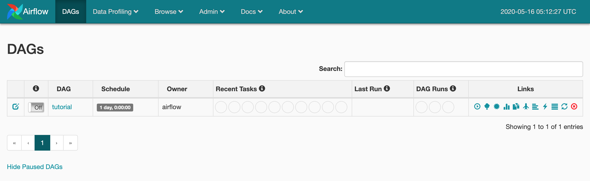
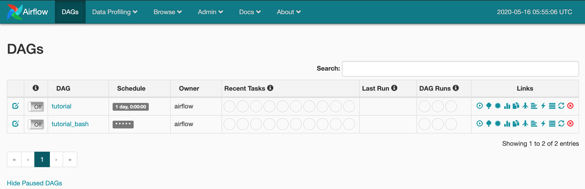
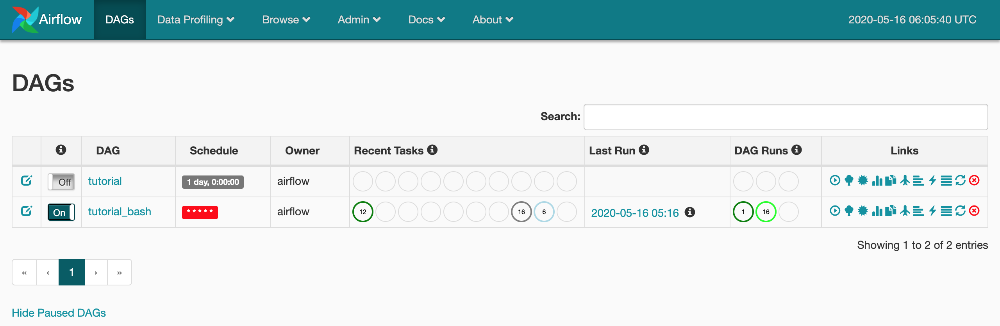

# 개요

Airflow를 사용할 일이 많아질 것 같아 사용법 정리 포스팅을 진행한다.

Ubuntu 환경에서 설치, 운영, 활용 실습을 진행하려 했으나, 시간도 넉넉하지 않고 Airflow 자체를 설치하거나 운영하기보다는 활용하는 법을 손에 익히는 일이 중요할 것 같아 [Docker airflow](https://github.com/puckel/docker-airflow)라는 Github에 올라와 있는 Docker compose 파일을 사용하여 실습을 진행한다.

# Airflow 실행

## 미리 준비해야할 사항

Docker Image로 만들어진 Airflow를 사용할 것이기 때문에 실행 환경에 Docker Engine과 Docker Compose가 미리 설치되어 있어야 한다.

## 실행 환경

* Macbook Pro Early 2015, Mojave 10.14.6
* Docker Desktop 2.1.0.5
  * Docker Engine 19.03.5
  * Docker Compose 1.24.1

## Docker Compose로 Airflow 실행하기

Docker Hub에 올라와 있는 [Dockerhub - puckel/docker-airflow](https://hub.docker.com/r/puckel/docker-airflow) 이미지를 Pull 한다.

```
> docker pull puckel/docker-airflow
```

Airflow 뿐만 아니라 Metadata Database로 사용되는 Postgresql과 CeleryExecutor를 사용하기 위한 Redis를 함께 실행하기 위해 Docker Compose로 실행해야 한다. 이 또한 [Github - puckel/docker-airflow]에 미리 정의된 Docker Compose 파일이 있기 때문에 아래와 같이 실행한다.

```
> git clone https://github.com/puckel/docker-airflow.git
```

Pull이 완료된 이후 docker-airflow 디렉토리로 접근해보면 아래와 같은 파일들이 존재하는 것을 확인할 수 있다.

```
Dockerfile                        config                            docker-compose-LocalExecutor.yml
LICENSE                           dags                              script
README.md                         docker-compose-CeleryExecutor.yml
```

우리가 사용할 Docker Compose 파일은 `docker-compose-CeleryExecutor.yml`이다. 해당 파일을 열어보면 실행할 Docker Container들과 사용할 포트, Volumn 경로 등이 지정되어 있는데, 필요하다면 수정하면 된다.(나는 8080포트가 이미 다른 프로세스에서 사용 중이라 Airflow Webserver의 Port mapping을 8080:8080에서 8081:8080으로 변경했다)

아래 명령어를 수행하여 Airflow Docker Image를 실행한다.

```
> docker-compose -f docker-compose-CeleryExecutor.yml up -d
```

정상적으로 실행된다면 아래와 같은 로그를 남기며 명령어가 종료될 것이다.

```
Removing docker-airflow_webserver_1
docker-airflow_redis_1 is up-to-date
docker-airflow_postgres_1 is up-to-date
docker-airflow_flower_1 is up-to-date
Starting 184bc6a95ed6_docker-airflow_webserver_1 ... done
Starting docker-airflow_scheduler_1              ... done
Starting docker-airflow_worker_1                 ... done
```

Airflow Webserver가 잘 떳는지 `http://localhost:8080` 주소로 들어가 확인해본다.



# Airflow Tutorial 진행

> [Airflow Tutorial](https://airflow.apache.org/docs/stable/tutorial.html) 페이지를 참고하여 Tutorial을 진행한다.

## `simple_bash.py` DAG 파일 생성

`simple_bash`라는 이름의 DAG를 생성할 것이다. Docker Compose를 실행한 경로(다른 경로로 이동하지 않았다면 docker-airflow)에 `dag`라는 디렉토리가 있을 것이다. 이 디렉토리에 `simple_bash.py` 파일을 생성하고, 작성을 시작한다.

### import 구문

```
from datetime import datetime, timedelta
from airflow import DAG
from airflow.operators.bash_operator import BashOperator
```

* `from airflow import DAG`: 정의할 DAG에 매핑하는 클래스를 임포트한다.
* `from airflow.operators.bash_operator import BashOperator`: Bash 명령어를 실행할 Task Operator 클래스를 임포트한다.

### Default Arguments 객체 생성

DAG 및 DAG 내 Task들에 일괄적으로 적용할 속성 객체를 작성한다.

```
default_args={
    'owner': 'airflow',
    'depends_on_past': False,
    'start_date': datetime(2020, 5, 16, 14, 0),
    'email': ['leeyh0216@gmail.com'],
    'email_on_failure': False,
    'email_on_retry': False,
    'retries': 1,
    'retry_delay': timedelta(minutes=1),
}
```

* `owner`: 작업 소유자 ID
* `depends_on_past`: 특정 작업의 Upstream이 성공한 경우에만 해당 작업을 Trigger할 것인지에 대한 여부
* `start_date`: DAG 최초 실행 시간(과거 혹은 예약 가능)
* `email`: 작업 실행 관련 이메일 수신 주소 목록
* `email_on_failure`: 작업 실패 시 이메일 수신 여부
* `email_on_retry`: 작업 재시도 시 이메일 수신 여부
* `retries`: 작업 재시도 횟수
* `retry_delay`: 작업 재시도 간격

### DAG 정의

DAG 객체를 정의한다.

```
dag = DAG(
    'tutorial_bash',
    default_args=default_args,
    description='My first tutorial bash DAG',
    schedule_interval= '* * * * *'
)
```

* `schedule_interval`: DAG 스케쥴링 간격(Cron 표현식 혹은 미리 정의된 속성 사용 가능)

### Task 정의

"hello world"를 출력하는 작업(say_hello)과 현재 시간을 출력하는 작업(what_time)을 정의할 것이다.

```
t1 = BashOperator(
    task_id='say_hello',
    bash_command='echo "hello world"',
    dag=dag
)

t2 = BashOperator(
    task_id='what_time',
    bash_command='date',
    dag=dag
)

t1 >> t2
```

`BashOperator`에는 다음과 같은 속성이 존재한다.

* `task_id`: 작업의 ID
* `bash_command`: 실행할 Bash Command
* `dag`: 작업이 속할 DAG

또한 `t1 >> t2`는 t1이 실행된 후 t2를 실행한다는 의미이다.(t1이 t2의 Upstream Task)

## Airflow CLI와 Webserver를 통해 생성된 DAG 확인하기

Airflow CLI로 방금 만든 DAG가 잘 반영되었는지 확인해보자. 원래는 `airflow list_dags` 명령어로 Airflow에 등록된 DAG 목록을 출력할 수 있는데, 여기서는 Docker Compose로 띄워 놓았기 때문에 `airflow list_dags` 명령어 앞에 `docker-compose -f docker-compose-CeleryExecutor.yml run --rm webserver`를 붙여주어야 한다.

```
> docker-compose -f docker-compose-CeleryExecutor.yml run --rm webserver airflow list_dags

-------------------------------------------------------------------
DAGS
-------------------------------------------------------------------
tutorial
tutorial_bash
```

WebServer에서도 일정 시간이 지나면 아래와 같이 tutorial_bash가 만들어진 것을 확인할 수 있다.



## DAG를 활성화하여 실행 확인하기

만들어진 DAG는 활성화된 상태가 아니어서(Paused) 실행되지 않는다. 실행을 위해서는 CLI나 Web UI 상에서 'Off' 버튼을 눌러 'On' 상태로 변경해주어야 한다.

CLI Command는 `airflow unpause [DAG ID]`로써 여기서는 Docker compose 명령어와 함께 아래와 같이 실행하면 된다.

```
> docker-compose -f docker-compose-CeleryExecutor.yml run --rm webserver airflow unpause tutorial_bash

[2020-05-16 06:04:41,772] {{dagbag.py:403}} INFO - Filling up the DagBag from /usr/local/airflow/dags/tutorial_bash.py
Dag: tutorial_bash, paused: False
```

Web UI에서 확인하면 'Off'였던 상태가 'On'으로 변경되고, DAG가 실행되고 있는 것을 볼 수 있다.



# 정리

UI와 개념에 익숙해지지 않아 오래 걸렸는데, 며칠 만져보면 운영에 큰 지장이 없을 정도로 사용 가능할 것 같다.

다만 실제 운영 환경에서 Airflow를 구축할 때 `dags` 디렉토리의 동기화나 프로젝트 배포 등을 어떻게 할지가 참 궁금하다.