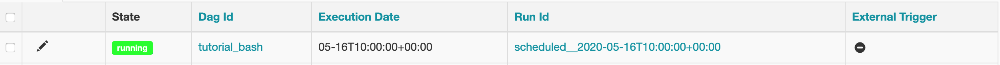
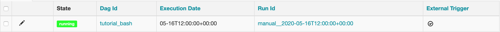
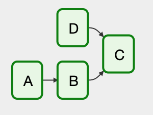
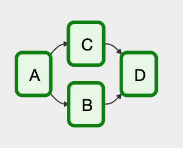

# 개요

Airflow에서 사용되는 개념들을 살펴본다. [Airflow concepts](https://airflow.apache.org/docs/stable/concepts.html) 페이지를 참고하여 작성하였다.

# 개념

## DAG

DAG(Directed Acyclic Graph)는 **관계와 의존성을 가진 작업들의 집합**이다. DAG는 파이썬 파일로 정의하고, 코드로써 DAG 구조를 나타낸다.

DAG는 작업 자체가 어떻게 구성된지와는 관계 없이

* 제시간에
* 정확한 순서로
* 이슈 없이

작업을 실행시키는데에 책임이 있다.

DAG를 정의한 파이썬 파일은 Airflow의 `DAG_FOLER` 아래에 위치시켜야 한다. 또한 Airflow는 `airflow`나 `DAG`라는 문자열을 포함한 파일만을 DAG 파일로 인식하기 때문에, 다른 파일들도 DAG에 관련된 파일로 인식시키기 위해서는 `DAG_DISCOVERY_SAFE_MODE`를 비활성화 해야한다.

### DAG 파일 내에서의 Scope

DAG 파일 내에서 DAG 객체 정의 시, Global Scope으로 정의되어 있지 않으면 Airflow는 이를 인지하지 못한다.


from airflow import DAG
  
global_dag = DAG('global_dag')

def local_dag():
  local_dag = DAG('local_dag')

local_dag()


위와 같이 DAG 파일을 정의한 뒤, 아래 명령어를 통해 DAG 목록을 출력하였다.

```
> airflow list_dags
-------------------------------------------------------------------
DAGS
-------------------------------------------------------------------
global_dag
tutorial
tutorial_bash 
```

`local_dag`는 보이지 않고 `global_dag`만 보이는 것을 확인할 수 있다.

> 다만 `SubDagOperator`를 사용하는 패턴에서는 Local Scope으로 만든 DAG가 유용할 거라고 적혀 있다. 이 부분은 나중에 해당 Operator를 사용해보며 확인해볼 예정이다.

### Default Arguments

DAG의 인자로 `default_args`라는 Dictionary 형태의 객체를 넘길 수 있는데, 이는 DAG에 포함된 Operator들에 공통적으로 적용된다. 모든 작업에 공통적으로 적용해야 하는 인자들이 존재할 경우 유용하게 사용된다.


from airflow import DAG
from datetime import datetime                                    
from airflow.operators.dummy_operator import DummyOperator

default_args = {
  'start_date': datetime(2020, 5, 15),  
  'owner': 'airflow'
}

dag = DAG(
  'dag_with_default_args',
  default_args=default_args
)

operator = DummyOperator(task_id='dummy_task', dag=dag)
print(operator.owner)


아래와 같은 명령어를 통해 DAG 파일을 실행해보면 `default_args`의 `owner`가 `dummy_task`에도 적용된 것을 확인할 수 있다.

```
> python dag_with_default_args.py
airflow
```

### DAG Runs

DAG run은 특정 시간(`execution_date`)에 실행된 DAG를 의미한다. DAG run은 보통 Scheduler를 통해 생성되지만, 외부 Trigger에 의해 생성될 수도 있다. 1개의 DAG는 여러 `execution_date`에 실행된 DAG runs로 실체화되게 된다.

DAG Runs는 Airflow UI의 Browse > DAG runs 메뉴나 명령어(`airflow list_dag_runs [DAG_ID]`)를 통해 확인할 수 있다.

#### Scheduler에 의해 실행된 DAG run

Scheduler를 통해 실행된 DAG는 아래와 같이 Run Id의 Prefix가 scheduled로 시작한다. 또한 External Trigger 탭이 -로 표기되어 있는 것을 확인할 수 있다.



또한 아래와 같이 CLI로 명령어를 통해 확인할 수도 있다. 이 경우 UI처럼 External Trigger 탭은 존재하지 않는다.

```
> airflow list_dag_runs tutorial_bash
------------------------------------------------------------------------------------------------------------------------
DAG RUNS
------------------------------------------------------------------------------------------------------------------------
id  | run_id               | state      | execution_date       | state_date           |

104 | scheduled__2020-05-16T10:00:00+00:00 | success    | 2020-05-16T10:00:00+00:00 | 2020-05-16T11:36:57.464026+00:00 |
```

#### External Trigger에 의해 실행된 DAG run

UI나 CLI 명령어(`airflow trigger_dag [DAG_ID] -e [EXECUTION_DATE]`)를 통해 DAG를 임의의 `execution_date`에 실행할 수 있다. 아래 명령어를 통해 `tutorial_bash` DAG를 실행해보자.

```
> airflow trigger_dag tutorial_bash -e 2020-05-16T12:00:00
Created <DagRun tutorial_bash @ 2020-05-16T12:00:00+00:00: manual__2020-05-16T12:00:00+00:00, externally triggered: True>
```

아래와 같이 UI를 통해 확인해보면 Run Id의 Prefix가 manual이고 External Trigger 탭이 체크표시 되어 있는 것을 확인할 수 있다.



### `execution_date`

`execution_date`는 DAG runs에 적용되는 논리적인 실행 시각이다. 실제로 해당 DAG run이 실행된 시간과는 구분되는 시각이다. 왜 `execution_date`라는 개념이 필요할까?

나도 현업에 오기 전에는 모르는 부분이었는데, 현업에서 일하면서 다음과 같은 상황이 종종 발생했다. 

1. 데이터를 처리하는 로직이 바뀌어서 과거 날짜 기준으로 작업을 다시 수행해야 함
2. 만일 `execution_date`라는 개념이 없다면(현재 시간 기준으로만 실행한다면), Airflow를 사용하지 못하고 별도 스크립트를 작성하여 프로그램을 실행해야 함
3. `execution_date` 개념을 사용하면 해당 값을 과거 날짜로 지정하여 수행하면 되므로 매우 편함

추가로 현업에서는 Late Log 등을 처리하기 위해 `execution_date`를 약간 미뤄두고 프로그램의 인자로 넘길 때는 특정 시간 값을 빼서 넘기기도 한다.

## Operators

Operator는 실제 작업 실행을 담당하는 개체이며 Workflow(DAG) 를 구성하는 하나의 작업을 기술한다. Operator는 보통 다른 작업에 의존적이지 않고 단독으로 수행이 가능하다. 또한 Operator들은 아래와 같은 특징을 가진다.

* DAG 내에 있는 Operator는 순차/병렬적으로 수행될 수 있으며 각 Operator들은 서로 다른 장비에서 수행될 수 있다.
* 만일 두 개의 Operator가 데이터를 공유해서 사용해야 한다면, 하나의 Operator로 합쳐서 사용하기를 권장한다. 그러기 어렵다면 XComs라는 컴포넌트를 사용하여 구성하기 바란다.

Airflow는 다양한 Operator를 제공하며 아래와 같은 대표적인 Operator들이 존재한다.

* BashOperator: Bash 명령어를 수행하는 Operator
* PythonOperator: Python 함수를 실행하는 Operator
* EmailOperator: Email을 전송하는 Operator
* SimpleHttpOperator: Http Request를 수행하는 Operator
* MySqlOperator, JdbcOperator, ...,  MsSqlOperator: SQL 명령어를 실행하는 Operator
* Sensor: 특정 시간, 파일, DB Row, S3 Key 등을 Polling하는 Operator

이외에도 HiveOperator, DockerOperator 등 다양한 Operator들이 존재한다.

### Operator가 포함될 DAG 할당하기

위의 예제들에서는 DAG 파일 내에 DAG를 먼저 생성하고 Operator 생성 시 생성자 인자로 dag를 전달해주었다. 꼭 Operator 생성자에 DAG를 넣어주지 않아도 Operator의 `dag` 필드를 통해 나중에 DAG를 설정해주어도 된다.

```
from airflow import DAG
from airflow.operators.dummy_operator import DummyOperator
from datetime import datetime

operator = DummyOperator(task_id='lazy_assign_dag')
dag = DAG('lazy_set_dag', start_date=datetime(2020, 5, 15))
operator.dag = dag
```

위와 같이 DAG를 나중에 선언하고 DAG보다 이후에 Operator에 `dag` 필드를 설정해주어도 정상적으로 DAG에 Operator가 포함된 것을 확인할 수 있다.

### Bitshift Composition

DAG를 구성하는 Task(Operator)들 간의 관계를 정의할 때 기존에는 `set_upstream()`, `set_downstream()`을 사용했으나, Airflow 1.8 버전부터 `>>`와 `<<` 연산자를 사용하여 관계를 정의할 수 있게 되었다.

A 작업이 실행된 뒤 B 작업이 실행되어야 하는 경우 아래와 같이 표기할 수 있다.

* `A >> B`
* `B << A`

여러 개의 Bitshift 연산자를 섞어서 아래와 같이 표현할 수도 있다.


* `A >> B >> C << D`
  * A 작업 완료 후 B 작업 수행
  * B 작업과 D 작업이 완료된 후 C 작업 수행



* `A >> [B, C] >> D`
  * A 작업이 완료된 후 B, C 작업 수행
  * B, C 작업이 완료된 후 D 작업 수행
