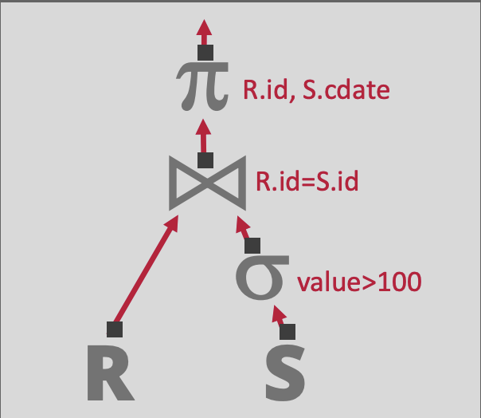
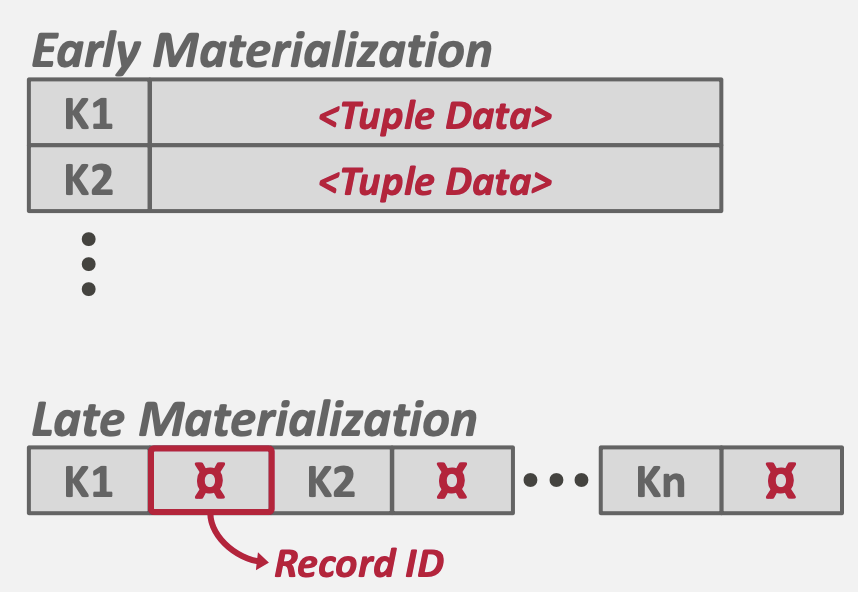
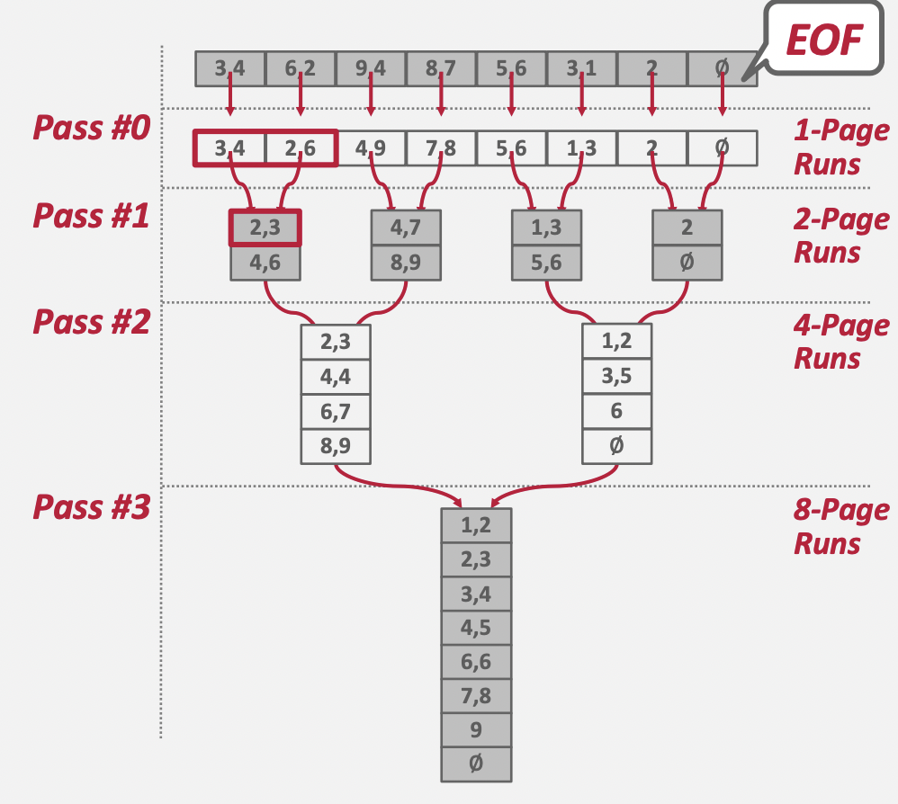
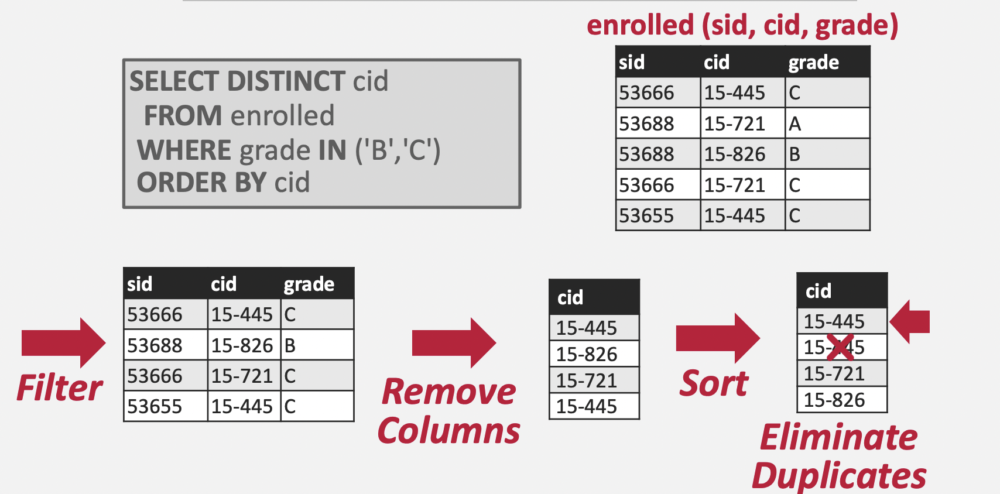
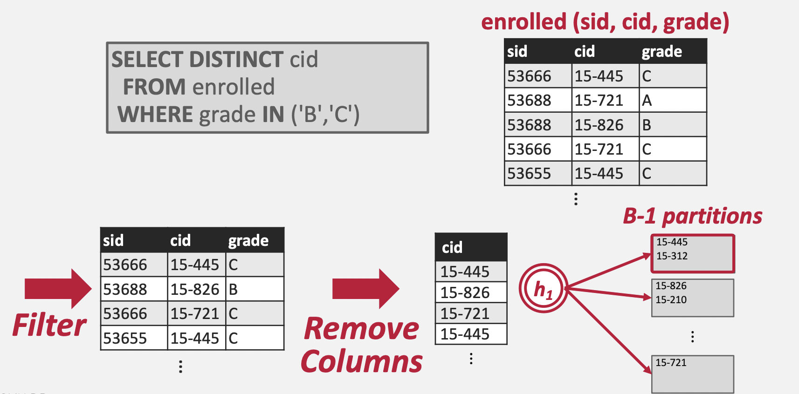
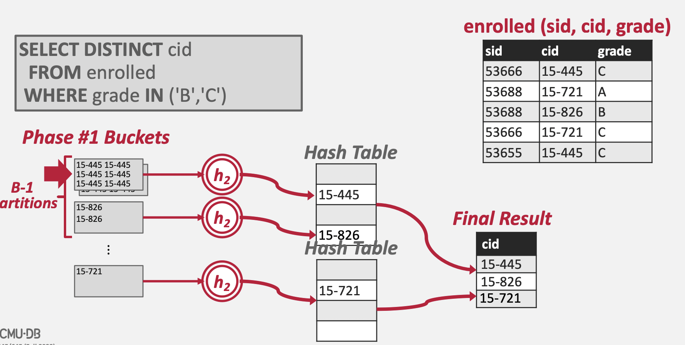

# Lecture #10: Sorting & Aggregation Algorithms

참고자료: [Youtube - F2023 #10 - Sorting & Aggregation Algorithms \(CMU Intro to Database Systems\)](https://youtu.be/DOu7SVUbuuM?si=tA9HB86_555y8QYD)

## Query Plan

SQL문을 실행하면, DBMS는 쿼리를 Compile하여 Query Plan으로 변환한다. Query Plan은 Operator(Relational Operator)로 구성된 Tree를 의미한다.

```
SELECT R.id, S.cdate
FROM R JOIN S
ON R.id = S.id
WHERE S.value > 100
```

위의 쿼리문을 실행하면, RDBMS는 쿼리를 아래의 Relational Algebra로 변환한다.

`πR.id,S.cdate(R▷◁(σvalue>100(S))`

또한 위의 Relational Algebra는 아래의 Tree 형태(Root Node가 1개인 DAG)로 표현이 가능하다. Tree의 각 Node는 Operator를 의미한다.



데이터는 Tree의 Leaf Node로부터 공급되며, Root Node로 흐르게 된다. Root Node의 결과가 곧 Query의 결과가 된다.

### Disk-Oriented DBMS

> Disk-Oriented DBMS라는 제목이지만, 분산 데이터베이스 혹은 데이터 처리 엔진에서도 동일한 이슈가 존재하며 유사한 방법으로 문제를 해결한다.

Relational Algebra의 Operator가 사용하는 알고리즘은 다음 사항들을 가정하고 설계해야 한다.

* 사용 가능한 메모리 용량을 넘어서는 데이터를 다룰 수 있어야 한다.
* 자주 사용되는 데이터에 빠르게 접근할 수 있도록 Buffer Pool 기반으로 동작할 수 있도록 설계해야 한다.
* 디스크 접근 시 Sequential I/O의 사용을 극대화 할 수 있도록 설계야해 한다.

## Sorting

이전에 정의했든 Relational Model은 정렬되지 않은 집합(`relation`)에 기반한 모델이다. SQL에는 명시적 혹은 묵시적으로 정렬을 필요로 하는 연산이 존재하는데, 이를 위해 정렬의 구현이 필요하다. 정렬을 필요로 하는 경우는 다음과 같다.

* 쿼리에 `ORDER BY` 구문이 포함되어 있는 경우 - 명시적
* `GROUP BY`, `JOIN`, `DISTINCT` 등의 Operator를 사용하는 경우 - 묵시적

> Aggregation의 경우 Hash 기반으로 구현할 수도 있지만, Sort 기반으로 구현할 수도 있다. 대부분의 경우 Hash 기반의 Aggregation이 사용되지만, 몇몇 경우는 Sort 기반의 Aggregation이 사용될 수 있다.

---

메모리 용량이 모든 데이터를 수용 가능한 경우, Quick Sort 등의 일반적인 In-Memory Sorting을 사용할 수 있다. 

> Python, Java 등에서는 실제 데이터에서 좀 더 잘 동작하는 TimSort를 기본 정렬 알고리즘으로 사용한다. TimSort는 Merge Sort와 Insertion Sort가 혼합된 정렬 알고리즘이다.

그러나 메모리에 모든 데이터를 로드할 수 없는 경우, DBMS는 필요한 경우 중간 데이터를 디스크에 쓸 수 있는(Sequential I/O를 중심으로) External Sorting을 사용해야 한다.

### Top N Heap Sort

> In-Memory Sorting의 예시로 제시하였다.

`ORDER BY`와 `LIMIT`이 함께 사용된 쿼리의 경우, RDBMS는 한 번의 스캔만으로 상위 N개의 Element들을 찾아낼 수 있다.

```
SELECT * FROM enrolled
ORDER BY sid
FETCH FIRST 4 ROWS
WITH TIES
```

위의 쿼리의 경우 `sid`를 기준으로 상위 4개의 ROW를 찾아내야 하는데, 이 연산에 가장 적합한 In-Memory Sorting Algorithm은 Heap Sort(= in-memory sorted Priority Queue)이다.

입력 데이터가 `[3, 4, 6, 2, 9, 1, 4, 4, 8]` 일 때, `[3]` -> `[4, 3]` -> `[6, 4, 3]` -> `[6, 4, 3, 2]` -> `[4, 3, 2, 1]` -> `[4, 4, 3, 2, 1]` -> `[4, 4, 4, 3, 2, 1]`의 순서로 상위 4개의 Element들을 골라낼 수 있다.

Heap 자료구조가 최대 값과 크기를 메모리에 유지하고 있을 수 있기 때문에, 새로운 Element를 삽입할지에 대한 여부를 즉시 판단할 수 있다.

### External Merge Sort

메모리에 모든 데이터를 로드할 수 없는 경우, 일반적으로 사용되는 정렬 알고리즘이 External Merge Sort이다. External Merge Sort는 데이터를 작은 단위(RUN)로 분할하고, 각각의 RUN을 정렬한 뒤, 이를 큰 단위의 RUN으로 합치는 분할-정복 알고리즘이다.

* Sorting: 데이터를 메모리에 올릴 수 있을 정도의 크기로 분할(Chunking)하여, 각 분할된 데이터(Chunk) 단위로 정렬한다. 정렬된 데이터는 다시 Disk에 쓴다.
* Merge: 디스크에 써진 정렬된 Chunk를 합쳐 새로운 Chunk를 만들고, 이를 Disk에 쓴다.

#### SORTED RUN

RUN은 키-값 쌍의 리스트를 의미한다.

* 키: 정렬 순서를 결정하는 Attribute이다.
* 값: 정렬 순서와 관계 없는 Attribute의 집합이다.

값은 두가지 방식으로 표현 가능한데, Tuple(Early Materialization) 방식과 Record ID(Late Materialization) 방식이 존재한다.



* Tuple 방식: 실제 데이터를 값으로 유지한다. 정렬 후 즉시 값에 접근이 가능하다.
* Record ID 방식: 데이터가 저장된 주소(메모리 혹은 디스크)를 값으로 유지한다. 정렬 후 값에 접근하기 위해 주소를 참조하여 실제 값을 읽어야 한다.

Tuple 방식은 보통 Row-Oriented RDBMS에서 많이 사용되고, Record ID 방식은 Column-Oriented RDBMS에서 많이 사용된다고 한다.

> Row-Oriented RDBMS의 경우 대부분 Row 의 전체 값을 읽어야 하는 경우가 대다수이지만, Column-Oriented RDBMS의 경우 특정 컬럼만 읽는 경우가 다수이기 때문에 모든 데이터를 값으로 유지하는 것이 비효율적이다.

#### 2-Way External Merge Sort

정렬해야 하는 데이터(파일)이 `[[3, 4], [6, 2], [9, 4], [8, 7], [5, 6], [3, 1], [2], [∅]]`이라고 가정해보자. 각 페이지는 최대 2개의 값을 가질 수 있다. 첫번째 페이지는 `[3, 4]`, 두번째 페이지는 `[6, 2]`라고 해석이 가능하다. 총 8개의 Page로 구성된 파일임을 알 수 있다.



##### 1 PASS

첫 번째 RUN은 1개 Page로 구성된다. 각 RUN 별로 정렬을 수행한 뒤, 결과를 파일로 저장한다. 총 8개의 파일이 생성된다.

* `[3, 4]`
* `[2, 6]`
* `[4, 9]`
* `[7, 8]`
* `[5, 6]`
* `[1, 3]`
* `[2]`
* `[∅]`

##### 2 PASS

두 번째 RUN은 2개 Page로 구성된다. 

* `[[2, 3], [4, 6]]` <- `[3, 4]` + `[2, 6]`
* `[[4, 7], [8, 9]]` <- `[4, 9]` + `[7, 8]`
* `[[1, 3], [5, 6]]` <- `[5, 6]` + `[1, 3]`
* `[[2], [∅]]` <- `[2]` + `[∅]`

##### 3 PASS

세 번째 RUN은 4개 Page로 구성된다.

* `[[2, 3], [4, 4], [6, 7], [8, 9]]` <- `[[2, 3], [4, 6]]` + `[[4, 7], [8, 9]]`
* `[[1, 2], [3, 5], [6], [∅]]` <- `[[5, 6], [1, 3]]` + `[[2], [∅]]`

##### 4 PASS

네 번째 Run은 8개 Page로 구성된다. 최종적으로 1개의 파일이 생성되었으므로 RUN 반복을 종료한다.

* `[[1, 2], [2, 3], [3, 4], [4, 5], [6, 6], [7, 8], [9], [∅]]`

---

중요한 사실은 RUN을 합칠 때 메모리에는 전체 파일을 다 올릴 필요 없이 **2개의 페이지(각 입력 파일 별로 1개 씩)만 올라와 있으면 된다**는 것이다.

* PASS 수: 1 + ⌈ log2 N ⌉
  * 사실상 Tree의 깊이와 같다.
* Total I/O Cost: 2N * (# of passes)
  * 각 PASS에서 전체 Page를 한번 읽게 되고, 전체 Page를 한번 쓰게 된다.

#### General External Sort

데이터가 커질 수록 2-Way External Sort는 느려진다. N이 커지며 PASS 수와 Total I/O Cost 모두 증가하기 때문이다. 만일 Merge 단계에서 2개가 아닌 3개, 4개 등 K개의 RUN을 한번에 Merge 하면 PASS수와 Total I/O Cost는 어떻게 변화할까?

* PASS 수: 1 + ⌈ logk N ⌉
  * 기존 2였던 k가 3, 4 등으로 증가하며 트리의 높이가 낮아진다.
  * 결과적으로 PASS 수가 줄어든다.
* Total I/O Cost: 2N * (# of passes)
  * 각 PASS에서 전체 Page를 한번 읽고, 한번 쓰는 것은 변화 없기 때문에 Total I/O Cost 계산식은 변화하지 않는다.

k를 늘리므로써 PASS 수를 줄여 전체 정렬 성능을 높일 수 있다. 단, k개의 Page를 한번에 메모리에 올려야 하기 때문에, 메모리 사용량은 k가 늘어날 수록 비례해서 늘어나게 된다.

---

정리하자면, 

* External Sorting은 모든 데이터를 메모리에 올릴 수 없을 때 사용할 수 있는 정렬 기법을 의미한다.
* External Merge Sort를 사용하면 logN 시간 복잡도로 External Sorting을 구현할 수 있다.
* External Merge Sort의 성능을 올리고 싶다면, 한번에 Merge할 RUN의 수(k)를 늘려주면 된다. 단, Trade-Off로 메모리 공간을 많이 사용하게 된다.

> External Sorting은 아니지만 [23. Merge k Sorted Lists](https://leetcode.com/problems/merge-k-sorted-lists/)을 풀어보면 개념 잡기에 도움이 될 것 같다.

### Comparison Optimizations

정렬 시 비교 연산을 최적화 하는 기법들을 소개한다.

* Code Specialization: 함수 포인터를 통해 비교 연산 알고리즘을 전달하는 대신, 특정 키 타압에 맞는 비교 연산 알고리즘을 명시적으로 전달하는 방식을 의미한다. C++의 Template Specialization을 예로 들 수 있다.
  * C++의 Virtual Method Call 등에 대한 Overhead를 줄이기 위한 방식으로 이해했다.
  * Java 진영에서는 Jit Compiler가 함수를 잘 Inline 할 수 있도록 하고, Method Dispatching 비용을 줄이기 위해 Reflection 대신 MethodHandle 등을 사용하도록 하면 비슷한 효과가 나오지 않을까? 라는 생각이 든다.
* Suffix Truncation: 긴 길이의 두 문자열을 비교하는 알고리즘은 매우 느리게 동작할 수 밖에 없다. 이를 개선하기 위해 Suffix 비교 후, 필요하다면 전체 비교로 Fallback 할 수 있는 방식을 취하도록 한다.

## Aggregations

Aggregation은 1개 이상의 Tuple의 값들을 단일 스칼라 값으로 축소하는 연산이다. DBMS는 Grouping에 사용되는 필드의 값이 같은 Tuple들의 집합을 빠르게 찾아내야 하는데, 이 때 사용 가능한 알고리즘이 Hashing과 Sorting이다.

### Sorting Aggregation



`DISTINCT` 가 포함된 SQL문을 어떻게 정렬 기반의 알고리즘으로 풀 수 있는지 설명한다. 정렬된 데이터에 대해서는 1 PASS로 유일 값을 찾아낼 수 있다는 것을 생각하면, 위 SQL문도 `cid` 기준으로 정렬만 한다면 1 PASS로 유일한 `cid`를 찾을 수 있다.

```
public List<Integer> extractDistinct(List<Integer> sortedList) {
  Integer prev = null;
  List<Integer> ret = new ArrayList<>();
          
  // 1 PASS로 유일 값을 추출
  for (Integer val : sortedList) {
    if (prev == null) {
      ret.add(val);
    }
    else if (!Objects.equals(val, prev)) {
      ret.add(val);
    }
    prev = val;
  }

  return ret;
}
```

#### Alternatives to Sorting

만일 Aggregation의 결과가 정렬되어 있어야 한다면 Sorting을 사용해야 한다. 그렇지 않은 경우 Hashing을 사용하는 것이 더 적합하다.

예를 들어 앞의 예제의 경우 `ORDER BY cid`라는 조건이 포함되어 있었기 때문에, Soring으로 접근하는 것이 좋다. 그러나 `ORDER BY cid`가 없었다면, Hashing으로 접근하는 것이 더 나았을 것이다.(Hashing이 Sorting에 비해 상대적으로 연산 비용이 적으므로)

## Hashing

Hashing을 사용하면 Aggregation을 매우 쉽게 구현할 수 있다. 다만 Sorting과 마찬가지로 메모리에 모든 데이터를 올릴 수 없는 경우의 대안이 필요하다.

### External Hashing Aggregate

External Hashing Aggregate는 Partition과 ReHash 단계로 이루어지며, 각 단계에서 서로 다른 Hash 함수(Partition - h1, Hash - h2)가 사용된다.

#### Partition



Partition 단계는 N개의 파티션 파일을 생성하는 것으로 시작된다. 이후 각 Tuple의 Key에 Hash Function(h1)을 적용하여 Hash 값을 추출하고, (mod N)을 적용한 뒤 해당 값에 맞는 파티션 파일에 Tuple Key를 쓴다. 이 때 주의해야 할 것은 **중복 등을 고려하지 않고 그냥 쓴다는 것**이다.

* 디스크에는 총 N개의 파티션 파일이 생성된다.
* 각 파티션 파일에는 Key의 Hash 값이 동일한 Tuple들이 포함되어 있다.
* 각 파티션 파일에는 중복된 Key들이 존재할 수 있다.
* 파티션 파일에는 Page 단위로 데이터를 쓰게 된다.

#### ReHash



Partition 단계가 끝나면 모든 Key 값들이 파티셔닝되어 디스크에 저장되어 있을 것이다. 디스크에 저장된 Key 값들을 읽어 Hash 테이블을 만들어야 한다. 그 전에 Partition 파일들의 특성에 대해 생각해보자.

* 하나의 파티션 파일 안에는 중복된 Key 값이 존재할 수 있다.
* 서로 다른 파티션 파일들이 같은 Key 값을 포함할 수 없다.

즉, 파티션 단위에서만 중복이 제거되면 모든 파티션을 합쳐도 중복이 발생하지 않는다는 결과를 얻어낼 수 있다. 그래서 파티션 별로 메모리에 Hash Table을 생성하고, 파티션 데이터를 읽어 해당 Hash Table에 채워 넣는다. 이후 모든 Hash Table을 Merge하면 최종 Hash Table을 도출할 수 있게 된다.

#### Rehash 시 메모리가 부족하다면?

Rehash 과정에서 사용되는 Hash Table의 크기가 메모리 용량을 넘어설 수 있다. 이러한 문제를 해결할 수 있는 방법은 다음과 같다.

1. 파티션 파일이 더 적은 수의 Key를 포함하도록 한다. 즉, 파티션의 개수(N)를 늘린다.
2. Rehash 대상 파티션을 한번 더 파티셔닝하여 처리한다.
3. Rehash에서 Hash Table이 아닌 Sorting을 사용한다.

## 개인적인 생각

이번 강의에서 나온 정렬, 해시 알고리즘들은 실제로 분산 병렬 애플리케이션에서도 많이 사용된다. 또한 각 알고리즘에서 사용되는 파라메터 값들이 결과적으로 분산 병렬 애플리케이션의 튜닝에도 사용된다.

External Hash Aggregate에서 나온 N(파티션 개수)값은 Spark에서의 파티션 수와 동일한 개념으로 생각할 수 있다. 그렇다면 Spark의 Aggregation 연산에서 일부 파티션으로 데이터가 몰려(Skew) 속도가 느려지거나 OOM 등이 발생하는 경우, 위의 "Rehash 시 메모리가 부족하다면?" 에서 제안한 방법과 같이 파티션의 개수를 늘리는 방법으로 해결할 수 있다.(물론 모든 Skew 문제를 해결할 수 있는 것은 아니지만!)

강의를 들으면 들을 수록 기본이 튼튼하면 상위 개념을 이해하기 쉽다는 생각이 든다.