# Roll-up

Druid에서는 입수(Ingestion) 단계에서 데이터를 선집계(Pre-Aggregate)하는 Roll-up이라는 기능을 제공한다. Roll-up을 구성할 경우 **모든 Dimension의 값이 동일한 데이터들의** Metric들에 대해 입수 단계에서 sum, count 등의 집계를 미리 수행하게 된다.

이 글에서는 [Apache Druid - Tutorial: Roll-up](https://druid.apache.org/docs/latest/tutorials/tutorial-rollup.html)를 따라할 때 Peon 프로세스 내에서 어떤 일이 일어나는지 확인해본다.

## Segment와 Index

Roll-up 과정을 알기 위해서는 Druid 내의 데이터 저장 구조인 Segment와 Segment가 포함하고 있는 Index의 종류에 대해 알아야 한다.

Druid의 Segment에는 `org.apache.druid.segment.IncrementalIndexSegment`와 `org.apache.druid.segment.QueryableIndexSegment` 두 가지 종류가 존재한다.

### IncrementalIndexSegment

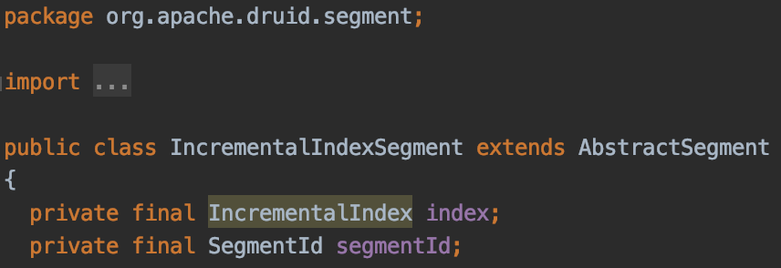

입수 단계에서 사용되는 Segment로써 데이터의 추가가 가능(Mutable)한 Segment이다.

`IncrementalIndexSegment`는 내부적으로 `IncrementalIndex`를 포함하고 있으며, `IncrementalIndex`는 메모리 상의 위치에 따라 `OnheapIncrementalIndex`와 `OffheapIncrementalIndex`로 나뉘게 된다.

### QueryableIndexSegment

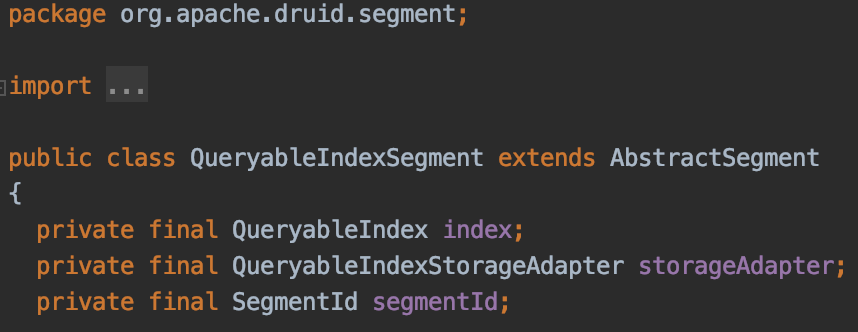

입수가 완료되어 Historical Node에 로드된 Segment로써 데이터의 추가가 불가능한(Immutable) 읽기 전용 Segment이다.

`QueryableIndexSegment`는 내부적으로 `QueryableIndex`를 포함하고 있으며, 실제 구현체는 `SimpleQueryableIndex` 클래스이다.

## Kafka Indexing Task에서의 Roll-up

Kafka Indexing Task에서는 실시간 데이터를 수집하여 적재하기 전까지 `IncrementalIndexSegment`를 유지하고, 내부적으로는 `OnheapIncrementalIndex`(혹은 `OffheapIncrementalIndex`)에 데이터를 유지한다.

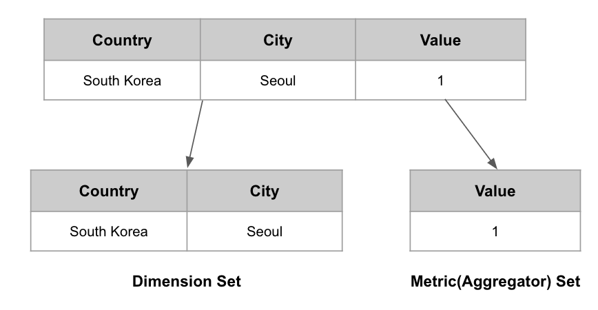

`OnheapIncrementalIndex`에서는 하나의 Row를 메모리에 유지할 때 위의 기름과 같이 Dimension(`IncrementalIndexRow`) Set과 Metric(`Aggregator`) Set을 따로 유지한다. 이 두 Set은 각각 `facts`와 `aggregators` 객체를 통해 표현한다.

* `facts`: `org.apache.druid.segment.incremental.IncrementalIndex.FactsHolder` 타입의 객체로써, Roll-up 여부에 따라 `PlainFactsHolder`(Roll-up을 사용하지 않을 경우)와 `RollupFactsHolder`(Roll-up을 사용할 경우) 둘 중 하나로 초기화된다.
* `aggregators`: `ConcurrentHashMap<Integer, Aggregator[]>` 타입의 객체로써 Row에 대한 Metric 정보들을 실제로 저장하고 있다. 키는 Row ID, 값은 해당 Row의 Metric 배열 타입이다.

`facts` 객체가 `RollupFactsHolder`인지 `PlainFactsHolder`인지에 따라 데이터 추가와 유지 방식이 완전히 달라지게 되는데, 두 클래스의 내부 데이터 유지 방식과 데이터 추가 과정을 알아보도록 한다.

### `RollupFactsHolder`가 Dimension Set을 유지하는 방법

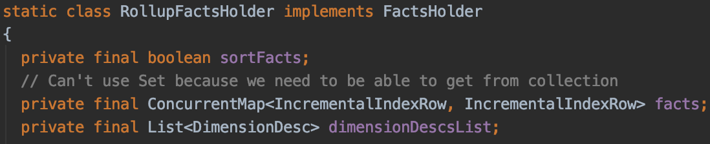

Roll-up이 적용되었을 때는 `RollupFactsHolder`를 사용한다. `RollupFactsHolder`는 Dimension Set을 유지하기 위해 `ConcurrentHashMap<IncrementalIndexRow, IncrementalIndexRow>` 타입의 객체를 유지한다.

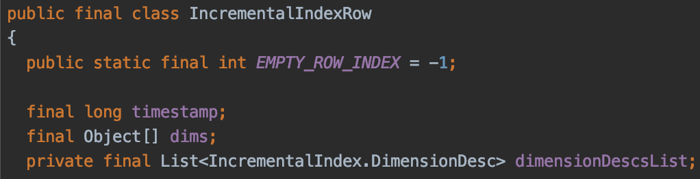

여기서 Key와 Value로 사용되는 `IncrementalIndexRow`는 하나의 Row의 Dimension 값들을 포함하고 있는 구조이다. 즉, **동일한 Dimension 값들을 가진 두 Row는 논리적으로 동일한 `IncrementalIndexRow`를 가질 수 있다.**

### `PlainFactsHolder`가 Dimension Set을 유지하는 방법

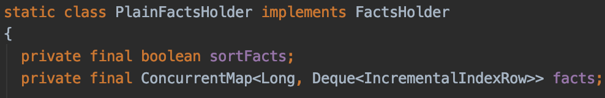

Roll-up이 적용되지 않았을 때는 `PlainFactsHolder`를 사용한다. `PlainFactsHolder`는 Dimension Set을 유지하기 위해 `ConcurrentMap<Long, Deque<IncrementalIndexRow>>` 타입의 객체를 유지한다.

여기서 Key는 `__time`(timestamp)이며, Value는 동일 `__time`에 발생한 Row들의 Dimension Set이다. `RollupFactsHolder`와 달리 Dimension Set을 유지할 때 `Map`이 아닌 `Deque`를 사용하고 있기 때문에, **`RollupFactsHolder`와 달리 동일한 Dimension 값들을 가진 두 Row를 동일하게 취급하지 않는다는 것을 대략적으로 유추할 수 있다.**

### `FactsHolder`의 `getPriorIndex`

`FactsHolder`에 구현된 **`getPriorIndex`는 Roll-up의 동작을 결정하는 가장 중요한 메서드**이다. 이 메서드는 동일한 Dimension(`IncrementalIndexRow`) Set을 가진 Row의 ID(`int`)값을 반환하는 메서드이다. 만일 동일한 Dimension Set을 가진 Row가 없다면 `IncrementalIndexRow.EMPTY_ROW_INDEX` 값을 반환한다.

반환된 값이 `IncrementalIndexRow.EMPTY_ROW_INDEX`라면 새로운 Row의 데이터를 추가하면 되고, `IncrementalIndexRow.EMPTY_ROW_INDEX`가 아니라면 해당 값을 통해 기존 Row의 Metric 값을 찾아 해당 값들에 현재 Row의 값들을 더해주면 된다.

```
@Override
public int getPriorIndex(IncrementalIndexRow key)
{
    IncrementalIndexRow row = facts.get(key);
    return row == null ? IncrementalIndexRow.EMPTY_ROW_INDEX : row.getRowIndex();
}
```

`RollupFactsHolder`에서는 동일한 `IncrementalIndexRow`를 가진 데이터가 있는지 확인한 뒤, 데이터가 존재한다면 해당 데이터의 Row ID를 반환한다. 만일 존재하지 않는다면 `IncrementalIndexRow.EMPTY_ROW_INDEX`를 반환하게 된다.

```
@Override
public int getPriorIndex(IncrementalIndexRow key)
{
    // always return EMPTY_ROW_INDEX to indicate that no prior key cause we always add new row
    return IncrementalIndexRow.EMPTY_ROW_INDEX;
}
```

반면에 `PlainFactsHolder`에서는 무조건 `IncrementalIndexRow.EMPTY_ROW_INDEX`를 반환한다. Roll-up을 사용하지 않기 때문에 동일한 Dimension Set을 가진 Row가 존재하더라도 이를 무시하고 새로운 Row를 추가하는 방식으로 동작하게 된다.

### 데이터의 추가 과정 살펴보기

위의 내용들을 바탕으로 실제 데이터의 추가와 Roll-up 과정이 어떻게 수행되는지 알아보자. Segment로의 실질적인 데이터 추가는 `IncrementalIndex`의 `add` 메서드로부터 시작되며 Roll-up 적용 여부에 따른 데이터 추가 방식의 변화는 `addToFacts` 메서드에서 확인할 수 있다.

```
@Override
protected AddToFactsResult addToFacts(
      InputRow row,
      IncrementalIndexRow key,
      ThreadLocal<InputRow> rowContainer,
      Supplier<InputRow> rowSupplier,
      boolean skipMaxRowsInMemoryCheck
  ) throws IndexSizeExceededException
  {
    List<String> parseExceptionMessages;
    final int priorIndex = facts.getPriorIndex(key);

    ...
    if (IncrementalIndexRow.EMPTY_ROW_INDEX != priorIndex) {
      aggs = concurrentGet(priorIndex);
      parseExceptionMessages = doAggregate(metrics, aggs, rowContainer, row);
    } else {
      aggs = new Aggregator[metrics.length];
      factorizeAggs(metrics, aggs, rowContainer, row);
      parseExceptionMessages = doAggregate(metrics, aggs, rowContainer, row);

      final int rowIndex = indexIncrement.getAndIncrement();
      concurrentSet(rowIndex, aggs);
      ...
    }

    return new AddToFactsResult(numEntries.get(), sizeInBytes.get(), parseExceptionMessages);
  }
```

메서드에서 두번째 라인에 등장하는 `final int priorIndex = facts.getPriorIndex(key)` 구문을 통해 동일한 Dimension Set을 가진 Row의 ID(`priorIndex`)를 가져온다. 이 `priorIndex` 값은 위에서 말했듯이 `FactsHolder`의 타입에 따라 결정되며, 이후 분기문(if문)에 많은 영향을 미치게 된다.

다음 3개의 데이터가 추가될 때 `PlainFactsHolder`와 `RollupFactsHolder` 일 때 어떻게 데이터가 추가되는지 확인해보도록 하자.

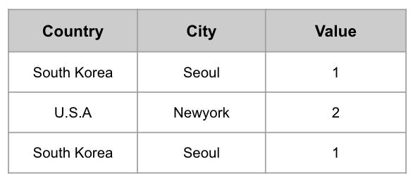

### `PlainFactsHolder`가 사용된 경우

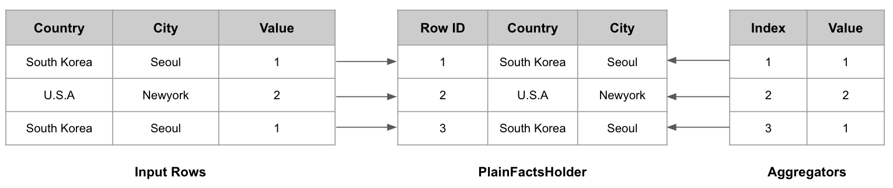

`addToFacts`에서 `PlainFactsHolder`가 사용된 경우에는 아래와 같은 순서로 데이터의 추가가 진행된다.

1. (South Korea, Seoul)를 매개변수로 `getPriorIndex`를 호출하며, `PlainFactsHolder`이기 때문에 무조건 `IncrementalIndexRow.EMPTY_ROW_INDEX`를 반환
2. 분기문에서 else문으로 진입하여 새로운 Aggregator(Value: 1) 배열 생성 후 `aggregators`에 추가함
3. (South Korea, Seoul)을 `PlainFactsHolder`에 추가함
4. (U.S.A, Newyork)를 매개변수로 `getPriorIndex`를 호출하며, 이는 `IncrementalIndexRow.EMPTY_ROW_INDEX`를 반환
5. 분기문에서 else문으로 진입하여 새로운 Aggregator(Value: 2) 배열 생성 후 `aggregators`에 추가함
6. (U.S.A, Newyork)를 `PlainFactsHolder`에 추가함
7. (South Korea, Seoul)를 매개변수로 `getPriorIndex`를 호출하며, 이는 `IncrementalIndexRow.EMPTY_ROW_INDEX`를 반환
8. 분기문에서 else문으로 진입하여 새로운 Aggregator(Value: 1) 배열 생성 후 `aggregators`에 추가함
9. (South Korea, Seoul)을 `PlainFactsHolder`에 추가함

최종적으로 `PlainFactsHolder`에는 Input Rows의 \[(South Korea, Seoul), (U.S.A, Newyork), (South Korea, Seoul)\] 이 추가되고, `aggregators`에는 \[1, 2, 1\]이 추가된다. 즉, 원본 데이터가 그대로 유지된다.

### `RollupFactsHolder`가 사용된 경우

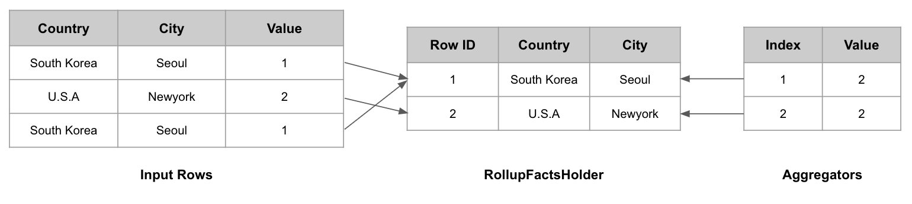

1. (South Korea, Seoul)를 매개변수로 `getPriorIndex`를 호출하며, 이전에 동일한 Dimension Set으로 추가되었던 데이터가 없었기 때문에 `IncrementalIndexRow.EMPTY_ROW_INDEX`를 반환
2. 분기문에서 else문으로 진입하여 새로운 Aggregator(Value: 1) 배열 생성 후 `aggregators`에 추가함
3. (South Korea, Seoul)을 `PlainFactsHolder`에 추가함
4. (U.S.A, Newyork)를 매개변수로 `getPriorIndex`를 호출하며, 이전에 동일한 Dimension Set으로 추가되었던 데이터가 없었기 때문에 `IncrementalIndexRow.EMPTY_ROW_INDEX`를 반환
5. 분기문에서 else문으로 진입하여 새로운 Aggregator(Value: 2) 배열 생성 후 `aggregators`에 추가함
6. (U.S.A, Newyork, 2)를 `PlainFactsHolder`에 추가함
7. (South Korea, Seoul)를 매개변수로 `getPriorIndex`를 호출하며, 3번째 Step에서 (South Korea, Seoul)을 추가한 적이 있었기 때문에, 해당 Row의 ID인 1을 반환
8. 분기문에서 if문으로 진입하여 `concurrentGet` 메서드를 호출하여 `aggregators`에서 1번째(priorIndex: 1) Aggregator를 가져온 뒤, `doAggregate` 메서드를 통해 해당 Aggregator(Value: 1)에 현재의 Metric인 1을 추가한다.

최종적으로 `RollupFactsHolder`에는 Input Rows의 \[(South Korea, Seoul), (U.S.A, Newyork)\] 이 추가되고, `aggregators`에는 \[2, 2\]이 추가된다. 즉, 동일한 Dimension으로 구성(South Korea, Seoul)된 Row들은 1개로 합쳐져서 원본보다 적은 데이터가 유지되게 된다.

## Heap Dump를 통해 바라본 Roll-up 시의 메모리 상태

Druid의 Kafka Ingestion Tutorial을 활용하여 Roll-up을 적용한 경우와 Roll-up을 적용하지 않은 경우의 메모리 구조를 확인해본다.

데이터는 `wikiticker-2015-09-12-sampled.json` 파일(원본 Row 수: 39,244)을 사용하며, 컬럼은 아래 컬럼만을 사용한다.

* channel
* cityName
* countryName
* user

이 데이터 소스를 만드는 목적은 (채널, 국가, 도시, 사용자) 별로 몇번이나 WikiPedia의 문서를 수정했는지 확인하기 위한 목적이며, 아래와 같은 쿼리를 수행할 예정이다.

```
SELECT channel, cityName, countryName, user, count(*) as cnt FROM wikiticker GROUP BY channel, cityName, countryName, user
```

### Roll-up을 적용하지 않은 경우

Roll-up을 적용하지 않은 경우, `PlainFactsHolder`에 유지되는 Dimension Set(`IncrementalIndexRow`)과 `Aggregator[]` 의 갯수가 원본과 동일하게 39,244개가 있을 것이다.

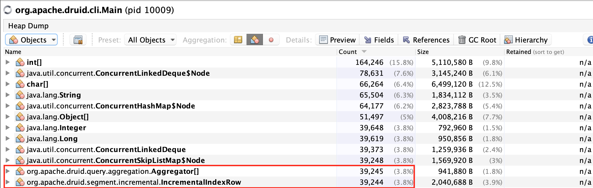

VisualVM을 통해 실행 중인 Peon의 Heap Dump를 떠보면, 위와 같이 `IncrementalIndexRow`가 39,244개, `Aggregator[]`가 39,245개(왜 1개가 늘었는지는 모르겠음..)가 있는 것을 확인할 수 있다.

### Roll-up을 적용한 경우

Roll-up을 적용한 경우 `RollupFactsHolder`에 유지되는 Dimension Set(`IncrementalIndexRow`)과 `Aggregator[]`의 갯수가 유일한 Dimension Set들의 갯수와 동일할 것이다.

위의 Roll-up이 적용되지 않은 Datasource에서 유일한 Dimension Set의 갯수가 몇 개인지 확인해보자.

```
select COUNT(*) FROM (SELECT channel, cityName, countryName, user FROM "wikiticker-nonrollup" GROUP BY channel, cityName, countryName, user)
```

총 10,804 개의 유일한 Dimension Set이 존재하는 것을 확인할 수 있다.

그렇다면 Roll-up(Query Gran: 1DAY)을 적용했을 때, 전체 Row 수가 10,804개가 만들어지고, `IncrementalIndexRow`와 `Aggregator[]`의 갯수 또한 10,804개가 되어야 할 것이다.

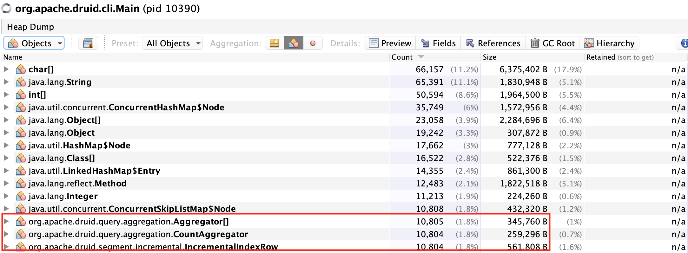

예상한대로 10,804개의 `IncrementalIndexRow`와 `Aggregator[]`가 생성된 것을 확인할 수 있었다.

## 결론

Druid에서 Datasource를 만들 때는 조회 목적을 고려하여 Dimension을 유지해야 한다.

사용하지 않는 Dimension임에도 유지하는 경우 Roll-up되는 비율도 줄어들 뿐만 아니라, 데이터 유지에 필요한 Heap 메모리나 데이터 Aggregation 속도(데이터 양에 비례) 또한 낮아지기 때문이다.