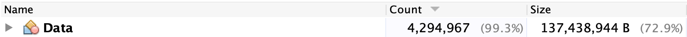
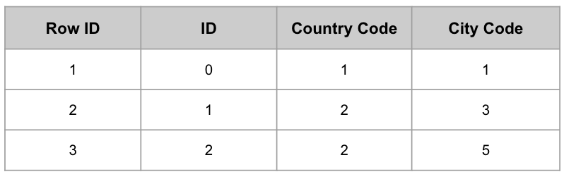
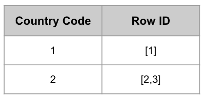
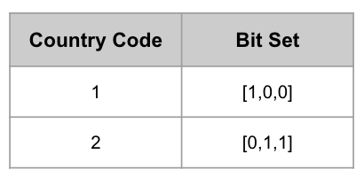

# 개요

Druid에서는 데이터 필터 속도 최적화와 저장 공간 절약을 위해 내부적으로 Bitmap Index를 사용한다. 

아래와 같은 스키마를 가진 데이터셋(테이블)이 존재한다고 가정해보자.

* ID: Long
* Country Code: Integer
* City Code: Integer

특정 조건에 일치하는 데이터를 찾기 위해 우리는 아래와 같은 쿼리들을 주로 수행한다.

**CountryCode로 ID 조회하기**
```
SELECT ID FROM TABLE WHERE CountryCode=3
```

**CountryCode와 CityCode를 통해 ID 조회하기**
```
SELECT ID FROM TABLE WHERE (CountryCode=3 AND CityCode = 4) OR CityCode=1
```

위의 기능을 수행하는 일반적인 자바 코드를 작성해보고, Bitmap Index를 적용한 코드와 얼마나 차이가 발생하는지 비교하도록 한다. 

## 데이터와 인터페이스 정의

위 데이터와 필터를 수행하는 클래스를 아래와 같이 정의한다.

**Data 클래스**

위 스키마를 표현하는 `Data` 클래스를 아래와 같이 작성한다.


public class Data {
  long id;
  int countryCode;
  int cityCode;

  public Data(long id, int countryCode, int cityCode) {
    this.id = id;
    this.countryCode = countryCode;
    this.cityCode = cityCode;
  }
  
  //getter 생략


**Filter 인터페이스**

위 데이터셋에 대해 `CountryCode`와 `CityCode`로 필터링을 수행하는 `IFilter` 인터페이스를 아래와 같이 작성한다.


import java.util.List;

public interface IFilter {

  long[] filterByCountryCode(int countryCode);

  long[] filterByCountryAndCityCode(int countryCode, int cityCode);

}


# for loop을 통해 접근하기

위의 요구사항을 만족하기 위해 가장 간단하게 접근 가능한 방법은 for loop을 사용하는 방법이다. for loop을 통해 데이터셋에 대해 필터 조건을 수행하는 코드를 작성해보자.


import java.util.*;

public class ForFilter implements IFilter {
  private List<Data> dataList = new ArrayList<>();

  public void add(Data data) {
    this.dataList.add(data);
  }

  @Override
  public long[] filterByCountryCode(int countryCode) {
    List<Long> filteredIdList = new ArrayList<>();

    for (Data data : dataList) {
      if (data.getCountryCode() == countryCode)
        filteredIdList.add(data.getId());
    }

    long[] ret = new long[filteredIdList.size()];
    for (int i = 0; i < filteredIdList.size(); i++)
      ret[i] = filteredIdList.get(i);
    return ret;
  }

  @Override
  public long[] filterByCountryAndCityOrCityCode(int countryCode, int cityCode1, int cityCode2) {
    Set<Long> resultSet = new HashSet<>();

    for (Data data : dataList) {
      //첫번째 조건에 일치하는 데이터 필터링
      if (data.getCountryCode() == countryCode && data.getCityCode() == cityCode1)
        resultSet.add(data.getId());
      //두번째 조건에 일치하는 데이터 필터링
      if (data.getCityCode() == cityCode2)
        resultSet.add(data.getId());
    }

    long[] ret = new long[resultSet.size()];
    Iterator<Long> iter = resultSet.iterator();
    int id = 0;
    while (iter.hasNext())
      ret[id++] = iter.next();
    return ret;
  }
}



## 성능 측정

데이터의 입력은 O(1), 조회는 O(N)의 시간 복잡도를 가질 것이다. 아래와 같은 테스트코드를 통해 실제 성능을 테스트해보았다.


import org.junit.Before;
import org.junit.Test;

public class FilterTest {

  private IFilter filter = new ForFilter();
  private int[] countryCodes = new int[]{1, 2, 3, 4, 5, 6, 7, 8, 9, 10};
  private int[] cityCodes = new int[]{1, 2, 3, 4, 5, 6, 7, 8, 9, 10};

  @Before
  public void setUp() {
    int dataSize = Integer.MAX_VALUE / 500;
    for (int i = 0; i < dataSize; i++)
      filter.add(new Data(i, countryCodes[i % 10], cityCodes[i % 10]));
    System.out.println(String.format("Data size: %d.", dataSize));
  }

  @Test
  public void testFilterIdByCountryCode() {
    long startTime = System.currentTimeMillis();

    for (int i = 0; i < countryCodes.length; i++)
      System.out.println(String.format("Country Code: %d, Data size: %d", countryCodes[i], filter.filterByCountryCode(countryCodes[i]).length));

    long endTime = System.currentTimeMillis();
    System.out.println(String.format("Elapsed time: %d millisecond.", endTime - startTime));
  }

  @Test
  public void testFilterIdByCountryAndCityOrCityCode() {
    long startTime = System.currentTimeMillis();

    for (int i = 0; i < cityCodes.length; i++) {
      int countryCode = countryCodes[i % 10];
      int cityCode1 = cityCodes[i];
      int cityCode2 = cityCodes[9 - i];
      System.out.println(String.format("Country Code: %d, City Code1: %d, City Code2: %d.", countryCode, cityCode1, cityCode2));
      System.out.println(String.format("Data size: %d.", filter.filterByCountryAndCityOrCityCode(countryCode, cityCode1, cityCode2).length));
    }

    long endTime = System.currentTimeMillis();
    System.out.println(String.format("Elapsed time: %d millisecond.", endTime - startTime));
  }
}


두 메서드에 대해 아래와 같은 결과를 얻어낼 수 있었다.

* `filterByCountryCode`: 372 millisecond
* `filterByCountryAndCityOrCityCode`: 2350 millisecond

또한 아래와 같이 4,294,967개의 `Data` 객체가 137,438,944Byte를 점유하고 있는 것을 확인할 수 있었다.



`Data` 객체는 `int`형 필드 2개(4byte * 2 = 8byte)와 `long`형 필드 1개(8byte)에 부가적인 크기를 합쳐 32byte로 구성되고, 객체의 수가 4,294,957개이기 때문에 137,438,944byte(약 134MB)가 되는 것이다.

# Bitmap Index로 접근하기

## Index

위의 for loop를 통한 접근에서 사용한 `Data` 객체 리스트를 표로 표현해보면 아래와 같을 것이다.



위와 같은 구성에서 "Country Code가 2인 Row의 ID 값은 무엇인가?"라는 질문을 했을 때, 우리는 모든 Row를 순회하여 찾을 수 밖에 없다. 저장 시 데이터의 묶음인 Row 기준으로 저장했었기 때문이다.

발상을 바꾸어 "어떤 값을 가지는 데이터는 몇 번째 데이터이다"라는 방식으로 저장해보면 어떨까?



CountryCode 값에 따라 어떤 Row에 속해있는지를 저장해놓았다. "Country Code가 2인 Row ID의 값은 무엇인가?"라는 질문에 O(1)만에 응답할 수 있다.

이렇게 특정 컬럼의 값을 기준으로 자신이 속한 데이터의 위치를 저장해놓고 조회할 수 있도록 하는 방식을 인덱스(Index)라고 한다.

## AND, OR 등의 연산

Index를 이용하여 특정 조건을 만족하는 데이터는 빠르게 찾을 수 있었다. 만일 조건이 1개가 아닌 여러개일 경우(AND, OR 등) 어떻게 처리해야 효율적으로 처리할 수 있을까?

가장 쉽게 생각할 수 있는 자료구조는 `Set` 일 것이다. AND 연산의 경우 두 `Set`의 교집합을 찾으면 되고, OR 연산의 경우 두 `Set`의 합집합을 찾으면 된다.


@Test
public void testAndOrInSet() {
  Set<Integer> aSet = new LinkedHashSet<>(Arrays.asList(1, 2, 3)), bSet = new HashSet<>(Arrays.asList(2, 3, 4));

  //AND 연산 수행하기
  Set<Integer> andSet = new HashSet<>();
  for (int val : aSet) {
    if (bSet.contains(val))
      andSet.add(val);
  }

  //OR 연산 수행하기
  Set<Integer> orSet = new HashSet<>();
  orSet.addAll(aSet);
  orSet.addAll(bSet);

  Set<Integer> andSetAnswer = new HashSet<>(Arrays.asList(2,3));
  Set<Integer> orSetAnswer = new HashSet<>(Arrays.asList(1,2,3,4));
  Assert.assertEquals(andSetAnswer, andSet);
  Assert.assertEquals(orSetAnswer, orSet);
}


보다 쉽고 빠르게 처리하기 위해서는 비트 연산을 사용하면 된다. 위에서 A Set과 B Set의 데이터는 각각 `\[1, 2, 3\]`과 `\[2, 3, 4\]` 였다. 이를 4bit로 표현해보면 다음과 같다.

* A Set: `\[1, 1, 1, 0\]`
* B Set: `\[0, 1, 1, 1\]`

이를 다시 `int` 형 데이터의 하위 4bit로 표현해보면 각각 14와 7을 가지게 될 것이고, 이 숫자에 대해 AND와 OR 연산을 수행한 뒤의 하위 4bit가 결과로 표현될 것이다.


@Test
public void testAndOrInBit() {
  //데이터는 int의 하위 4비트만 이용하여 표현
  int aBits = 14;// 00000000 00000000 00000000 00001110
  int bBits = 7;// 00000000 00000000 00000000 00000111

  int andResult = aBits & bBits;
  int orResult = aBits | bBits;

  Set<Integer> andSet = new HashSet<>(), orSet = new HashSet<>();

  //Shift 연산을 통해 결과인 하위 4bit를 Set 자료구조에 넣는다.
  int idx = 4;
  while(idx > 0){
    if(andResult % 2 == 1)
      andSet.add(idx);
    andResult = andResult >> 1;
    idx--;
  }

  idx = 4;
  while(idx > 0){
    if(orResult % 2 == 1)
      orSet.add(idx);
    orResult = orResult >> 1;
    idx--;
  }

  Set<Integer> andSetAnswer = new HashSet<>(Arrays.asList(2,3));
  Set<Integer> orSetAnswer = new HashSet<>(Arrays.asList(1,2,3,4));
  Assert.assertEquals(andSetAnswer, andSet);
  Assert.assertEquals(orSetAnswer, orSet);
}


위의 Set을 통한 연산의 경우 54000 nano seconds가 소요되었지만, 아래 Bit 연산을 이용하면 570 nano seconds 밖에 소요되지 않았다.(결과를 Set에 넣는 것 제외)

## 그래서 Bitmap Index란?

Bitmap Index는 Bit를 통해 Index를 구성하는 방법으로 데이터를 빠르게 필터링하고, AND, OR 등의 비트 연산도 빠르게 수행할 수 있도록 한다.

위에서 Country Code를 기준으로 Index를 표현했던 그림을 Bitmap Index로 표현하면 아래와 같다.



Country Code 컬럼에 등장하는 모든 유일 값 별로 BitSet을 가지고 있고, 이 BitSet의 길이는 Row 수와 동일하다. Row 수가 200개이고 유일한 Country Code의 갯수가 10개인 경우 각 BitSet의 길이는 10이고, Country Code가 가진 모든 BitSet의 크기는 10 * 200 = 2000bit가 될 것이다. 8bit = 1byte이기 때문에 Country Code에 관련된 데이터를 표현하는데 250byte 밖에 사용하지 않는다.

## Bitmap Index로 구현한 `Filter`

Java에는 `BitSet`이라는 자료구조가 존재한다. 이는 Bit로 구성된 Vector를 표현하는 자료구조이다. 이를 통해 Filter를 구현해보았다.


import java.util.*;

public class BitmapFilter implements IFilter {

  private List<Long> idList = new ArrayList<>();
  private Map<Integer, BitSet> countryCodeBitSetMap = new HashMap<>();
  private Map<Integer, BitSet> cityCodeBitSetMap = new HashMap<>();
  private int dataSize = 0;

  public void add(Data data) {
    long id = data.getId();
    int countryCode = data.getCountryCode();
    int cityCode = data.getCityCode();
    idList.add(id);

    if (countryCodeBitSetMap.containsKey(countryCode))
      countryCodeBitSetMap.get(countryCode).set(dataSize, true);
    else {
      BitSet bitSet = new BitSet();
      bitSet.set(dataSize, true);
      countryCodeBitSetMap.put(countryCode, bitSet);
    }

    if (cityCodeBitSetMap.containsKey(cityCode))
      cityCodeBitSetMap.get(cityCode).set(dataSize, true);
    else {
      BitSet bitSet = new BitSet();
      bitSet.set(dataSize, true);
      cityCodeBitSetMap.put(cityCode, bitSet);
    }

    dataSize++;
  }

  @Override
  public long[] filterByCountryCode(int countryCode) {
    BitSet bitSet = countryCodeBitSetMap.get(countryCode);

    long[] ret = new long[bitSet.cardinality()];
    int idx = 0;
    for (int i = bitSet.nextSetBit(0); i >= 0; i = bitSet.nextSetBit(i + 1)) {
      ret[idx++] = i;
      if(i == Integer.MAX_VALUE)
        break;
    }
    return ret;
  }

  @Override
  public long[] filterByCountryAndCityOrCityCode(int countryCode, int cityCode1, int cityCode2) {
    BitSet countryCodeMatches = countryCodeBitSetMap.get(countryCode);
    BitSet cityCode1Matches = cityCodeBitSetMap.get(cityCode1);
    BitSet cityCode2Matches = cityCodeBitSetMap.get(cityCode2);

    BitSet resultBitSet = BitSet.valueOf(countryCodeMatches.toLongArray());
    resultBitSet.and(cityCode1Matches);
    resultBitSet.or(cityCode2Matches);


    long[] ret = new long[resultBitSet.cardinality()];
    int idx = 0;
    for (int i = resultBitSet.nextSetBit(0); i >= 0; i = resultBitSet.nextSetBit(i + 1)) {
      ret[idx++] = i;
      if (i == Integer.MAX_VALUE) {
        break; // or (i+1) would overflow
      }
    }
    return ret;
  }
}


## 성능 측정

시간복잡도는 `ForFilter`와 동일하게 데이터의 입력은 O(1), 조회는 O(N)를 가질 것이다. 성능 테스트는 `FilterTest`의 `IFilter` 객체 초기화를 `BitmapFilter`로 바꾸어 수행하였다.

두 메서드에 대해 아래와 같은 결과를 얻어낼 수 있었다.

* `filterByCountryCode`: 70 millisecond
* `filterByCountryAndCityOrCityCode`: 140 millisecond

또한 아래와 같이 26개의 `BitSet` 객체가 754Byte를 점유하고 있는 것을 확인할 수 있었다.


다만 BitSet 내부적으로 `long` 타입의 배열로 Bit Word들을 유지하고 있기 때문에 각 BitSet 별로 1,048,600byte를 사용하고 있었기 때문에, 총 26개의 BitSet이 20,972,000byte의 공간을 점유하고 있는 것을 확인하였다.


# 정리

데이터의 필터와 AND, OR 등의 연산에 최적화 되어 있는 Bitmap Index에 대해서 살펴보았다.

Druid에서도 OnHeap 공간을 사용하는 Realtime Task에서는 `BitSet` 클래스를 Wrapping 하여 `org.apache.druid.collections.bitmap.WrappedBitSetBitmap`이라는 것을 구현해 사용하고 있다.

다만 더 많은 최적화(저장 공간 최적화, Off-Heap을 사용한 Bitmap 연산)를 수행하기 위해 Historical Node에서는 Off Heap 기반의 Concise Bitmap이나 Roaring Bitmap을 사용하고 있다. 

이는 다음 기회에 더 자세히 알아볼 예정이다.