> 이 글은 [Coursera - Cloud Computing Concepts, Part 1](https://www.coursera.org/learn/cloud-computing)을 참고하여 작성하였습니다.

# 개요

스트리밍 애플리케이션은 매우 긴 시간 동안 수행되며 **내부적으로 상태를 가지고 있다**. 예를 들어 아래와 같이 (사용자, 페이지 체류 시간)이 입력으로 들어오고, 평균 사용자 체류 시간을 계산하는 애플리케이션이 있다고 가정하자.

```
Source -> Task(평균 사용자 체류 시간 계산)
```

* Source: 입력 소스로부터 데이터를 가져온다.
* Task: 사용자 수와 체류 시간을 누적(In-Memory)하며 이 값을 통해 평균 사용자 체류 시간을 계산한다.

시스템 오류로 인해 위 애플리케이션이 재시작된다면 어떻게 될까? Task에서 사용하는 누적 사용자 수와 누적 페이지 체류 시간은 메모리에 있었기 때문에 이 정보는 유실되고 **처음부터 모든 데이터를 다시 처리**해야할 것이다.

이러한 문제를 해결하기 위해 Checkpointing이라는 기술을 사용한다. Checkpointing은 특정 시점의 애플리케이션 상태를 저장한다. 이후 오류로 인해 애플리케이션이 재시작된다면, **이전에 저장해둔 Checkpoint로부터 특정 시점의 애플리케이션의 상태를 불러와 해당 시점부터 재처리**를 수행할 수 있게 된다.

위의 예제에서 특정 시점의 Checkpoint를 저장한다면 아래와 같은 데이터들이 저장될 것이다.

* Source: 현재까지 소비한 메시지의 Offset 번호
* Task: 현재까지의 누적 사용자 수, 누적 체류 시간

예를 들어 100번째 데이터까지 처리한 상태가 Checkpointing되어 아래와 같이 저장되어 있다고 하자.

```
{
  "source":{"offset":101},
  "task":{"users":100, "times":100000}
}
```

이후 120번째 데이터를 처리하던 중 오류가 발생하는 경우 1번째 데이터부터 처리할 필요 없이 위의 Checkpoint 정보를 이용하여 101번째 데이터부터 처리를 수행하면 된다.

대부분의 스트리밍 엔진은 Checkpointing 기능을 제공하고 있으며, Flink 또한 이를 제공하고 있다. 이 글에서는 Flink의 Checkpointing의 기반이 되는 Chandy-Lamport Global Snapshot Algorithm에 대해 알아본다.

# Global Snapshot Algorithm

Chandy-Lamport Global Snapshot Algorithm에 대해 알기 위해서는 Global Snapshot에 대한 이해가 선행되어야 한다.

분산 시스템 환경에서는 여러 개의 프로세스(Process)와 이를 연결하는 채널(Channel)이 존재한다. Global Snapshot은 시스템을 구성하는 프로세스와 채널의 상태를 기록하는 것이다. 그렇다면 언제 Global Snapshot을 기록해야 할까?

1. 시간 기반 Global Snapshot

정해진 시간에 Global Snapshot을 남기는 방법이다. 얼핏 들어서는 성공할 것 같지만, 일부 장비에 설정된 시간이 틀어지거나 제시간에 상태 저장이 되지 않은 경우 데이터 불일치가 발생할 수 있다.

2. 이벤트 발생(Causality) 기반 Global Snapshot

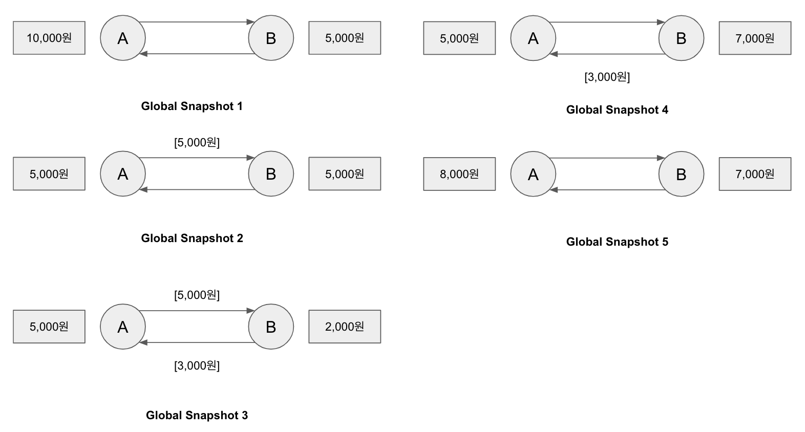

프로세스에서의 이벤트가 발생해서 상태가 바뀔 때마다 Global Snapshot을 남기는 방법이다. 위의 그림에서 A와 B 프로세스가 서로 돈을 보내고 받을 때마다 Global Snapshot이 생성되는 것을 확인할 수 있다.

# Chandy-Lamport Global Snapshot Algorithm

Chandy-Lamport Global Snapshot Algorithm(이후 Chandy-Lamport Algorithm으로 줄임)은 Causality 기반의 Global Snapshot 중 하나이다. Chandy-Lamport Algorithm이 어떻게 동작하는지 알아보도록 한다. 

## System Model

* System에는 N개의 프로세스가 존재한다.
* 각 프로세스는 단방향 채널 2개로 연결되어 있다. 즉 Pi, Pj가 있으면, Pi -> Pj로 향하는 채널 Cij와 Pj -> Pi로 향하는 채널 Cji가 존재한다.
* 채널에 들어온 메시지는 FIFO(First In, First Out)로 처리된다.

## Requirements

* Snapshot 과정이 애플리케이션의 동작이나 메시지의 전송/수신을 방해해서는 안된다. 즉, Snapshot을 뜨는 동안에도 애플리케이션은 정상적으로 동작해야 한다.
* 각 프로세스는 자신의 상태를 기록할 수 있어야 한다.
* 상태는 분산 시스템 방식으로 저장되어야 한다.(Centralized 한 처리를 하지 않는다는 의미)
* 아무 프로세스나 Snapshot 생성의 시작을 유발할 수 있다.

## Algorithm

Algorithm에 참여하는 프로세스 중 최초로 Snapshot 생성을 유발한 Process를 Initiator라고 한다(N개의 Process가 존재할 때, 1개의 Initiator와 N-1개의 Non-Initiator가 존재).

Initiator와 Non-Initator 각각의 기준으로 알고리즘의 수행 방식을 설명한다.

### Initiator

Initiator 프로세스는 Pi, Non-Initiator 프로세스는 Pj로 간주한다.

1. Initiator인 프로세스 Pi는 자신의 상태를 기록한다.
2. Marker라는 특별한 종류의 메시지를 만들어 1 ~ N까지의 프로세스에게 전달한다.(자기 자신인 i에게는 보내지 않는다. 즉, N-1개의 프로세스에 전달)
3. Pj(j: i를 제외한 1 ~ N)로부터 들어오는 채널들(Cji)의 메시지를 기록한다.

### Non-Initiator

Non-Initiator 프로세스는 Marker 메시지를 받은적이 있는지 없는지에 따라 동작이 나뉜다.

#### Marker 메시지를 처음 받은 경우

Non-Initiator 프로세스는 Pi, Marker 메시지를 보낸 프로세스는 Pk로 간주한다.

1. Pi는 자신의 상태를 기록한다.
2. Channelki의 상태를 EMPTY로 초기화한다.
3. Pj(j: i를 제외한 1 ~ N)에게 Marker 메시지를 전달한다.
4. Pj(j: i와 k를 제외한 1 ~ N)로부터 들어오는 채널들(Cji)의 메시지를 기록한다.

#### Marker 메시지를 받은 적이 있는 경우

Non-Initiator 프로세스는 Pi, Marker 메시지를 보낸 프로세스는 Pk로 간주한다.

Ckj로 들어온 메시지들을 계속해서 추가하며 기록한다.

### Initiator와 Non-Initiator를 합쳐서 보기

두 개의 프로세스(A, B)와 채널(Cab, Cba)이 있다고 가정하고 Chandy-Lamport 알고리즘을 시뮬레이션 해보자.

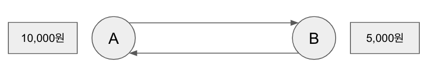

최초의 상태는 위와 같이 프로세스 A가 10,000원, B가 5,000원을 가지고 있는 상태에서 시작한다.

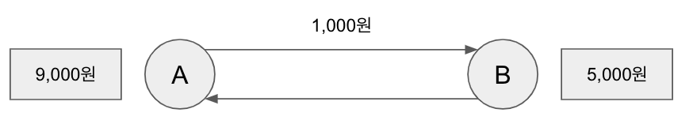

A가 1,000원을 B에게 송금한다. A는 9,000원이 남는다.

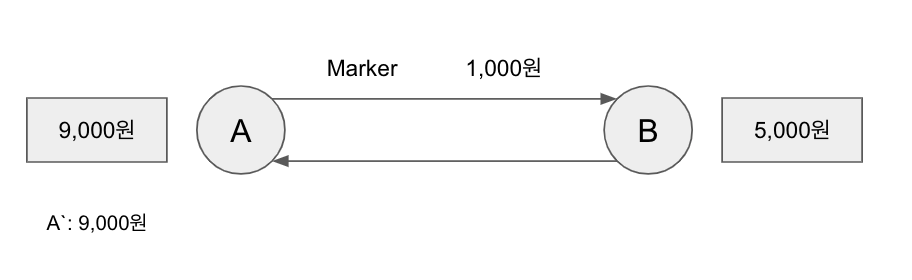

A가 Initiator가 되어 Checkpointing이 시작된다. A는 자신의 상태인 9,000원을 A`에 저장한다. 또한 Marker 메시지를 Cab 채널을 통해 내보낸다.

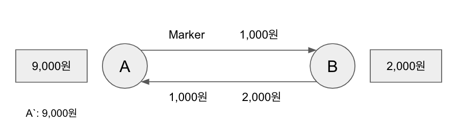

B는 A로 1,000원, 2,000원을 연이어 송금한다. B의 상태는 2,000원이 된다.

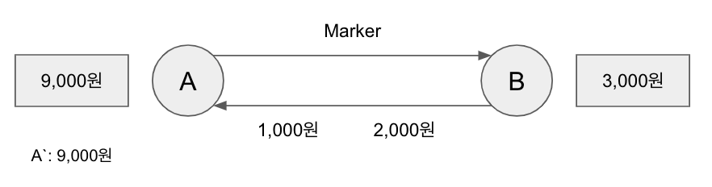

A가 송금한 1,000원이 B에게 도착하여 B의 상태는 3,000원이 된다.

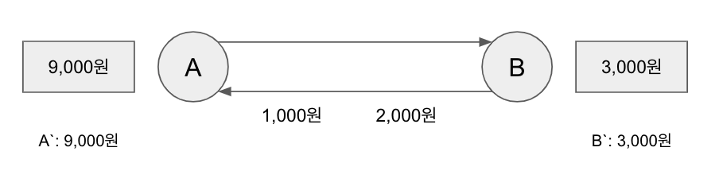

이후 A가 도착한 Marker가 도착하여 B에 도착하여 B는 자신의 상태인 3,000원을 B`에 저장한다.

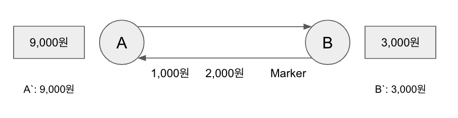

이후 B는 A에게 다시 Marker 메시지를 전달한다. 추가로 B에게 들어오는 채널들의 메시지를 기록해야 하지만, 여기서는 B를 제외한 프로세스가 A 밖에 존재하지 않고, A 에게는 이미 메시지를 수신하였기 때문에 채널 메시지를 기록하지 않는다.

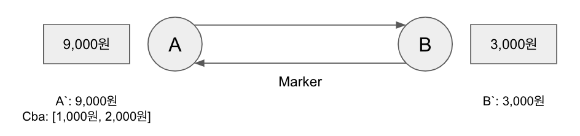

B가 A에게 전송한 1,000원, 2,000원이 채널 Cab를 통해 A에게 도착한다. A의 상태는 12,000원으로 바뀌고, 채널 Cab의 상태를 \[1,000원, 2,000원\]으로 기록한다.

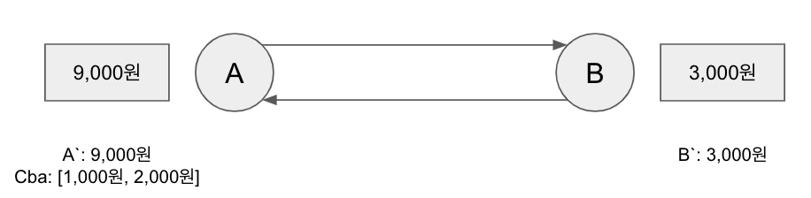

B가 A에게 보낸 Marker가 A에게 도착하여 Cab의 상태 기록이 종료된다. 이로써 Checkpointing이 완료된다.

### 어떻게 복구되는가?

우리가 Checkpointing을 통해 저장한 정보는 아래와 같다.

* A`: 9,000원
* B`: 3,000원
* Cab: \[\]
* Cba: \[1,000원, 2,000원\]

만일 위 Checkpointing 이후 오류가 발생하여 애플리케이션이 종료되어 다시 시작해야한다고 가정해보자.

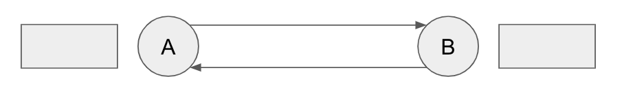

프로세스 A, B와 채널 Cab, Cba가 구성된다. A와 B의 상태와 채널에는 아무것도 없다.

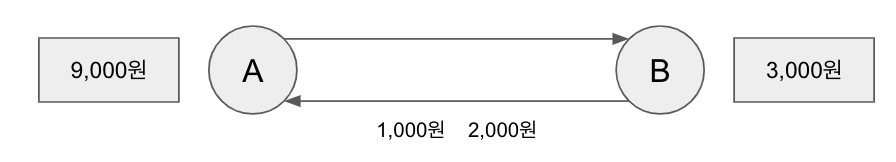

Checkpointing 정보를 이용하여 프로세스 A의 상태를 9,000원, B의 상태를 3,000원으로 구성한다.

또한 채널 정보도 Cab와 Cba를 통해 구성하면 Checkpointing 당시의 상태로 복구된다.

