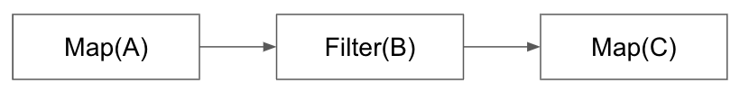

# 개요

Flink Job의 Operator 간의 데이터 교환이 어떻게 이루어지는지 알아보고, 유의해야 할 옵션은 어떤 것이 있는지 알아보도록 한다.

## Flink의 Input과 Ouptut

위와 같이 3개의 Operator가 연결되어 있다고 생각해보자. 한 Operator의 출력 데이터는 다른 Operator의 입력 데이터로 사용된다. 그래프 관점에서는 Operator는 Vertex, Operator 사이의 단방향 화살표를 Edge로 표현한다.

Flink에서는 Operator(Vertex)를 `Input`, 데이터 교환 채널(Edge)을 `Output`으로 추상화하여 사용한다.

### Input

Flink에서 하나의 입력을 처리하는 Operator는 `Input` 인터페이스를 상속한다.


public interface Input<IN> {
    void processElement(StreamRecord<IN> element) throws Exception;

    void processWatermark(Watermark mark) throws Exception;

    void processLatencyMarker(LatencyMarker latencyMarker) throws Exception;

    void setKeyContextElement(StreamRecord<IN> record) throws Exception;
}


`Input`을 상속하는 `StreamMap`의 코드는 아래와 같다.


public class StreamMap<IN, OUT> extends AbstractUdfStreamOperator<OUT, MapFunction<IN, OUT>>
        implements OneInputStreamOperator<IN, OUT> {

    private static final long serialVersionUID = 1L;

    public StreamMap(MapFunction<IN, OUT> mapper) {
        super(mapper);
        chainingStrategy = ChainingStrategy.ALWAYS;
    }

    @Override
    public void processElement(StreamRecord<IN> element) throws Exception {
        output.collect(element.replace(userFunction.map(element.getValue())));
    }
}


`StreamMap`이 구현한 `OneInputStreamOperator`는 `Input`을 상속하기 때문에 결론적으로 `StreamMap`이 `Input`을 구현하는 구조가 된다.

모든 `Input`을 상속한 클래스들은 자신의 출력 결과를 다음 `Operator`(`Input`)에게 전달할 `Output`을 가지고 있다.

`Input`은 자신이 가지고 있는 사용자 함수(Function)으로 이전 출력에서 가져온 입력 데이터(`StreamRecord`)를 처리한 뒤, `Output`의 `collect`를 통해 다음 출력으로 내보내게 된다.

### Output

Flink에서 Operator가 처리한 데이터를 다음 Operator로 넘기는 역할은 `Output`이 처리한다.

이전 단계의 Operator가 자신이 처리한 데이터를 `Output`의 `collect`를 호출하여 전달하면, `Output`은 이 데이터를 자신이 가지고 있는 다음 `Operator` 객체의 `processElement`의 매개변수로 전달하여 데이터를 전달하는 과정을 거치게 된다.

Operator 간의 관계(1:1인가, 1:N인가)와 동일 OperatorChain에 속하는지의 여부에 따라 세가지 `Output`으로 나뉘게 된다.

* Operator 간의 관계가 1:1인 경우
  * 같은 OperatorChain에 속한 Operator 간 연결: `ChainingOutput`
  * 한 OperatorChain의 마지막 Operator와 다음 OperatorChain의 첫번째 Operator 간 연결: `RecordWriterOutput`
* Operator 간의 관계가 1:N인 경우: `BroadcastingOutputCollector`

당연한 이야기이지만 두 Operator가 동일한 Parallelism을 가지고 있더라도, `shuffle`이나 `disableChaining`을 호출하여 서로 다른 OperatorChain으로 분리되는 경우에는 `RecordWriterOutput`이 사용된다.

#### ChainingOutput

`ChainingOutput`은 동일한 OperatorChain에 속한 두 Operator 간(1:1)의 데이터 전달에 사용된다. 네트워크를 사용하지 않고 1:1 관계의 교환이기 때문에 구현이 매우 간단하다.

이전 Operator(`Input`)의 `processElement`에서 데이터를 호출한 뒤 `ChainingOutput`의 `collect`를 호출하면 데이터 전달이 진행된다. `collect`은 아래와 같이 구현되어 있다.


@Override
public void collect(StreamRecord<T> record) {
  if (this.outputTag != null) {
    // we are not responsible for emitting to the main output.
    return;
  }

  pushToOperator(record);
}


이전 Operator의 출력 데이터(record)를 매개변수로 `pushToOperator`를 호출하고 있다.


protected <X> void pushToOperator(StreamRecord<X> record) {
  try {
    // we know that the given outputTag matches our OutputTag so the record
    // must be of the type that our operator expects.
    @SuppressWarnings("unchecked")
    StreamRecord<T> castRecord = (StreamRecord<T>) record;

    numRecordsIn.inc();
    input.setKeyContextElement(castRecord);
    input.processElement(castRecord);
  } catch (Exception e) {
    throw new ExceptionInChainedOperatorException(e);
  }
}


전달받은 record를 자신이 가지고 있는 `input`(다음 Operator)의 `processElement`를 호출하여 다음 Operator로 데이터를 전달하게 된다.

#### RecordWriterOutput

`ChainingOutput`은 한 OperatorChain의 마지막 Operator와 다음 OperatorChain의 첫번째 Operator 간의 데이터 교환에 사용된다. 네트워크를 사용하며, `broadcast`를 사용했는지 아닌지 여부에 따라 실제로 다음 데이터로 전달하는 객체인 `RecordWriter` 종류가 달라지게 된다.

* `broadcast`를 사용하지 않은 경우
  * `ChannelSelectorRecordWriter`가 사용된다.
  *  Parallelism 설정과 `shuffle`, `rebalance`, `disableChaining` 호출에 따라 ChannelSelector의 타입이 달라지게 된다.
* `broadcast`를 사용하는 경우
  * `BroadcastRecordWriter`가 사용된다.

#### BroadcastingOutputCollector

하나의 Operator에서 2개 이상의 Operator로 데이터를 전달하는 경우에 사용된다.

내부적으로 Output 배열이 있어 각 Operator 간의 관계에 따라 `ChainingOutput`, `RecordWriterOutput`을 가지게 된다.

## 더 알아보기

### `pipeline.object-reuse` 옵션과 Output

[Flink Documentation - Config](https://ci.apache.org/projects/flink/flink-docs-release-1.12/deployment/config.html) 페이지에는 `pipeline.object-reuse` 옵션에 대한 설명이 존재한다.

When enabled objects that Flink internally uses for deserialization and passing data to user-code functions will be reused. Keep in mind that this can lead to bugs when the user-code function of an operation is not aware of this behaviour.

> `pipeline.object-reuse` 옵션을 사용하면 Flink는 User Function으로 전달하는 데이터를 재사용하게 된다.

`Output` 객체를 만들 때, 이 옵션의 활성 여부에 따라 다른 클래스의 `Output` 객체가 만들어진다. 같은 OperatorChain에 속하는 Operator를 연결하는 `Output`을 만들어내는 코드를 보자.


if (containingTask.getExecutionConfig().isObjectReuseEnabled()) {
  currentOperatorOutput = new ChainingOutput<>(operator, this, outputTag);
} else {
  TypeSerializer<IN> inSerializer =
    operatorConfig.getTypeSerializerIn1(userCodeClassloader);
  currentOperatorOutput =
    new CopyingChainingOutput<>(operator, inSerializer, outputTag, this);
}


`pipeline.object-reuse` 옵션이 활성화되어 있는 경우 초기화되는 객체가 `ChainingOutput` 타입이고, 활성화 되어 있지 않은 경우 `CopyingChainingOutput`인 것을 확인할 수 있다.

이 둘이 어떻게 다른지는 다음 Operator로 데이터를 전달하는 `pushToOperator` 구현을 보면 알 수 있다. `ChainingOutput`의 경우 아래와 같이 이전 Operator가 전달한 데이터를 별다른 변경 없이 다음 Operator로 전달하는 것을 볼 수 있다.


protected <X> void pushToOperator(StreamRecord<X> record) {
  try {
    // we know that the given outputTag matches our OutputTag so the record
    // must be of the type that our operator expects.
    @SuppressWarnings("unchecked")
    StreamRecord<T> castRecord = (StreamRecord<T>) record;

    numRecordsIn.inc();
    input.setKeyContextElement(castRecord);
    input.processElement(castRecord);
  } catch (Exception e) {
    throw new ExceptionInChainedOperatorException(e);
  }
}


그러나 `CopyingChainingOutput`의 경우 중간에 이전 Record를 Deep Copy하는 코드(`serializer.copy`)가 호출되어 원본이 아닌 복사된 객체를 다음 Operator로 전달하는 것을 볼 수 있다.


@Override
  protected <X> void pushToOperator(StreamRecord<X> record) {
    try {
      // we know that the given outputTag matches our OutputTag so the record
      // must be of the type that our operator (and Serializer) expects.
      @SuppressWarnings("unchecked")
      StreamRecord<T> castRecord = (StreamRecord<T>) record;

      numRecordsIn.inc();
      StreamRecord<T> copy = castRecord.copy(serializer.copy(castRecord.getValue()));
      input.setKeyContextElement(copy);
      input.processElement(copy);
  ...
}


아마 이 옵션은 사용자가 자체 Thread를 만들어 이미 전달한 Record를 바꾸는 경우 이후 Pipeline에서 발생할 수 있는 문제를 방지하기 위해 만들었을 것으로 예상한다.

이 옵션이 켜져 있으면 Operator 갯수 - 1번의 데이터 복사가 반복해서 발생하기 떄문에 위와 같은 상황이 아니라면 false로 처리하는 편이 낫다(default는 true이다).

### `execution.buffer-timeout`과 Output

[Flink Documentation - Config](https://ci.apache.org/projects/flink/flink-docs-release-1.12/deployment/config.html) 페이지에는 `execution.buffer-timeout` 옵션에 대한 설명이 존재한다.

The maximum time frequency (milliseconds) for the flushing of the output buffers. By default the output buffers flush frequently to provide low latency and to aid smooth developer experience. Setting the parameter can result in three logical modes:
A positive value triggers flushing periodically by that interval
0 triggers flushing after every record thus minimizing latency
-1 ms triggers flushing only when the output buffer is full thus maximizing throughput

> Output Buffer의 데이터를 얼마나 자주 Flush 할 것인지에 대한 내용이다. 이 값이 작으면 Latency가 줄어들지만 Throughput 또한 줄어들 수 있다.

이 옵션은 네트워크를 통해 데이터를 전달하는 `RecordWriter`에서 사용된다. `RecordWriter`의 생성자의 `timeout`값으로 전달되며, 이 값은 내부적으로 사용되는 `flushAlways`옵션과 `OutputFlusher`의 Flush 주기에 영향을 미친다.

우선 `flushAlways`는 `timeout`값이 0인 경우 true, 아닐 경우 false로 설정된다. 이전 Operator의 결과 데이터를 다음 Operator로 전달하는 `emit`의 코드는 아래와 같다.


protected void emit(T record, int targetSubpartition) throws IOException {
  checkErroneous();

  targetPartition.emitRecord(serializeRecord(serializer, record), targetSubpartition);

  if (flushAlways) {
    targetPartition.flush(targetSubpartition);
  }
}


전달해야하는 파티션(Operator)의 `emitRecord`를 통해 데이터를 전달한다. 그러나 이 과정에서는 내부 버퍼에만 데이터가 쌓일 뿐 Flush가 일어나지는 않는다. 이후 if문에서 `flushAlways` 여부에 따라 바로 Flush를 하는지 아닌지가 결정된다.

또한 `RecordWriter`에는 주기적으로 Buffer에 쌓인 데이터를 Flush하는 `OutputFlusher`가 존재한다. `OutputFlusher`의 `run` 구현은 아래와 같다.


public void run() {
  try {
    while (running) {
      try {
        Thread.sleep(timeout);
      } catch (InterruptedException e) {
        // propagate this if we are still running, because it should not happen
        // in that case
        if (running) {
          throw new Exception(e);
        }
      }

      // any errors here should let the thread come to a halt and be
      // recognized by the writer
      flushAll();
    }
  } catch (Throwable t) {
    notifyFlusherException(t);
  }
}


무한 루프 내에서 `timeout` 주기로 Thread가 Sleep하는 것을 확인할 수 있다. 이후 `flushAll` 호출을 통해 버퍼의 데이터를 Flush 하는 것을 확인할 수 있다.