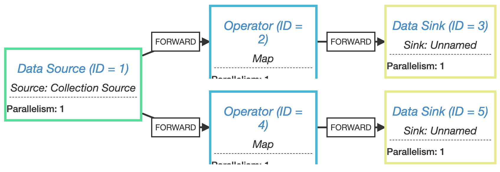

# 개요

[이전 글](https://leeyh0216.github.io/2021-03-25/flink_output)에서 `pipeline.object_reuse` 옵션에 대해 설명하였다. 이 옵션을 사용하면 안되는 경우에 대해서는 Flink 공식 문서에 나와 있지 않으며, 이전 글에서도 제대로 설명하지 못했다.

이번 글에서는 언제 이 옵션을 사용하면 안되는지와 그럼에도 불구하고 옵션을 적용하고 싶은 경우 우회하는 방법에 대해 알아보도록 한다.

## `pipeline.object_reuse`를 사용하면 안되는 경우



`pipeline.object_reuse`를 사용하면 안되는 경우는 같은 Operator Chain에서 한 Operator의 출력에 두 개 이상의 Operator가 연결되는 경우이다. 코드는 아래와 같다.


StreamExecutionEnvironment environment = StreamExecutionEnvironment.createLocalEnvironment();
environment.getConfig().enableObjectReuse();

DataStream<Data> input = environment.fromElements(new Data(1), new Data(2), new Data(3)).setParallelism(1);

input
  .map(d -> {
    d.v += 1;
    return d;
  }).setParallelism(1)
  .addSink(new SinkFunction<Data>() {
    @Override
    public void invoke(Data data, Context context) throws Exception {
      System.out.println(String.format("P1: %d", data.v));
    }
  }).setParallelism(1);

input
  .map(d -> {
    d.v += 10;
    return d;
  })
  .setParallelism(1)
  .addSink(new SinkFunction<Data>() {
    @Override
    public void invoke(Data data, Context context) throws Exception {
      System.out.println(String.format("P2: %d", data.v));
    }
  }).setParallelism(1);

environment.execute();


위 코드의 출력 결과는 아래와 같다.(출력 순서나 값은 실행 환경에 따라 바뀔 수 있다)

```
P1: 2
P2: 12
P1: 3
P2: 13
P1: 4
P2: 14
```

P1의 값들은 정상적으로 1씩 증가했으나, P2의 값들은 10이 아닌 11씩 증가한 것을 볼 수 있다. Object Reuse 옵션을 적용했기 때문에 P1과 P2의 작업들이 동일한 객체에 1과 10을 각각 더했기 때문에 위와 같이 출력되는 것이다.

내부적으로 Input Operator의 Output으로 `CopyingBroadcastingOutputCollector`가 사용된다. `CopyingBroadcastingOutputCollector`는 하나의 레코드를 여러 Operator에 전달할 때 사용한다.


@Override
public void collect(StreamRecord<T> record) {

  for (int i = 0; i < outputs.length - 1; i++) {
    Output<StreamRecord<T>> output = outputs[i];
    StreamRecord<T> shallowCopy = record.copy(record.getValue());
    output.collect(shallowCopy);
  }
  ...
}  


위 코드는 `CopyingBroadcastingOutputCollector`의 `collect` 메서드이다. 이전 Operator에 연결된 Operator들에게 데이터를 전달하기 위해 Output 객체(동일 OperatorChain에 있기 때문에 `ChainingOutput`)의 `collect` 함수를 호출한다. 이 때 `StreamRecord` 객체만 새로 만들 뿐 실제 값을 담고 있는 객체(`record.getValue()`)를 사용하고, `ChainingOutput`에서도 별다른 복사 과정 없이 그대로 다음 Operator의 `processElement`를 호출해버리기 때문에 문제가 발생하는 것이다.

## 그래도 성능을 위해 `pipeline.object_reuse`를 사용하고 싶다면?

만일 위와 같은 상황이더라도 Operator가 너무 많아 복사 비용이 부담될 수 있다. 이 경우 분기가 시작되는 `Operator`에 `disableChaining`이나 `rebalance`를 걸면 된다.

위 두 옵션을 적용해도 1개의 Operator가 다수의 Operator에게 동일한 데이터를 전달해야 하기 때문에 `CopyingBroadcastingOutputCollector`를 사용한다. 다만 Output이 `ChainingOutput`이 아닌 `ChannelSelectRecordWriter`로 변경된다. `ChannelSelectRecordWriter`는 데이터를 다음 Operator로 넘길 때 직렬화/역직렬화 과정을 거치기 때문에 실제로는 Deep Copy가 발생하게 된다.


protected void emit(T record, int targetSubpartition) throws IOException {
  checkErroneous();

  targetPartition.emitRecord(serializeRecord(serializer, record), targetSubpartition);

  if (flushAlways) {
    targetPartition.flush(targetSubpartition);
  }
}


위의 코드를 보면 `serializeRecord`를 호출하여 객체를 직렬화 하는 것을 확인할 수 있다.

# 정리

1개의 Operator가 2개 이상의 Operator와 연결되는 상황이 아니라면 부담없이 `pipeline.object_reuse`를 사용할 수 있다. 그러나 동일 OperatorChain에 속하는데 1개의 Operator가 2개 이상의 Operator와 연결되는 상황이라면 문제가 발생할 가능성이 매우 높기 때문에 해당 옵션을 사용하지 않거나 Operator Chain을 구성하지 않도록 하기를 권장한다.