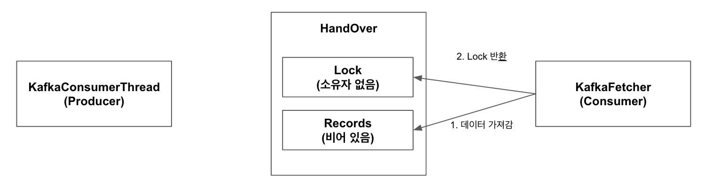

# 개요

Flink의 `FlinkKafkaConsumer`와 같은 High Level API를 사용하다보면 궁금해지는 점들이 있다.

* Kafka의 Consumer는 Pull 방식으로 데이터를 가져오는데, Flink에서는 얼마 정도의 간격으로 Pull을 수행할까?
* Source와 다른 Operator를 Chaining하면 Kafka로부터 데이터를 Pull할 때 해당 Operator Chain이 Blocking 될까?(즉, I/O와 Computing이 합쳐져 있을까, 분리되어 있을까?에 대한 질문)
* Kafka Transaction이나 발생하는 Exception 은 어떻게 처리할까?

이번 글에서는 Flink에서 Kafka로부터 어떻게 데이터를 가져오고, 이를 어떻게 Pipeline에 전달하는지 알아보도록 한다.

# Flink의 Kafka Consumer 동작 방식


Properties properties = new Properties();
properties.setProperty("bootstrap.servers", "localhost:9092");
properties.setProperty("group.id", "test");
DataStream<String> stream = env
	.addSource(new FlinkKafkaConsumer<>("topic", new SimpleStringSchema(), properties));


위의 코드는 Flink의 공식문서에서 제공하는 Kafka Source 사용 방법이다. 

`FlinkKafkaConsumer` 클래스 하나만 노출하여 단순해보이지만, 내부적으로 많은 클래스가 Flink와 Kafka Consumer 연동에 관여하고 있기 때문에 전체 구조를 파악한 뒤, 어떤 흐름으로 동작하는지를 알아보도록 한다.

## 사전 지식

### Flink의 `SourceFunction`

Flink에 Data Source를 연동하기 위해서는 `SourceFunction`(`ParallelSourceFunction`)을 구현해야 한다. Kafka 또한 `FlinkKafkaConsumer`(의 부모 클래스인 `FlinkKakfaConsumerBase`)가 이를 구현하고 있다.

`SourceFunction`을 상속받아 구현해야 하는 주요 메서드는 `run`과 `cancel`이 있다.

* `run`: Pipeline이 시작될 때 한번 호출되며, `cancel`이 호출되기 전까지 내부에서 Loop를 돌며 데이터를 만들어내야 한다.
* `cancel`: Pipeline이 종료될 때 호출되며, `run`에서 실행되고 있는 Loop를 멈춰야 하는 책임을 가진다.

Flink에서 제공하는 `run`과 `cancel`의 예제 코드는 다음과 같다.

**`run` 메서드**


public void run(SourceContext<T> ctx) {
  while (isRunning && count < 1000) {
    synchronized (ctx.getCheckpointLock()) {
      ctx.collect(count);
      count++;
    }
  }
}


Loop가 계속 돌 수 있는지 체크하는 `isRunning`을 체크하며 Loop를 돌고 있고, `run` 메서드 호출 시 매개변수로 전달받은 `SourceContext` 객체인 `ctx`의 `collect` 메서드를 통해 다음 Operator로 데이터를 전달하는 것을 확인할 수 있다.

또한 CheckPoint가 수행될 때(`synchronized`)는 데이터를 만들어내지 않는 것을 확인할 수 있다.(추후에 확인해봐야겠지만 이 때 Checkpoint Barrier가 전달되는 것으로 예상된다)

**`cancel` 메서드**


public void cancel() {
  isRunning = false;
}


`run` 메서드의 Loop에서 사용하는 `isRunning` 값을 `false`로 변경하므로써, `SourceFunction`의 동작을 멈추는 것을 확인할 수 있다.

## Architecture Overview

Flink의 Kafka Consumer를 구성하는 전반적인 클래스 다이어그램이다. 주요 클래스와 그 역할은 아래와 같다.

* `FlinkKafkaConsumerBase`: Flink의 `SourceFunction`을 구현하며, 실제 데이터를 `KafkaFetcher` 객체를 통해 전달받는다.
* `KafkaFetcher`: `KafkaConsumerThread`에서 전달받은 데이터를 `FlinkKafkaConsumerBase`에 전달한다.
* `KafkaConsumerThread`: `KafkaConsumer`를 통해 데이터 Pull을 수행하고, 이 데이터를 `KafkaFetcher`에게 전달한다.
* `Handover`: `KafkaConsuerThread`와 `KafkaFetcher`간의 데이터 교환을 위한 Buffer

## Workflow

### `FlinkKafkaConsumerBase`의 `run`

`FlinkKafkaConsumerBase`는 `ParallelSourceFunction`을 구현한 클래스로써, SourceFunction 관련 메서드들을 구현한다. 위의 사전 지식에서 서술한 것처럼 `run` 메서드에서 무한 루프를 돌며 Kafka에서 데이터를 Pull하고, 이 데이터를 `SourceContext` 객체의 `collect` 메서드를 호출하여 다음 Operator로 전달해야하는 의무를 가진다.


public void run(SourceContext<T> sourceContext) throws Exception {
  ... 초기화 코드
  this.kafkaFetcher =
                createFetcher(
                        sourceContext,
                        subscribedPartitionsToStartOffsets,
                        watermarkStrategy,
                        (StreamingRuntimeContext) getRuntimeContext(),
                        offsetCommitMode,
                        getRuntimeContext().getMetricGroup().addGroup(KAFKA_CONSUMER_METRICS_GROUP),
                        useMetrics);
  
  ...

  if (discoveryIntervalMillis == PARTITION_DISCOVERY_DISABLED) {
    kafkaFetcher.runFetchLoop();
  } else {
    runWithPartitionDiscovery();
  }
}


위의 코드를 보면 Kafka로부터 데이터를 Pull하거나, 데이터를 가져오는 Loop를 유지하는 코드는 보이지 않는다. 이는 Flink 관련 기능과 Kafka 관련 기능의 역할 분리를 위한 것으로 판단되며, `FlinkKafkaConsumerBase`는 Flink 관련 기능, `KafkaFetcher`는 Kafka 관련 기능으로 역할을 부여받은 것으로 보인다.

때문에 `FlinkKafkaConsumerBase`는 실제 데이터 Fetch를 수행하는 `KafkaFetcher` 객체를 초기화하고 실행(`runFetchLoop`)하는 역할만을 담당한다.

후술하겠지만 `KafkaFetcher`의 `runFetchLoop`는 내부적으로 무한 루프가 수행되는 Blocking 메서드이기 때문에, Pipeline이 종료되기 전까지 `FlinkKafkaConsumerBase`의 `run` 메서드 또한 종료되지 않는다(Blocking 된다).

### `KafkaFetcher`의 `runFetchLoop`

`KafkaFetcher`의 `runFetchLoop` 메서드 내부에 Loop 유지, Kafka로부터의 데이터 Pull, 다음 Operator에게 데이터 전달 등의 코드가 있을 것 같지만 그렇지 않다. `KafkaFetcher`는 Kafka로부터 데이터를 Pull하는 역할은 `KafkaConsumerThread`에게 위임하고, 자신은 Loop를 유지하며 `KafkaConsumerThread`로부터 전달받은 데이터를 다음 Operator에게 전달하는 역할만을 수행한다.

**`runFetchLoop` 메서드**


public void runFetchLoop() throws Exception {
  try {
    // kick off the actual Kafka consumer
    consumerThread.start();

    while (running) {
      final ConsumerRecords<byte[], byte[]> records = handover.pollNext();

      for (KafkaTopicPartitionState<T, TopicPartition> partition : subscribedPartitionStates()) {
        List<ConsumerRecord<byte[], byte[]>> partitionRecords = records.records(partition.getKafkaPartitionHandle());
        partitionConsumerRecordsHandler(partitionRecords, partition);
      }
    }
  } finally {
    consumerThread.shutdown();
  }

  try {
    consumerThread.join();
  } catch (InterruptedException e) {
    Thread.currentThread().interrupt();
  }
}


`runFetchLoop` 메서드가 실행된 후 첫번째 행동은 `KafkaConsumerThread`를 실행하는 것이다. `KafkaConsumerThread`는 SourceFunction이 수행되는 Thread와 별도의 Thread로 실행되며, Background에서 Kafka Broker로부터 데이터를 Pull하고 이를 `KafkaFetcher`에게 전달하는 역할을 수행한다.

`KafkaFetcher`는 Loop 내에서 `Handover` 객체의 `pollNext` 메서드를 수행한다. `Handover`는 `KafkaConsumerThread`가 `KafkaFetcher`에게 데이터를 전달하기 위한 Buffer 역할을 수행한다. `Handover`의 `pollNext` 메서드는 `KafkaConsumerThread`가 Kafka로부터 받아온 데이터가 있을 때 반환되는 Blocking 메서드이다.

`pollNext`가 반환한 데이터는 `partitionConsumerRecordsHandler` 메서드의 매개변수로 전달되며, `partitionConsumerRecordsHandler` 내에서 Deserialize -> Assign Timestamp -> Emit 과정을 거쳐 다음 Operator에게 전달된다.

### `KafkaConsumerThread`의 역할

위의 `KafkaFetcher`는 `runFetchLoop`의 첫번째 라인에서 `KafkaConsumerThread`를 실행했다.

위에서도 서술했듯 `KafkaConsumerThread`는 SourceFunction과 별도의 Thread로 동작하며, 내부적으로 무한 루프를 돌며 Kafka Broker로부터 데이터를 Pull하고, 받아온 데이터를 `Handover` 객체를 통해 `KafkaFetcher`에게 전달한다.

**`KafkaConsumerThread`의 `run` 코드 일부**


@Override
public void run() {
  ... 생략

  while (running) {
    if (records == null) {
      try {
        records = consumer.poll(pollTimeout);
      } catch (WakeupException we) {
        continue;
      }
    }

    try {
      handover.produce(records);
      records = null;
    } catch (Handover.WakeupException e) {
      // fall through the loop
  }
  ...생략
}


무한 루프가 존재하고, 내부에서 `KafkaConsumer` 객체의 `poll` 메서드를 호출하여 Kafka Broker로부터 데이터를 Pull 한 뒤, `Handover`의 `produce` 메서드를 호출하여 `KafkaFetcher`에게 데이터를 전달하는 것을 볼 수 있다.

재미있는 점은 데이터 Pull 과정에서의 예외 처리 방식이다. `records` 객체를 통해 Kafka로부터의 Poll에서의 예외와 Handover의 produce의 예외를 모두 처리하는데, 로직은 다음과 같다.

* `records`가 null인 경우
  * 정상인 경우: 이전 Step에서 Kafka Broker로부터 정상적으로 데이터를 받아오고, 이를 `Handover`로 잘 전달하였다.
  * 비정상인 경우: 이전 Step에서 Kafka Broker로부터 데이터를 받는데 실패했다.(첫번째 Catch 절에 걸려 continue됨)
* `records`가 null이 아닌 경우: 이전 Step에서 `Handover`로 데이터를 전달하지 못했다. 때문에 다시 Kafka Broker로부터 데이터를 받아올 필요 없이 전달에 실패한 데이터를 다시 `Handover`로 전달한다.

### `Handover`의 역할과 생산자-소비자 패턴

위에서 서술했듯 `KafkaFetcher`의 Loop와 `KafkaConsumerThread`의 Loop는 서로 다른 Thread에서 실행된다. Flink에서는 두 Thread간의 데이터 교환을 생산자-소비자 패턴을 통해 구현하였다.

여기서는 `KafkaConsumerThread`가 데이터를 생성하는 생산자(Producer) 역할을 하고, `KafkaFetcher`가 소비자(Consumer) 역할을 한다. 생성자-소비자 패턴에서 데이터 교환에는 보통 `BlockingQueue`가 사용되는데, 여기서는 `Handover` 객체가 `BlockingQueue`의 역할을 대체한다.

`Handover`는 `BlockingQueue`의 역할을 수행하기 위해 내부적으로 2개의 변수를 활용한다.

* `lock`: `Object` 타입의 객체이며, `KafkaConsumerThread`와 `KafkaFetcher`가 서로의 동작이 끝나길 기다리거나(`wait`), 상대방에게 동작이 완료되었다고 알려주는(`notifyAll`) 역할을 수행한다.
* `next`: `ConsumerRecords` 타입의 객체이며, `KafkaConsumerThread`가 Kafka Broker로부터 Fetch 해온 데이터를 넣거나 `KafkaFetcher`가 다음 Operator에게 데이터를 전달할 때 조회하여 가져간다.

설명만으로는 이해가 어려우니 상황 별로 나누어 그림으로 설명 후 코드를 살펴보도록 한다.

> `KafkaConsumerThread`는 Kafka Broker로부터 Pull한 데이터를 `Handover`의 `produce` 호출을 통해 `KafkaFetcher`에게 전달하려 하고, `KafkaFetcher`는 `Handover`의 `pollNext` 호출을 통해 `KafkaConsumerThread`가 넣어놓은 데이터가 있다면 가져가려는 상황

1. `KafkaConsumerThread`가 Kafka Broker로부터 데이터를 가져와 `Handover`의 `produce` 호출. `KafkaConsumerThread`가 `Handover`의 lock을 획득하여 Critical Section에 진입.

2. `KafkaFetcher`가 1과 동시에 `Handover`의 `pollNext` 호출. `KafkaFetcher`는 `Handover`의 lock을 획득하려 하나 이미 `KafkaConsumerThread`가 lock을 선점하고 있기 때문에 Critical Section에 들어가지 못하고 Blocking

3. `KafkaConsumerThread`에서 `Handover`의 `records`에 Kafka Broker로부터 Pull했던 데이터를 할당. 작업이 완료되었으므로 lock을 반환하고 다음 데이터를 Fetch하러 감

4. 3번째 Step에서 `KafkaConsumerThread`가 lock을 반환했기 때문에, `KafkaFetcher`는 lock 획득에 성공하여 Critical Section에 진입. 

5. `KafkaFetcher`는 `records`에 데이터가 있는 것(`KafkaConsumerThread`가 넣어준)을 확인하고 이를 가져감. 또한 lock은 반환함

6. `KafkaConsumerThread`의 데이터 Pull이 오래 걸리는 상황에서 `KafkaFetcher`가 이전 Step의 모든 데이터 처리. 이에 `KafkaFetcher`는 다시 `Handover`의 `pollNext` 호출

7. `KafkaFetcher`는 `Handover`의 lock을 획득하고 `records`를 확인하지만 데이터가 존재하지 않음(null). 이에 `lock`의 `wait`을 호출하여 대기 상태로 진입

8. `KafkaConsumerThread`가 Kafka Broker로부터 데이터 Pull 완료. `Handover`의 `produce` 호출

9. 7번째 Step에서 `KafkaFetcher`가 `lock`의 `wait`을 호출하며 `lock` 소유권을 반환했기 때문에 `KafkaConsumerThread`가 lock을 획득하며 Critical Section 진입.

10. `KafkaConsumerThread`는 자신이 Kafka Broker로부터 Pull한 데이터를 `records`에 할당. 이후 `lock`의 `notifyAll`을 호출하며 종료

11. `KafkaFetcher`는 10번째 Step에서 호출된 `notifyAll`에 의해 WAIT에서 RUNNING 상태로 진입. 5번째 Step 반복

12. `KafkaConsumerThread`가 1, 3번째 Step 수행

13. `KafkaFetcher`의 수행이 늦어져 `KafkaConsumerThread`는 다시 한번 1번째 Step 수행. 그러나 `records`에 아직 가져가지 않은 데이터가 존재하는 것을 확인하여 `lock`의 `wait`을 호출하여 대기 상태로 진입

14. `KafkaFetcher`의 데이터 처리가 완료되어 `Handover`의 `pollNext` 호출

15. 13번째 Step에서 `KafkaConsumerThread`가 `lock`의 `wait`을 호출하며 `lock`의 소유권을 반환했기 때문에 `KafkaFetcher`가 lock을 획득하며 Critical Section 진입

16. `KafkaFetcher`는 5번 Step을 반복. 이 때 `lock`의 `notifyAll`을 호출

17. `KafkaConsumerThread`는 16번째 Step에서 호출된 `notifyAll`에 의해 WAIT에서 RUNNING 상태로 진입. 1, 3번째 Step 진행

위 과정을 코드로 살펴보면 아래와 같다.

**생산자(`KafkaConsumerThread`)에서 사용하는 `Handover`의 `produce`**


public void produce(final ConsumerRecords<byte[], byte[]> element)
  throws InterruptedException, WakeupException, ClosedException {

  checkNotNull(element);

  synchronized (lock) {
    while (next != null && !wakeupProducer) {
      lock.wait();
    }

    wakeupProducer = false;

    // if there is still an element, we must have been woken up
    if (next != null) {
      throw new WakeupException();
    }
    // if there is no error, then this is open and can accept this element
    else if (error == null) {
      next = element;
      lock.notifyAll();
    }
    // an error marks this as closed for the producer
    else {
      throw new ClosedException();
    }
  }
}


* `synchronized (lock)` 구문을 통해 소비자(`KafkaFetcher`)와의 Race Condition을 없애고 있다.
* `while(next != null && !wakeupProducer)` 구문을 통해 소비자가 데이터를 가져가지 않은 경우 lock을 반환하고 데이터를 가져갈 때까지 대기(`lock.wait`)하는 것을 볼 수 있다.
* 데이터를 넣은 후(`next = element`)에는 혹시나 데이터를 넣기를 기다리고 있을 소비자를 깨우기 위해 `lock.notifyAll`을 호출하는 것을 볼 수 있다.

**소비자(`KafkaFetcher`)에서 사용하는 `Handover`의 `pollNext`**


public ConsumerRecords<byte[], byte[]> pollNext() throws Exception {
  synchronized (lock) {
    while (next == null && error == null) {
      lock.wait();
    }

    ConsumerRecords<byte[], byte[]> n = next;
    if (n != null) {
      next = null;
      lock.notifyAll();
      return n;
    } else {
      ExceptionUtils.rethrowException(error, error.getMessage());
      return ConsumerRecords.empty();
    }
  }
}


* `synchronized (lock)` 구문을 통해 생산자(`KafkaConsumerThread`)와의 Race Condition을 없애고 있다.
* `while(next == null && error == null)` 구문을 통해 생산자가 데이터를 넣어주지 않은 경우 lock을 반환하고 데이터를 넣어줄 때까지 대기(`lock.wait`)하는 것을 볼 수 있다.
* 데이터를 처리한 뒤(`ConsumerRecords<byte[], byte[]> n = next`)에는 혹시나 데이터를 소비하기를 기다리고 있을 생산자를 깨우기 위해 `lock.notifyAll`을 호출하는 것을 볼 수 있다.

# 정리

웹이나 ETL 개발 등에는 잘 사용하지 않는 생산자-소비자 패턴과 `Object`의 `wait`이나 `notifyAll`의 자세한 사용법을 알아서 좋았다.

또한 Kafka <-> Flink 혹은 Flink 내의 Source <-> Operator 간의 속도가 다를 경우 어떤 관점에서는 마이크로 배치처럼 보일 수도 있겠구나 라는 생각도 들었다.

다음 글에는 Flink Kafka Consumer가 Checkpoint를 어떻게 처리하는지 알아볼 예정이다.