> 출처
>
> [Untangling Apache Hadoop YARN, Part 3: Scheduler Concepts](https://blog.cloudera.com/untangling-apache-hadoop-yarn-part-3-scheduler-concepts/)
> 
> [Untangling Apache Hadoop YARN, Part 4: Fair Scheduler Queue Basics](https://clouderatemp.wpengine.com/blog/2016/06/untangling-apache-hadoop-yarn-part-4-fair-scheduler-queue-basics/)


# Yarn Scheduler

단일 컴퓨터는 하나의 Process를 실행 시킬 수 있는 Core를 여러 개 가진 CPU를 가지고 있다. 수 백개의 Process를 동시에 수행할 수 있도록 운영체제에는 스케쥴러가 존재한다.

클러스터에서 수행되는 어플리케이션은 서로 다른 노드에서 수행되는 수십 개의 작업으로 구성되어 있다. 그렇기 때문에 클러스터의 스케쥴러는 다음과 같은 문제를 해결해야 한다.

* Multi-tenancy: 클러스터에는 서로 다른 조직의 사용자들이 여러 종류의 어플리케이션을 수행할 수 있다. 클러스터의 스케쥴러는 다양한 워크 로드를 동시에 수행할 수 있어야 한다.
* Scalability: 클러스터의 스케쥴러는 시스템 지연 없이 클러스터의 크기를 확장할 수 있어야 한다.

## Scheduling in YARN

ResourceManager는 클러스터의 자원을 추적하고, 자원을 필요로 하는 어플리케이션에게 자원을 할당한다. 스케쥴러는 리소스를 공유하는 역할을 수행하는 ResourceManager의 모듈이다.

* Yarn은 다양한 사용자에게 자원을 공유하기 위해 Queue를 사용한다.
* ApplicationMaster는 자신이 수행하는 작업이 필요한 자원을 조정하여 ResourceManager에게 요청하고, 할당받은 자원을 다시 작업들에게 할당한다. 즉, ResourceManager는 클러스터에서 수행되는 모든 Container(작업)의 자원 할당에 관여할 필요 없이 ApplicationMaster 단위로의 자원 할당을 수행하면 된다.

## Introducing Queues

Yarn 스케쥴러는 다양한 사용자들에게 클러스터의 자원을 할당하는 Queue로 구성되어 있다. YARN에서 수행되는 Application 들은 자신이 수행되어야 할 Queue를 할당받게 된다. 

`root` Queue는 모든 Queue의 부모이며, `root` 하위의 Queue들은 모두 `root` Queue의 자식이며, 또 다시 자신의 자식을 가질 수 있다. 즉, Queue들이 Hierarchical 하게 구성될 수 있다.

- `root`
  - `marketing`
  - `development`
    - `ETL`
    - `adhoc`
  - `streaming`

예를 들어 위와 같은 Queue는 `root` 아래에 `marketing`, `development`, `streaming` 등 3개의 Queue가 존재하며, `development` 아래에는 다시 `ETL`과 `adhoc` 등의 자식 Queue가 존재한다.

### Queue Naming

Hierarchical 하게 구성된 Queue는 `.`을 이용하여 단계를 나타낸다. 예를 들어 위의 Queue에서 `adhoc`의 이름은 `root.development.adhoc`과 같이 표현할 수 있다.

### Queue Weights

Queue에게 할당되는 자원의 비중 또한 Hierarchical 하게 구성된다. 아래와 같이 Queue에 Weight가 할당되었다고 가정해보자.

- `root`
  - `marketing`: 0.1
  - `development`: 0.7
    - `ETL`: 0.4
    - `adhoc`: 0.6
  - `streaming`: 0.2

`root.marketing`과 `root.streaming`에는 각각 10%, 20%의 자원이 할당된다. `development`는 70%를 할당받으며, 다시 자식인 `ETL`과 `adhoc`은 부모 Queue인 `development`에게 할당된 70%의 0.4, 0.6 씩인 28%, 42% 씩을 할당받는다. 위의 Weight를 %로 표기해보면 아래와 같다.

- `root`
  - `marketing`: 10%
  - `development`
    - `ETL`: 28%
    - `adhoc`: 42%
  - `streaming`: 20%

## Fair Scheduler Queue basics

### Queue Properties

#### FairShare

FairShare는 YARN 클러스터의 리소스의 양을 의미한다. 예를 들어 YARN 클러스터의 리소스가 100GB 메모리, 25VCore로 구성되어 있다면 FairShare는 \<memory:100GB, vcores:25\>와 같이 표기한다.

##### Share Weights

```
<weight>0.5<weight>
```

위와 같이 Queue의 Weight를 표기할 수 있다. 만일 Yarn 클러스터의 전체 FairShare가 \<memory:100GB,vcores:50\> 인데, Queue X의 Weight가 0.5인 경우 Queue X는 \<memory:50GB, vcores:25\>의 리소스를 할당받는다.

다만 **Fair Share는 자신 혹은 자식 Queue가 1개 이상의 실행 중인 Application을 가지고 있을 때에만 적용된다.**

8 Core, 16GB Memory의 장비에 아래와 같이 Queue를 구성해 보았다.

```
<allocations>
  <queue name="marketing">
    <weight>2.0</weight>
    <schedulingPolicy>fair</schedulingPolicy>
  </queue>
  <queue name="development">
    <weight>8.0</weight>
    <schedulingPolicy>fair</schedulingPolicy>
  </queue>
</allocations>
```

두 Queue에 아무 Application도 동작 중이지 않은 경우에는 두 Queue 모두 Fair Share가 \<memory:0GB, vcores:0\>이 된다.

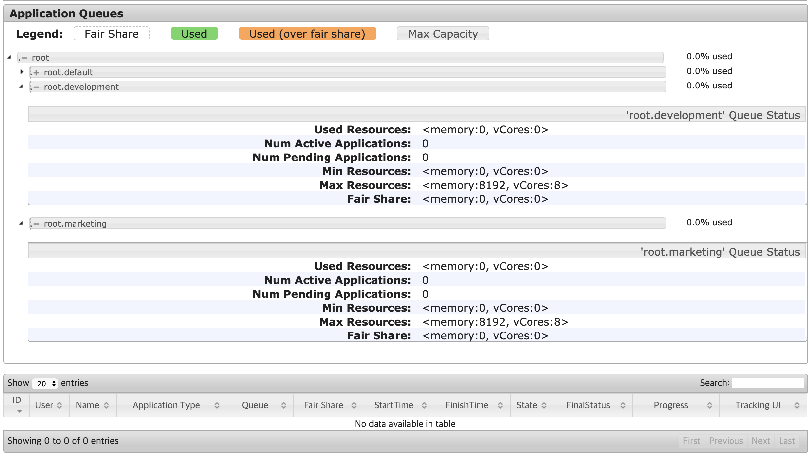

이 상황에서 development Queue에 Application을 1개 실행하면, 아래와 같이 development Queue의 Fair Share가 \<memory:8GB, vcores:0\>이 되는 것을 확인할 수 있다. 반면 marketing Queue에는 실행 중인 Application이 존재하지 않기 때문에 \<memory:0GB, vcores:0\>의 Fair Share를 가지는 것을 볼 수 있다.

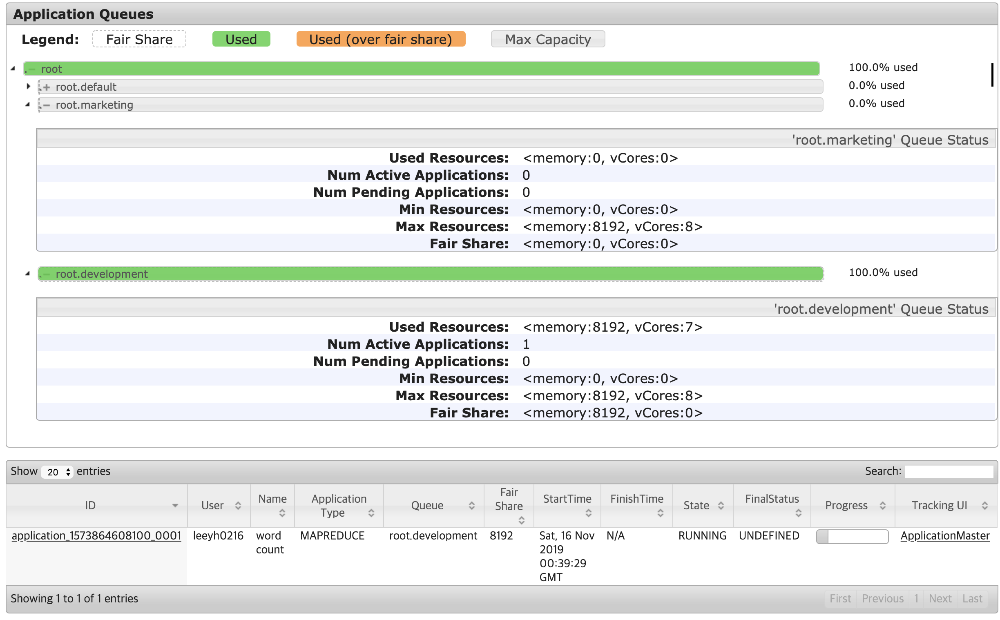

`development` Queue에서 아직 Application이 실행되고 있는 상태에서 `marketing` Queue에 Application을 1개 실행시키면, Queue 설정의 Weight 비율과 같이 Fair Share가 2:8의 비율로 구성되는 것을 아래와 같이 확인할 수 있다.

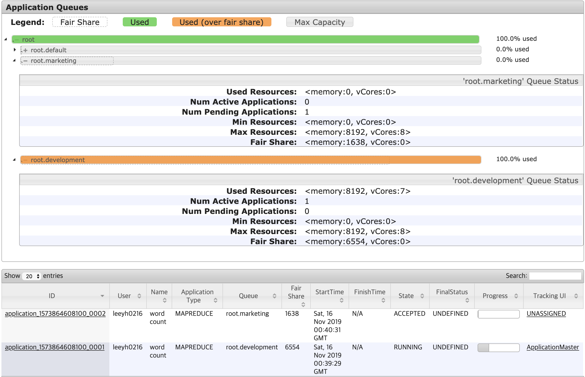

다만 Fair Share가 위와 같이 2:8 비율로 변경되었다 해서, `marketing` Queue에서 실행된 Application이 바로 실행될 수 있는 것은 아니다.(이와 관련해서는 Preemption을 이해해야 한다.) 위 그림에서도 Fair Share가 1,638인데도 Application의 상태가 ACCEPTED로 되어 있는 것을 확인할 수 있다.

결론적으로 Fair Share는 다음과 같은 특성을 가진다.

* Cluster Resource가 증가함에 따라, Fair Share도 증가한다.
* Cluster를 구성하는 Queue의 상태(Application의 실행 여부)에 따라 Fair Share가 달라진다.

#### Resource Constraints

```
<minResources>20000mb, 10 vcores</minResources>
<maxResources>2000000mb, 1000 vcores</maxResources>
```
Queue의 Resource를 제한하는 방법에는 `minResources`와 `maxResources`가 존재한다.

`minResources`는 약한 제약조건이다. 이 값은 Queue가 요청하는 최소한의 리소스 요구사항이며, 다음 조건들을 만족해야만 `minResources`만큼의 리소스를 확보할 수 있다.

* `minResources`만큼의 리소스가 클러스터에 남아 있거나, 리소스가 클러스터에 남아 있지 않더라도 다른 Queue로부터 Preemption이 가능한 경우
* `minResources`의 총 합이 Cluster의 총 리소스 양보다 크지 않은 경우

`maxResource`는 강한 제약조건이다. 이 옵션이 적용된 Queue와 자식 Queue들의 총 사용 리소스의 합이 반드시 해당 값보다 작아야 한다.

`minResources`와 `maxResources`는 아래와 같은 단점이 있기 때문에 권장되는 옵션이 아니다.

* `minResources`와 `maxResources`에 적용되는 옵션은 정적(명확한 Memory와 Core가 정해져 있음)이기 때문에, 클러스터의 구성(노드가 추가되거나 제거되는 등)이 변경될 때마다 바꾸어 주어야 한다.
* `maxResources`의 경우 클러스터의 사용률이 낮은 경우(리소스가 남는 경우)에도 이 값을 넘어서는 리소스를 사용할 수 없다.
* `minResources`의 리소스가 FairShare를 넘어서는 경우 다른 Queue의 Fair Share에도 영향을 미친다.

##### `minResources`를 Weight 값에 의해 계산되는 리소스의 양보다 크게 만들어보기

위의 `minResources`의 단점 중, `minResources`가 FairShare를 넘어서는 경우 다른 Queue의 Fair Share에도 영향을 미친다는 내용이 있었다.

이를 테스트하기 위해, fair scheduler의 옵션을 아래오 같이 변경하였다.

```
<?xml version="1.0"?>
<allocations>
  <queue name="marketing">
    <weight>2.0</weight>
    <schedulingPolicy>fair</schedulingPolicy>
    <minResources>2048mb, 2 vcores</minResources>
  </queue>
  <queue name="development">
    <weight>8.0</weight>
    <schedulingPolicy>fair</schedulingPolicy>
  </queue>
  <queueMaxAMShareDefault>0.5</queueMaxAMShareDefault>
</allocations>
```

장비의 Spec이 8GB Memory이기 때문에, weight만 가지고 Fair Share를 계산했을 때에는 아래와 같이 Fair Share가 구성되어야 한다.

* `marketing`: 1,638MB Memory
* `development`: 6,554MB Memory

그러나 `marketing` Queue에는 `minResources`를 2,048MB로 적용했기 때문에, 기존 Weight 값으로 설정된 Fair Share를 무시하고 다음과 같이 구성되어야 한다.

* `marketing`: 2,048MB Memory
* `development`: 6,144MB Memory

적용해본 결과, 아래와 같이 `minResources`에 설정된 옵션이 기존 weight에 의한 FairShare를 무시하고 설정되는 것을 볼 수 있다.

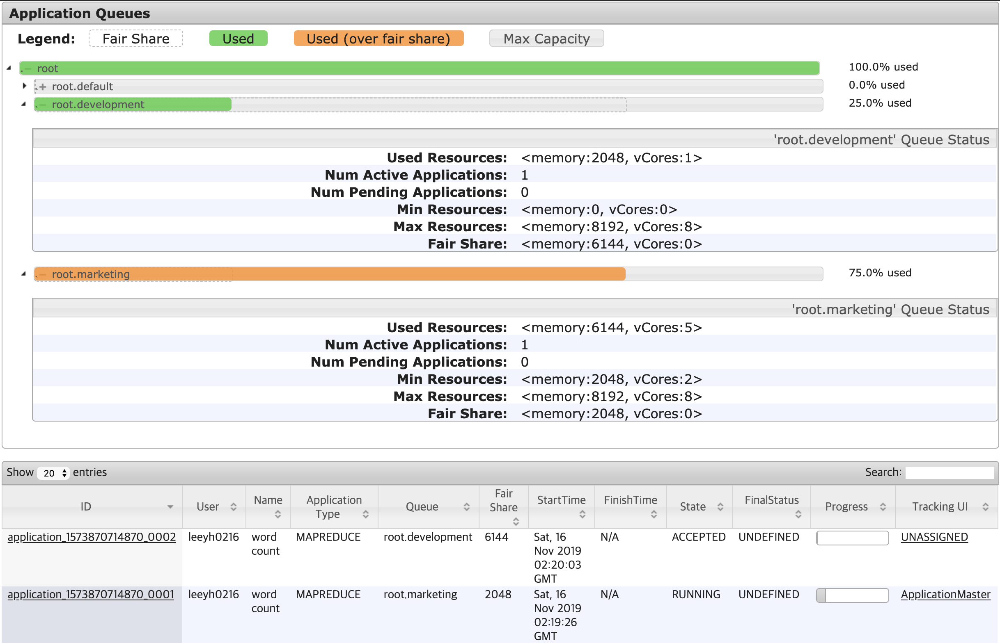

#### Limiting Applications

Queue에서 동작하는 Application의 수를 제어하고 싶은 경우, `maxRunningApps`와 `maxAMShare` 옵션을 사용할 수 있다.

* `maxRunningApps`는 Queue에서 실행할 수 있는 Application의 수이다.
* `maxAMShare`는 Queue에서 Application Master Container가 사용할 수 있는 리소스의 양을 의미한다.
  * 리소스는 부족한데 `maxAMShare` 값이 크다면 Application들이 동시에 수행되었을 경우 Queue의 모든 Resource를 Application Master Container들이 점유하여 실제 작업을 수행하는 Non Application Master Container들이 수행되지 못해, 전체 작업이 수행되지 않는 상황이 발생할 수 있다.
  * 기본 값은 0.5로 설정되어 있다.

##### maxRunningApps 설정해보기

```
<?xml version="1.0"?>
<allocations>
  <queue name="marketing">
    <weight>2.0</weight>
    <schedulingPolicy>fair</schedulingPolicy>
    <maxResources>4096mb, 4 vcores</maxResources>
    <maxRunningApps>0</maxRunningApps>
  </queue>
  <queue name="development">
    <weight>8.0</weight>
    <schedulingPolicy>fair</schedulingPolicy>
    <maxResources>4096mb, 4 vcores</maxResources>
  </queue>
  <queueMaxAMShareDefault>0.5</queueMaxAMShareDefault>
</allocations>
```
`marketing` Queue의 `maxRunningApps`를 0으로 설정한 후 Application을 실행해보았다.

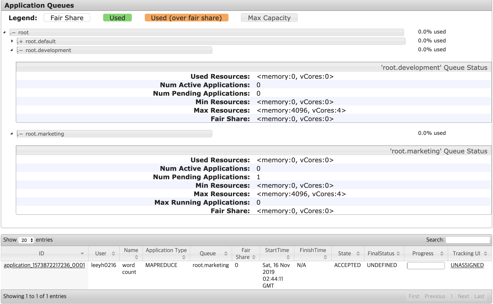

클러스터와 Queue의 가용 리소스가 충분한데도, Application이 ACCEPTED 상태로 되어 있는 것을 확인할 수 있다.

##### maxAMShare 설정해보기

```
<?xml version="1.0"?>
<allocations>
  <queue name="marketing">
    <weight>2.0</weight>
    <schedulingPolicy>fair</schedulingPolicy>
    <maxResources>4096mb, 4 vcores</maxResources>
    <maxAMShare>0</maxAMShare>
  </queue>
  <queue name="development">
    <weight>8.0</weight>
    <schedulingPolicy>fair</schedulingPolicy>
    <maxResources>4096mb, 4 vcores</maxResources>
  </queue>
  <queueMaxAMShareDefault>0.5</queueMaxAMShareDefault>
</allocations>
```

`marketing` Queue의 `maxAMShare`를 0으로 설정한 후 Application을 실행해보았다.

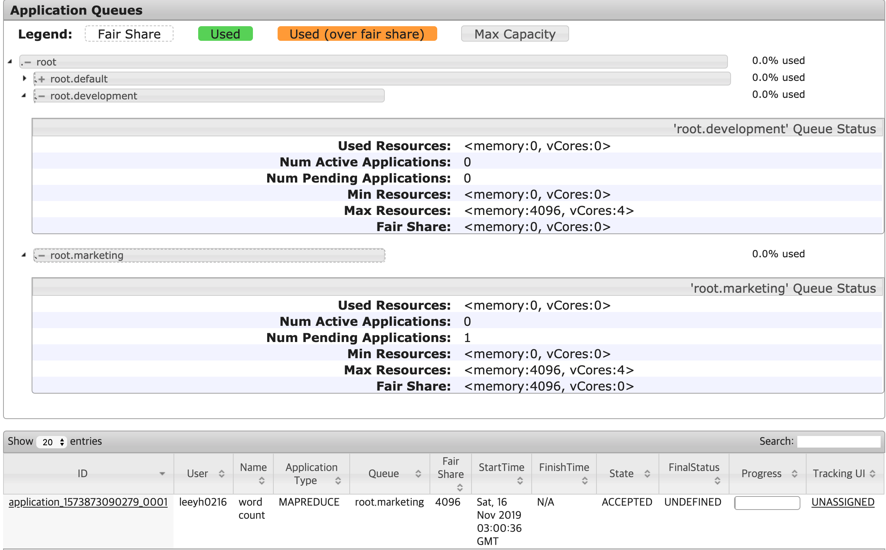

클러스터와 Queue의 가용 리소스가 충분한데도, Application이 ACCEPTED 상태로 되어 있는 것을 확인할 수 있다. 위의 `maxRunningApps`와 다른 점은, `maxRunningApps`의 `marketing` Queue 상태에는 `maxRunningApps`에 Max Running Applications가 0으로 설정되어 있어 왜 Application이 수행되지 않는지 알 수 있지만, `maxAMShare`의 경우 아무런 옵션도 써있지 않아 구분이 힘들다는 점이 있다.

### Preemption

Preemption은 Queue들이 FairShare만큼의 리소스를 보장받을 수 있도록, FairShare를 넘겨 리소스를 사용 중인 Queue의 Allocation된 Container를 Kill 하므로써 리소스를 뺏어오는 방법이다.

#### Steady FairShare vs Instantaneous FairShare

* Steady FairShare: 각 Queue에 적용되는 이론적인 FairShare 값을 의미한다. \<memory:100GB, vcores: 100\>인 클러스터에 `marketing`과 `development` Queue가 각각 0.2, 0.8만큼의 Weight를 가지고 있다면 **클러스터 상태와는 관계 없이** \<memory: 20GB, vcores: 20\>과 \<memory: 80GB, vcores: 80\>의 Steady FairShare를 가지게 된다.

* Instantaneous FairShare: 실행 중인 Application을 가진 Queue들의 Weight로만 계산된 FairShare를 의미한다. 위 Steady FairShare 구성에서 `marketing` Queue에서 실행 중인 Application이 없고, `development` Queue에는 실행 중인 Application이 존재하는 경우 `marketing`과 `development` Queue의 Instantaneous FairShare는 \<memory:0GB, vcores: 0\>과 \<memory:100GB, vcores: 20\>이 된다.

#### Configuring Fair Scheduler for Preemption

preemption을 활성화하기 위해서는 `yarn-site.xml`에 아래 설정을 추가해야 한다.

```
<property>yarn.scheduler.fair.preemption</property>
<value>true</value>
```

Queue에 적용 가능한 옵션은 `fairSharePreemptionThreshold`와 `fairSharePreemptionTimeout`이다. Preemption은  `Ìnstantaneous FairShare` < `Steady FairShare * fairSharePreemptionThreshold` 인 상태가 `fairSharePreemptionTimeout`만큼 지속되면 발생한다.

```
<?xml version="1.0"?>
<allocations>
  <queue name="marketing">
    <weight>4.0</weight>
    <schedulingPolicy>fair</schedulingPolicy>
    <fairSharePreemptionThreshold>1.0</fairSharePreemptionThreshold>
    <fairSharePreemptionTimeout>1</fairSharePreemptionTimeout>
  </queue>
  <queue name="development">
    <weight>6.0</weight>
    <schedulingPolicy>fair</schedulingPolicy>
    <fairSharePreemptionThreshold>1.0</fairSharePreemptionThreshold>
    <fairSharePreemptionTimeout>1</fairSharePreemptionTimeout>
  </queue>
  <queueMaxAMShareDefault>0.5</queueMaxAMShareDefault>

</allocations>
```

위와 같이 설정하는 경우 `marketing`와 `development`에 모두 Application이 있을 때, 각각 3,276, 4,915만큼의 FairShare 보장을 1초라도 못받게 되면 Preemption이 발생하게 된다.

맨 처음 `marketing` Queue에 Application을 실행했을 경우엔 아래와 같이 `marketing` Queue의 FairShare가 8,192가 된다.

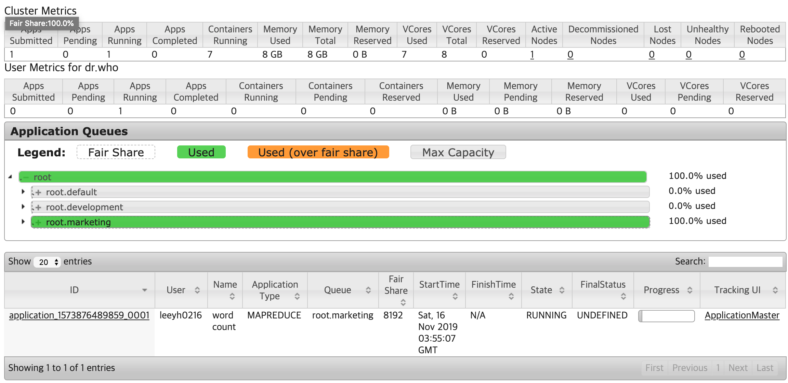

이 상태에서 `development` Queue에 Application을 실행하는 경우, 일시적으로 `marketing` Queue가 자신의 Steady Fair Share보다 더 많은 Instantaneous Fair Share보다 많은 리소스를 할당받은 `Over Fair Share` 상태가 된다.

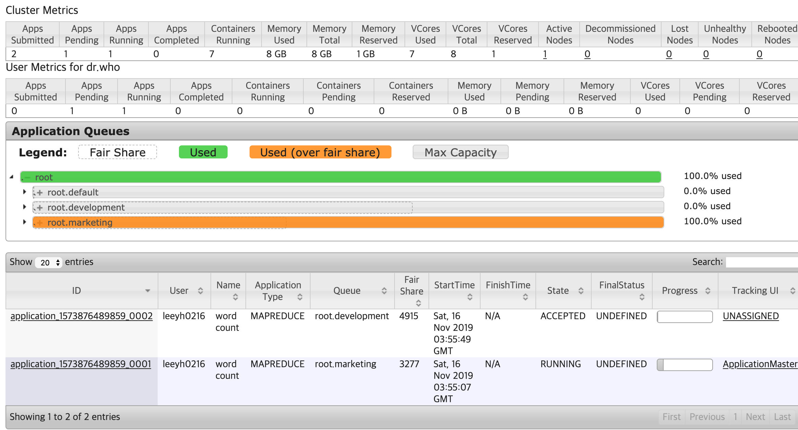

`development`에 설정된 preemption 옵션에 따라 1초(`fairSharePreemptionTimeout`) 후 Preemption이 동작한다. 이 때의 Yarn의 Resource Manager 로그에서는 다음과 같이 `marketing` Queue가 초과 선점한 리소스에 대한 Preemption을 수행한다는 로그가 발생하며

```
2019-11-16 12:55:20,033 INFO org.apache.hadoop.yarn.server.resourcemanager.scheduler.fair.FairScheduler: Should preempt <memory:1024, vCores:-6> res for queue root.marketing: resDueToMinShare = <memory:0, vCores:0>, resDueToFairShare = <memory:1024, vCores:-6>
2019-11-16 12:55:55,159 INFO org.apache.hadoop.yarn.server.resourcemanager.scheduler.fair.FairScheduler: Preempting container (prio=20res=<memory:1024, vCores:1>) from queue root.marketing
```

실제로 Preemption이 발생하며 `development` Queue에 존재하는 Application도 RUNNING 상태로 변경되며 실행된다.(다만 그림에서는 Preemption 직후의 상황을 캡쳐하여 아직 `marketing` Queue가 `Over Fair Share` 상태이다)

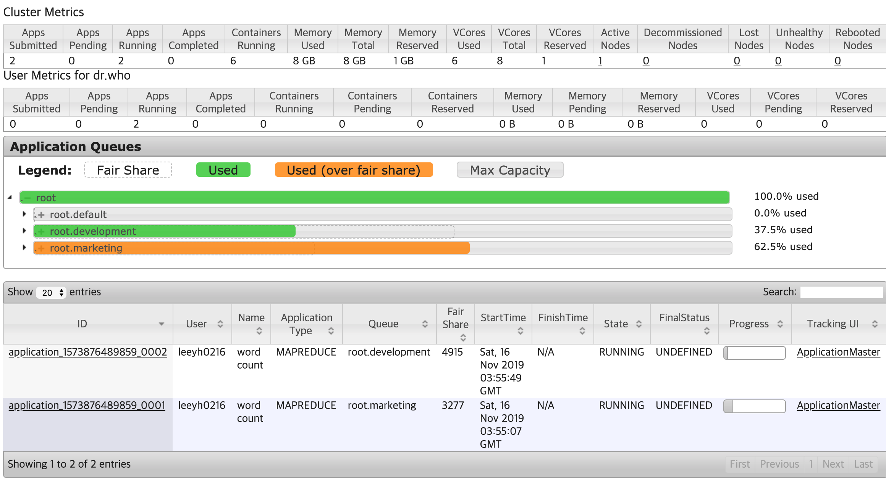

이 때 Preemption 당한 Application을 보면 아래와 같이 Killed 상태의 Container가 존재하며,

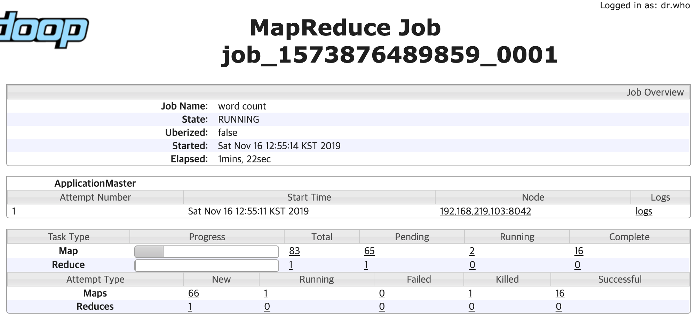

Killed된 Container의 Reason에는 Scheduler에 의해 Preemption 되었다는 내용을 확인할 수 있다.

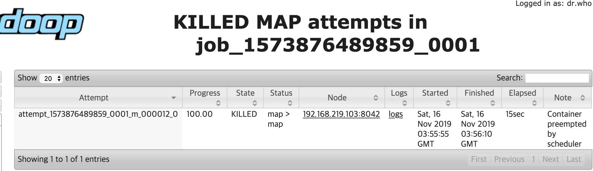