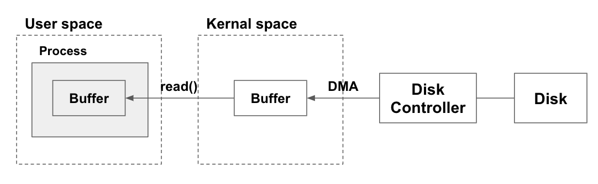
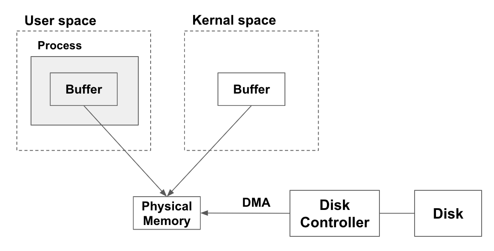

* **Java NIO - 1. 왜 자바의 IO 패키지는 느린가?**
* [Java NIO - 2. Buffers](https://leeyh0216.github.io/2020-05-24/java_nio_buffer)

# 개요

요즘 Druid, Kafka 등의 오픈소스를 보면 Java NIO를 사용하는 프로젝트들이 참 많다.

Java NIO가 나온지도 오래되었는데 학부 때는 기존 IO 패키지에 있는 것만 배웠고, 업무 중에는 사실 I/O 관련 패키지를 직접 사용하는 경우가 드물다. 그럼에도 불구하고 왜 오픈소스들이 NIO를 사용하는지, NIO를 통해 얻을 수 있는 것은 무엇인지 정리하기 위해 관련 서적과 문서를 통해 Java의 NIO 공부를 진행하려 한다.

## 참고 서적 및 문서

* [Java NI0 - Ron Hitchens](http://shop.oreilly.com/product/9780596002886.do)
* [How Java I/O Works Internally at Lower Level? - HowToDoInJava](https://howtodoinjava.com/java/io/how-java-io-works-internally-at-lower-level/)

# I/O는 느리다.

프로그램을 작성하다보면 성능 향상을 위해 많은 최적화를 진행한다.

대부분 최적화라고 하면 CPU Intensive한 코드들을 적절한 자료구조와 기법을 통해 성능을 향상시킨다고 생각할 것이다. 그러나 현업에서 작성하는 프로그램 중 I/O 관련 코드가 들어가지 않은 프로그램은 드물고, 대부분 I/O 과정에서 성능 저하가 많이 일어나게 된다.

## I/O와 CPU 성능 비교하기

테스트로 1 ~ 1,000,000까지의 숫자가 기록된 파일(`numbers`)을 한줄씩 읽어 리스트에 저장한 뒤, 이 숫자들을 모두 더하는 프로그램을 작성하였다.


public class IOPerformanceTest {

  public static void main(String[] args) throws Exception {
    List<String> list = new ArrayList<>();
    long totalStartTime = System.currentTimeMillis();

    // I/O Section
    long ioStartTime = System.currentTimeMillis();
    BufferedReader reader = new BufferedReader(new FileReader("numbers"));
    String readedLine = null;
    while ((readedLine = reader.readLine()) != null)
      list.add(readedLine);
    long ioEndTime = System.currentTimeMillis();

    // CPU Section
    long calcStartTime = System.currentTimeMillis();
    long sum = 0;
    for(int i = 0; i < list.size(); i++)
      sum += Integer.parseInt(list.get(i));
    long calcEndTime = System.currentTimeMillis();

    long totalEndTime = System.currentTimeMillis();
    System.out.println("Total elapsed: " + (totalEndTime - totalStartTime));
    System.out.println("I/O elapsed: " + (ioEndTime - ioStartTime));
    System.out.println("Calculate elapsed: " + (calcEndTime - calcStartTime));
  }
}



위 프로그램을 실행시킨 결과는 아래와 같다. I/O를 통해 파일을 읽어들이는 시간이 값을 더해 출력하는 코드보다 3배나 느리게 동작하는 것을 알 수 있다.

```
Total elapsed: 266
I/O elapsed: 214
Calculate elapsed: 52
```

# OS에서의 I/O

## I/O의 기본 동작 원리


> 출처: [HowToDoInJava](https://howtodoinjava.com/java/io/how-java-io-works-internally-at-lower-level/)

위의 그림은 사용자가 `read()` 시스템콜 호출 시의 순서도이다. 각 과정에서 발생하는 상세 동작은 아래와 같다.

### read() 함수 호출

사용자 프로세스는 User Space에서 동작하기 때문에 하드웨어에 직접적으로 접근할 수 없다. 때문에 OS에서 제공하는 시스템콜을 통해 I/O를 수행해야 한다.

여기서는 `read()` 시스템콜을 통해 커널에게 I/O 수행을 요청한다. 이 과정에서 유저 모드(User mode)에서 커널 모드(Kernal mode)로 스위칭이 발생한다.

제어권을 넘겨받은 커널은 우선 프로세스가 요청한 **데이터가 이미 커널 영역 캐시 메모리에 존재하는지 확인**한다. 만일 **데이터가 캐시에 존재한다면 해당 데이터를 `read()` 함수 호출 시 전달받은 메모리 영역에 복사**한 뒤 제어권을 다시 사용자 프로세스에게 넘긴다.(커널 모드 -> 유저 모드로 스위칭)

데이터가 캐시에 존재하지 않는다면 디스크로부터 데이터를 가져오는 과정을 수행한다.

### DMA 컨트롤러에게 데이터 로드를 요청

CPU는 디스크와 통신하여 직접 데이터를 읽지 않고(PIO, Programmed Input/Output의 줄임말로 CPU와 주변기기가 직접 통신하여 I/O를 수행하는 방법), DMA(Direct Memory Access) 컨트롤러에게 데이터 로드를 요청한다.

> 이는 CPU가 디스크보다 수백배는 빠르기 때문에, 디스크의 처리 시간을 기다리는 것이 낭비이기 때문이다.

DMA 컨트롤러는 다시 Disk Controller에게 디스크로부터 데이터 읽기를 요청한다.

### DMA -> CPU 인터럽트

Disk Controller -> DMA로의 데이터 전송이 완료되면, DMA 컨트롤러는 **DMA에 저장된 데이터를 다시 커널의 버퍼 메모리 영역에 복사**한다. 이 과정이 완료된 후 DMA 컨트롤러는 CPU 인터럽트를 수행한다.

### CPU 인터럽트 이후

DMA -> CPU 인터럽트가 일어나면 CPU는 **커널 영역 버퍼 메모리의 데이터를 유저 영역 버퍼 메모리에 복사한 뒤 `read()` 과정을 종료**한다.

사용자 프로세스는 Block 되어 있던 메서드가 완료되며 요청한 데이터를 사용할 수 있게 된다.

## Virtual Memory와 Multiply mapped memory space

Virtual Memory를 사용하므로써 아래와 같은 장점을 얻을 수 있다.

* 하나 이상의 가상 주소가 동일한 하나의 물리 주소를 가리킬 수 있다.
* 물리 메모리 공간보다 큰 가상 메모리 공간을 사용할 수 있다.

위 장점 중 첫번째 장점을 사용하면 커널 영역 메모리에 적재된 I/O 데이터를 다시 유저 영역의 메모리에 복사하지 않아도 된다. 아래의 그림과 같이 I/O에서 적재한 커널 메모리 주소 공간(Virtual Memory)가 실제로 가리키는 물리 메모리 공간을 다시 유저 영역 메모리 공간(Virtual Memory)로 매핑시키면 된다.



다만 Block 방식의 I/O의 경우 Buffer 공간의 크기가 Disk의 Block 크기의 배수가 되어야한다는 단점이 존재한다.

관련 내용으로는
* [Mapping Multiple Memory Views in User Space](https://nullprogram.com/blog/2016/04/10/)
* [Virtual Memory](https://howtodoinjava.com/java/io/how-java-io-works-internally-at-lower-level/)
를 참고하길 바란다.

# Java IO 패키지는 OS의 I/O 방식과 임피던스 불일치를 가진다.

Java IO 패키지는 OS의 I/O 방식과 임피던스 불일치를 가진다. **그렇기 때문에 느리다.**

1. OS에서는 디스크 -> 커널 메모리로 데이터를 옮길 때는 DMA를 사용하기 때문에, CPU를 사용하지 않는다. 비동기 방식의 I/O를 사용하면 유리할텐데, Java의 I/O 메서드들은 모두 동기/Blocking 방식이기 때문에 이러한 장점을 살리지 못한다.
2. Virtual Memory를 통한 커널 <-> 사용자 영역 간 메모리 공유가 Java에서는 불가능하다. 그렇기 때문에 CPU가 개입하여 커널 영역 메모리의 데이터를 사용자 영역으로 옮기며 오버헤드가 발생한다.
3. 2의 과정에서 생성된 Java의 객체들은 GC 대상이 된다. 필요 없는 Overhead가 발생한 것이다.

Java IO가 가지는 이러한 문제점을 해결하기 위하여 Java NIO가 등장하게 되었다.(다만 Java NIO 또한 Direct Memory Allocate 등의 일부 기능을 사용하지 않고는 기존 IO와 크게 성능 차이가 없다는 말도 있다)

> 개인적으로 1번 문제의 경우 파일 읽기보다 네트워크 프로그래밍 시 유리하지 않을까 라는 생각이 든다.