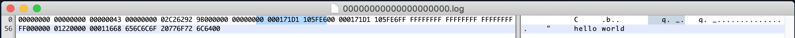

# Topic


Topic은 메시지가 발행되는 카테고리 혹은 Feed로써, 메시지들의 스트림으로 볼 수 있다. 다양한 생산자(Producer)와 소비자(Consumer)들이 Topic에 메시지를 발행하거나, Topic으로부터 발행된 메시지를 가져와 사용한다.

> Kafka의 문서나 관련 서적에서 Kafka를 분산 커밋 로그(Distributed commit log)라고 부른다. 분산 커밋 로그에서의 로그가 Topic과 일치하는 개념이라고 보면 된다. Kafka 소스코드에는 Topic보다는 Log라는 용어가 더 많이 사용된다.


## Topic의 파티셔닝

Topic에는 수십 ~ 수천억개 이상의 메시지들이 발행될 수 있다. 하나의 Topic이 하나의 서버에 종속되는 구조라면 아래와 같은 문제점이 발생한다.

* Topic을 구성하는 데이터의 크기는 종속된 서버의 저장소 크기보다 작아야 한다.
* 메시지의 발행/소비도 1개 서버의 성능에 종속된다.

이러한 문제점을 해결하기 위하여 Kafka에서는 **하나의 Topic을 1개 이상의 파티션(파티션된 로그)으로 구성**된다. 각 파티션은 순차적으로 추가된 메시지로 구성되어 있으며, **메시지는 파티션 내에서의 자신의 위치를 표현하는 Offset이라는 ID를 발급**받게 된다.

> 다만 메시지의 처리 순서는 토픽이 아닌 파티션별로 관리된다.

Topic을 파티셔닝하므로써 논리적으로 Topic의 **데이터 크기와 성능은 수평 확장(Horizontally Scalable)** 될 수 있고, Topic을 구성하는 **파티션의 갯수만큼 병렬성(Parallelism)을 확보**할 수 있게 된다.

> HDFS에 익숙한 사람이라면 Topic과 파티션의 관계를 파일과 블록의 관계라고 생각하면 편할 것 같다.

Topic의 파티션은 코드에서 `org.apache.kafka.common.TopicPartition`이라는 클래스로 관리된다.


/**
 * A topic name and partition number
 */
public final class TopicPartition implements Serializable {
    private static final long serialVersionUID = -613627415771699627L;

    private int hash = 0;
    private final int partition;
    private final String topic;
...


또한 파티션의 이름은 `kafka.log.Log` 오브젝트의 `logDirName`을 통해 "Topic명 + 파티션 번호"로 생성한다.


/**
  * Return a directory name for the given topic partition. The name will be in the following
  * format: topic-partition where topic, partition are variables.
*/
def logDirName(topicPartition: TopicPartition): String = {
  s"${topicPartition.topic}-${topicPartition.partition}"
}


## Topic 생성하기

Topic과 파티션의 개념을 알았으니 이제 Kafka에 Topic을 생성해보자.

`${KAFKA_HOME}/bin` 디렉토리를 보면 `kafka-topics.sh` 스크립트가 존재하는 것을 볼 수 있다. 아래 명령어를 통해 `test` 라는 이름의 Topic을 생성한다.

```
> ${KAFKA_HOME}/bin/kafka-topics.sh --create --topic test --bootstrap-server localhost:9092 --replication-factor 1 --partitions 1
Created topic test
```

위 명령어에서 사용한 옵션들은 아래와 같다.

* create: Topic 생성을 요청한다는 의미이다. create 이외에도 alter, describe, delete 기능이 존재한다.
* topic: 생성할 Topic의 이름이다.
* bootstrap-server: 작업 수행을 요청할 Kafka Cluster의 Broker를 명시한다.
* replication-factor: 파티션 복제본의 수이다. 여기서는 1로 설정한다.
* partitions: Topic을 구성하는 파티션의 수를 의미한다.

정상적으로 Topic이 생성된 경우 "Created topic test"라는 문구가 발생한다. 이미 존재하는 Topic을 생성하려 할 경우 "Error while executing topic command : Topic test already exists"라는 문구가 발생한다.

생성된 Topic의 속성을 확인하기 위해서는 describe 기능을 사용하면 된다. 아래 명령어를 입력하여 위에서 생성한 `test` Topic의 정보를 확인해보자.

```
> ${KAFKA_HOME}/bin/kafka-topics.sh --describe --topic test --bootstrap-server localhost:9092
Topic: test	PartitionCount: 1	ReplicationFactor: 1	Configs: segment.bytes=1073741824
	Topic: test	Partition: 0	Leader: 0	Replicas: 0	Isr: 0
```

위와 같이 생성된 파티션의 정보를 확인할 수 있다.

### 파티션 데이터는 어떻게 저장될까?

Topic을 구성하는 **파티션 1개는 Kafka Broker의 파티션 디렉토리 1개와 매핑**된다. Broker 설정 파일(`${KAFKA_HOME}/config/server.properties`)에서 설정한 `log.dirs` 디렉토리를 확인해보면, 우리가 생성한 `test` Topic의 0번째 파티션이 생성되어 있는 것을 확인할 수 있다.

```
> ls
cleaner-offset-checkpoint        meta.properties                  replication-offset-checkpoint
log-start-offset-checkpoint      recovery-point-offset-checkpoint test-0
```

1개의 파티션(파티션 로그)은 다시 1개 이상의 세그먼트(로그 세그먼트)로 구성된다. `test-0` 디렉토리에서 `ls` 명령어를 쳐보면, `test-0` 파티션을 구성하는 00000000000000000000 세그먼트를 확인할 수 있다.

```
> ls
00000000000000000000.index     00000000000000000000.timeindex
00000000000000000000.log       leader-epoch-checkpoint
```

세그먼트는 로그, 인덱스 파일로 구성되어 있다.

* 로그 파일: 세그먼트를 구성하는 실제 데이터가 들어 있는 파일이다. 위에서는 00000000000000000000.log 파일로 기록되어 있다.
* 인덱스 파일: 파티션의 논리적인 인덱스와 파일의 물리적인 인덱스를 매핑해주는 파일이다. 위에서는 00000000000000000000.index 파일로 기록되어 있다.

파일명에서 등장하는 00000000000000000000는 해당 Segment의 Base Offset이다. 여기서는 0값이 Base Offset이기 때문에, 이 파일들에 처음 기록된 메시지의 Offset은 0으로 시작하게 된다.

#### Segment 생성 옵션

Segment 파일의 크기가 특정 바이트를 넘어섰거나, 파일이 생성된지 일정 기간이 지나면 기존 Segment를 닫고 신규 Segment를 생성하도록 설정할 수 있다. 이와 관련된 옵션은 `log.segment.bytes`와 `log.segment.ms`이다.

`log.segment.bytes` 옵션을 사용할 경우 현재 세그먼트 파일이 해당 크기를 넘어설 경우 새로운 세그먼트가 생성된다. 테스트를 위해 해당 값을 256으로 변경하고 Broker를 재시작한 뒤, Topic에 새로운 메시지를 발행한 뒤, `test-0` 디렉토리를 확인해보았다.

```
> ls
00000000000000000000.index     00000000000000000002.index     00000000000000000002.timeindex
00000000000000000000.log       00000000000000000002.log       leader-epoch-checkpoint
00000000000000000000.timeindex 00000000000000000002.snapshot
```

기존 00000000000000000000 이외에도 00000000000000000002 관련 파일이 생성된 것을 확인할 수 있었다. 해당 Topic에 발행한 메시지의 수가 3개였는데, 두번째 Segment 파일의 Base Offset(파일명)이 2인 것으로 보아 마지막 메시지(Zero-based Index 기준으로 2번째, 실제로는 3번쨰 메시지) 1개만 00000000000000000002 Segment에 존재하는 것을 확인할 수 있었다.

#### 코드에서 확인하기

코드 상에서는 `kafka.log.LogSegment` 클래스가 하나의 세그먼트와 매핑된다.


class LogSegment private[log] (val log: FileRecords,
                               val lazyOffsetIndex: LazyIndex[OffsetIndex],
                               val lazyTimeIndex: LazyIndex[TimeIndex],
                               val txnIndex: TransactionIndex,
                               val baseOffset: Long,
                               val indexIntervalBytes: Int,
                               val rollJitterMs: Long,
                               val time: Time) extends Logging {


생성자의 `FileRecords` 객체가 실제 메시지를 담고 있는 객체이며, `log` 확장자를 가진 파일로 저장된다. `LazyIndex[OffsetIndex]` 객체는 파티션의 논리적인 인덱스와 `FileRecords`에서의 인덱스의 매핑을 가지고 있는 객체이며, `index` 확장자를 가진 파일로 저장된다.

### 데이터의 유지(Retention)

RabbitMQ와 같은 시스템들은 Consumer가 메시지를 소비하면 Topic에서 메시지를 삭제하지만, Kafka는 **발행된 메시지를 일정 기간동안 유지**할 수 있다.

때문에 메시지 유지 기간 동안은 컨슈머가 일시적으로 동작하지 않더라도 후행 처리가 가능하며, 필요하다면 남아 있는 데이터를 Replay하며 재처리할 수도 있다.

이는 Kafka가 메시지를 메모리가 아닌 디스크에 유지하므로써 공간적인 제약에서 일부 자유롭기 때문인 것으로 생각된다.

#### 시간 기준으로 데이터 유지

* `log.retention.ms`: 카프카가 메시지를 얼마 동안 보존할 지 설정할 수 있다(밀리초 단위). (**로그 세그먼트 파일의 마지막 수정시간(mtime)** +  `log.retention.ms`) 시간 후에 데이터가 삭제된다.
* `log.retention.minutes`: `log.retention.ms`와 동일한 역할을 수행하며, 분 단위로 적용된다.
* `log.retention.hours`: `log.retention.ms`와 동일한 역할을 수행하며, 시간 단위로 적용된다.

위의 값들을 설정하지 않으면 `log.retention.hours`가 168시간(7일)로 설정된다. 또한 `log.retention.ms` 값을 -1로 설정하는 경우, 로그가 삭제되지 않고 계속 유지된다.

우선순위는 `ms`, `minutes`, `hours` 순이며, 높은 우선순위를 가진 설정 값이 낮은 우선순위를 가진 설정 값을 무시한다.

#### 크기 기준으로 데이터 유지

`log.retention.bytes` 값을 설정하므로써 파티션의 로그 크기에 따라 데이터의 보존을 설정할 수 있다.

# 메시지(레코드)

Kafka에서의 데이터 기본 단위는 [메시지](https://kafka.apache.org/documentation/#messages)(혹은 레코드)이다. 

Message는 아래와 같은 요소로 구성된다.

* 가변 길이 헤더
* 가변 길이 키(바이트 배열)
* 가변 길이 메시지(바이트 배열)

## 코드에서 확인하기


public interface Record {

    Header[] EMPTY_HEADERS = new Header[0];

    long offset();

    int sequence();
    
    ...


`org.apache.kafka.common.record.Record`가 메시지를 표현하는 인터페이스이다. 위의 헤더, 키, 메시지 이외에도 `offset`, `sequence` 등 다양한 프로퍼티를 가지고 있다. 이 인터페이스를 구현한 클래스는  `org.apache.kafka.common.record.DefaultRecord`이다.

[Apache Kafka - Record](https://kafka.apache.org/documentation/#record) 문서를 보면 아래와 같은 포맷으로 Record가 기록되는 것을 알 수 있다.

```
length: varint
attributes: int8
    bit 0~7: unused
timestampDelta: varint
offsetDelta: varint
keyLength: varint
key: byte[]
valueLen: varint
value: byte[]
Headers => [Header]
```

`DefaultRecord` 클래스의 `writeTo`에서 위 포맷대로 데이터를 Output Stream에 기록하는 것을 확인할 수 있다.


public static int writeTo(DataOutputStream out,
                            int offsetDelta,
                            long timestampDelta,
                            ByteBuffer key,
                            ByteBuffer value,
                            Header[] headers) throws IOException {
    int sizeInBytes = sizeOfBodyInBytes(offsetDelta, timestampDelta, key, value, headers);
    ByteUtils.writeVarint(sizeInBytes, out);
    
    ...


## Record Batch

Kafka에서는 쓰기 처리량을 높이기 위해 여러 개의 메시지를 묶어 한번에 저장한다. 이 메시지 묶음을 Record Batch라고 하며, Record Batch에는 1개 이상의 메시지가 포함되어 있다. 또한 하나의 세그먼트에는 1개 이상의 Record Batch가 포함될 수 있다.

[Apache Kafka - Record Batch](https://kafka.apache.org/documentation/#recordbatch)를 보면 아래와 같이 Record Batch에 대한 포맷을 확인할 수 있다.

```
baseOffset: int64
batchLength: int32
partitionLeaderEpoch: int32
magic: int8 (current magic value is 2)
crc: int32
attributes: int16
    bit 0~2:
        0: no compression
        1: gzip
        2: snappy
        3: lz4
        4: zstd
    bit 3: timestampType
    bit 4: isTransactional (0 means not transactional)
    bit 5: isControlBatch (0 means not a control batch)
    bit 6~15: unused
lastOffsetDelta: int32
firstTimestamp: int64
maxTimestamp: int64
producerId: int64
producerEpoch: int16
baseSequence: int32
records: [Record]
```

### 파일에서 확인하기

`test-0` 디렉토리의 00000000000000000000.log 파일을 Hex Fiend라는 프로그램을 통해 열어보면, 위의 포맷이 정상적으로 기록되었는지 확인할 수 있다.

`firstTimestamp`가 기록된 부분(28byte부터 8byte)을 확인해보았다.



Hex 값으로는 0x00000171D1105FE6, Decimal 값으로는 1588350443494이 나오고 이 값을 Timestamp 변환기로 바꾸어보면 첫번째 메시지를 발행한 시각(여기서는 2020년 5월 2일 토요일 오전 1:27:23.494)이 나오게 된다.

### 코드에서 확인하기


public interface RecordBatch extends Iterable<Record> {
...
}


`org.apache.kafka.common.record.RecordBatch`가 Record Batch를 표현하는 인터페이스이다. Record Batch는 1개 이상의 메시지(Record)를 포함하는 개념이기 때문에, 이 인터페이스를 구현한 클래스는 내부 메시지 순회를 위해 `Iterable<Record>` 인터페이스를 구현해야 한다.

이를 실제로 구현한 클래스는 `org.apache.kafka.common.record.DefaultRecordBatch` 클래스이며, Record Batch의 데이터를 기록하기 위한 `Bytebuffer`와 각종 쓰기 메서드들을 가지고 있는 것을 확인할 수 있다.


public class DefaultRecordBatch extends AbstractRecordBatch implements MutableRecordBatch {
    ...
    private final ByteBuffer buffer;

    DefaultRecordBatch(ByteBuffer buffer) {
        this.buffer = buffer;
    }
    ...
}


## 세그먼트와 Record Batch

세그먼트는 1개 이상의 Record Batch로 구성되어 있고, Record Batch는 1개 이상의 메시지로 구성되어 있다.

세그먼트의 로그 파일 내에는 1개 이상의 Record Batch가 포함되어 있을 수 있는 것이고, 코드 상에서도 아래와 같이 `FileRecords` 클래스 내에 여러 개의 `RecordBatch`를 가지는 구조로 되어 있는 것을 확인할 수 있다.


public class FileRecords extends AbstractRecords implements Closeable {
    ...

    private final Iterable<FileLogInputStream.FileChannelRecordBatch> batches;

    ...
}
