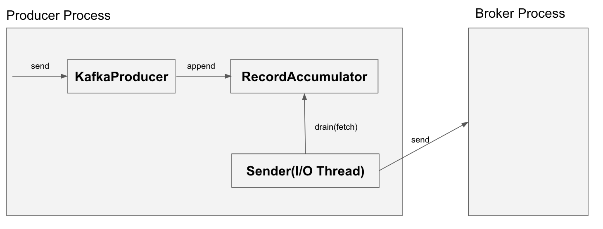
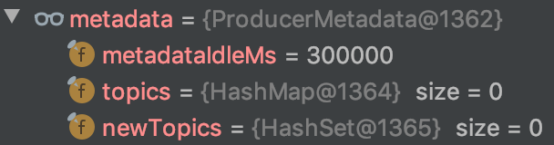
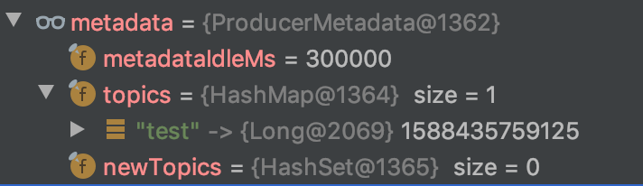

# Kafka Producer

메시지 발행/구독 시스템에서 Producer는 메시지의 발행을 수행하는 컴포넌트이다.

이 글에서는 Kafka Client API를 사용하여 Kafka Producer를 만들어보고, 메시지가 실제로 어떤 과정을 거쳐 전달되는지 알아본다.

## build.gradle에 Kafka Client 의존성 추가하기

build.gradle의 dependencies 블록에 아래 구문을 추가하여 Kafka Client API 의존성을 추가한다. 오늘 날짜(2020년 5월 2일) 기준으로 2.5.0 버전(Release: 2020/04)이 가장 최신의 API이며, 공식 문서에서도 사용을 권장한다.

```
compile group: 'org.apache.kafka', name: 'kafka-clients', version: '2.5.0'
```

## `KafkaProducer` 객체 초기화

[`KafkaProducer`](https://kafka.apache.org/25/javadoc/index.html?org/apache/kafka/clients/producer/KafkaProducer.html)는 Kafka Cluster에 메시지를 발행하는 API를 제공하는 클래스이다.

`KafkaProducer` 객체를 생성할 때는 Kafka Cluster 연결 정보, Serializer 설정 등을 전달해주어야 한다. 이러한 정보들은 `java.util.Properties`를 통해 전달한다.


Properties properties = new Properties();

properties.setProperty("bootstrap.servers", "localhost:9092");
properties.setProperty("key.serializer", "org.apache.kafka.common.serialization.StringSerializer");
properties.setProperty("value.serializer", "org.apache.kafka.common.serialization.StringSerializer");


* `bootstrap.servers`: Kafka Cluster의 Broker 주소를 (host:port) 형식으로 넣어주면 된다. Kafka Cluster를 구성하는 Broker 중 하나의 주소만 넘겨줘도 연결 과정에서 다른 Broker들의 주소도 수신한다. 다만 운영 환경에서는 Producer 재시작 시 기입된 주소의 Broker가 다운되더라도 다른 Broker 주소를 통해 연결 가능하도록 2개 이상의 주소를 넣어주는 것을 권장한다.
* `key.serializer`: 메시지의 Key를 직렬화 할 수 있는 Serializer 클래스를 설정한다.
* `value.serializer`: 메시지의 Value를 직렬화 할 수 있는 Serializer 클래스를 설정한다.

`Properties` 객체 초기화가 완료되었다면, 이제 `KafkaProducer` 객체를 아래와 같이 초기화한다. `Producer`의 Generic 값은 메시지를 구성하는 Key, Value 타입을 나타낸다.

```
Producer<String, String> kafkaProducer = new KafkaProducer<>(properties);
```

참고로 `Producer`(`KafkaProducer`)는 **Thread-Safe한 객체**이다. 따라서 해당 객체를 **Singleton으로 유지하여 애플리케이션 내의 Thread들이 공유**하도록 하는 것이 좋다. 오히려 많이 만들수록 Kafka Broker Server와의 Connection만 많이 생성되기 때문에 좋지 않은 영향을 끼치게 된다.

## `send()` 메서드로 메시지 보내기

`KafkaProducer`의 초기화가 완료되었다면 `send()` 메서드를 통해 Kafka Broker로 메시지를 전송할 수 있다.

`send` 메서드로 전달하는 객체는 `ProducerRecord`이다. 기본적으로 Topic명과 메시지의 Value 만으로도 `ProducerRecord` 객체를 만들어 전송이 가능하며, 추가적으로 Key, Partition ID, Timestamp, Header 등을 설정할 수 있다.

```
for(int i = 0; i < 100; i++) {
    kafkaProducer.send(new ProducerRecord<>("test", String.format("%d: hello world!!", i)));
}
kafkaProducer.close();
```

위와 같이 `send` 메서드를 통해 `test` Topic에 100개의 메시지를 발행하였다. `kafka-console-consumer.sh` 파일을 이용하여 Topic에 메시지가 정상적으로 전달되었는지 확인해보자.

```
> ${KAFKA_HOME}/bin/kafka-console-consumer.sh --bootstrap-server localhost:9092 --topic test --from-beginning
1: hello world!!
2: hello world!!
...
98: hello world!!
99: hello world!!
Processed a total of 100 messages
```

총 100개의 메시지가 정상적으로 들어온 것을 확인할 수 있다.

### `send`는 비동기 메서드이다.

`send` 메서드는 비동기 메서드이다. Kafka Client Javadoc 에서의 `send` 메서드 주석을 보면 아래와 같이 설명되어 있다.

> Asynchronously send a record to a topic and invoke the provided callback when the send has been acknowledged.
>
> The send is asynchronous and this method will return immediately once the record has been stored in the buffer of records waiting to be sent. 

**`send` 메서드는 비동기로 동작하며, 전달된 `ProducerRecord` 메시지는 Broker로 즉시 전송되는 것이 아니라 Producer 프로세스의 buffer에 저장된 후 전송**된다. 이와 같은 구현을 한 이유는 바로 다음 줄에 적혀있다.

> This allows sending many records in parallel without blocking to wait for the response after each one.

동기 방식으로 메서드를 구현했다면 `send`를 호출할 때마다 하나씩 메시지가 Broker로 전송될 것이다. 이는

* `send` 메서드 호출 시 I/O Block이 발생하여 병렬성이 떨어짐
* Bulk로 보내는 것보다 Network Overhead가 발생

하는 단점이 존재한다.

때문에 `KafkaProducer`의 `send`를 호출하게 되면 `ProducerRecord`를 `KafkaProducer`의 내부 Buffer에 저장해놓은 후, 어느정도 메시지가 모이게 되면 여러 개의 메시지를 한번에 보내고 Callback을 호출한다.

### `send`의 Callback 활용하기

`send`의 메서드 시그니처는 아래와 같다.


public Future<RecordMetadata> send(ProducerRecord<K,V> record, Callback callback)


`Future<RecordMetadata>`가 반환되기 때문에 `get`을 호출하면 해당 Call이 Block되어 동기 방식으로 메시지 전송결과를 알 수 있겠지만, 이는 Kafka Client 구현자의 의도가 아닐 것이다. 이상적인 메시지 전송 후처리 방식은 Callback을 이용하는 것이다.


int messageCnt = 100;
CountDownLatch latch = new CountDownLatch(messageCnt);

for(int i = 0; i < messageCnt; i++) {
    kafkaProducer.send(new ProducerRecord<>("test", String.format("%d: hello world!!", i)), new Callback() {
        @Override
        public void onCompletion(RecordMetadata metadata, Exception exception) {
            if(exception != null)
                System.out.println(exception.getMessage());
            else
                System.out.println("Send successfully");
            latch.countDown();
        }
    });
}
latch.await();
kafkaProducer.close();


`CountDownLatch`를 통해 모든 메시지가 처리된 이후에 애플리케이션을 종료할 수 있도록 하였다. 프로덕션 환경에서는 위와 같이 익명 인터페이스로 구현하는 것보다는 실패 시 재시도 가능한 로직을 구현한 구체 클래스로 처리하는 것이 더 좋을 것 같다.

### `send`는 실제로 어떻게 동작하는가?



`send`를 통한 메시지 전송에 관여하는 객체는 `Sender`와 `RecordAccumulator`이다. `send`를 호출하게 되면 간략히 아래와 같은 순서로 메시지 전송이 수행된다.

#### Kafka Cluster에서 Topic 관련 최신 메타데이터를 Fetch 한다.


try {
    clusterAndWaitTime = waitOnMetadata(record.topic(), record.partition(), nowMs, maxBlockTimeMs);
} catch (KafkaException e) {
    if (metadata.isClosed())
        throw new KafkaException("Producer closed while send in progress", e);
    throw e;
}


`KafkaProducer`는 자신이 데이터를 전송할 Topic과 파티션 등의 정보를 관리하기 위해 `ProducerMetadata`를 유지한다. 메시지를 전송하기 전에 `waitOnMetadata` 메서드를 호출하여 최신 메타데이터를 Fetch한 뒤 `ProducerMetadata` 상태를 갱신한다.



위의 데이터는 `waitOnMetadata` 호출 이전의 `ProducerMetadata`이며, 아래의 데이터는 `waitOnMetadata` 호출 이후의 `ProducerMetadata`이다.



메시지를 전송할 Topic인 `test`의 정보가 생겨난 것을 확인할 수 있다. 참고로 `waitOnMetadata`는 요청한 Topic에 대해서만 정보를 업데이트한다. 또한 `waitOnMetadata` 과정에서 `Cluster` 객체 또한 업데이트한다. 이 정보도 `ProducerMetadata` 와 유사하게 Topic이나 Partition 정보를 가지고 있다.

#### 메시지의 Key와 Value를 지정된 Serializer를 통해 직렬화한다.


byte[] serializedKey;
try {
    serializedKey = keySerializer.serialize(record.topic(), record.headers(), record.key());
} catch (ClassCastException cce) {
    throw new SerializationException("Can't convert key of class " + record.key().getClass().getName() +
        " to class " + producerConfig.getClass(ProducerConfig.KEY_SERIALIZER_CLASS_CONFIG).getName() +
        " specified in key.serializer", cce);
}
byte[] serializedValue;
try {
    serializedValue = valueSerializer.serialize(record.topic(), record.headers(), record.value());
} catch (ClassCastException cce) {
    throw new SerializationException("Can't convert value of class " + record.value().getClass().getName() +
        " to class " + producerConfig.getClass(ProducerConfig.VALUE_SERIALIZER_CLASS_CONFIG).getName() +
        " specified in value.serializer", cce);
}


위 코드와 같이 지정된 KeySerializer와 ValueSerializer를 통해 메시지의 데이터를 직렬화한다. 이 과정에서 오류가 발생할 경우 `SerializationException`이 발생하게 된다.

#### 메시지가 발행될 Partition을 결정한다.


int partition = partition(record, serializedKey, serializedValue, cluster);
tp = new TopicPartition(record.topic(), partition);


`partition` 메서드를 통해 메시지를 전송할 Partition의 ID 값을 얻어온다. 


public int partition(String topic, Object key, byte[] keyBytes, Object value, byte[] valueBytes, Cluster cluster) {
    if (keyBytes == null) {
        return stickyPartitionCache.partition(topic, cluster);
    } 
    List<PartitionInfo> partitions = cluster.partitionsForTopic(topic);
    int numPartitions = partitions.size();
    // hash the keyBytes to choose a partition
    return Utils.toPositive(Utils.murmur2(keyBytes)) % numPartitions;
}


이 `partition` 함수는 메시지의 Key가 설정되어 있는지 아닌지에 따라 완전히 동작방식이 달라지게 된다.

* Key가 설정되어 있는 경우: Key의 해시 값을 통해 현재 사용 가능한 파티션 중 하나를 선택한다. 즉, **동일 Key를 가진 메시지는 동일한 파티션으로 전송**된다.
* Key가 설정되어 있지 않은 경우: `StickyPartitionCache` 객체를 통해 파티션이 결정된다. Topic 기준으로 매번 같은 파티션 번호를 반환하며, 첫 호출 시 Topic 별로 랜덤한 파티션 ID를 Cache하여 해당 값을 고정으로 사용한다.

#### Buffer 역할을 하는 `RecordAccumulator` 객체에 메시지를 저장한다.


RecordAccumulator.RecordAppendResult result = accumulator.append(tp, timestamp, serializedKey,
                    serializedValue, headers, interceptCallback, remainingWaitMs, true, nowMs);


`RecordAccumulator`는 여러 개의 메시지를 배치 방식으로 전송하기 위해, 실제 Broker로의 전송 전에 임시로 보관해두는 Buffer이다. 내부적으로 `TopicPartiton`을 키로 가지고 `Deque<ProducerBatch>`를 값으로 가지는 `ConcurrentMap` 타입의 객체(batches)에 메시지를 쌓아놓는다.


private final ConcurrentMap<TopicPartition, Deque<ProducerBatch>> batches;


아래와 같이 메시지를 batches에 넣어두는 로직을 수행한다. batches의 키는 `TopicPartition` 이기 때문에, **동일한 토픽명과 파티션 ID를 가진 메시지들은 하나의 `ProducerBatch`로 묶여 전송되고, Broker에서는 동일한 `RecordBatch`로 저장**된다.


public RecordAppendResult append(TopicPartition tp, long timestamp, byte[] key,
                                 byte[] value, Header[] headers, Callback callback,
                                 long maxTimeToBlock, boolean abortOnNewBatch, long nowMs) throws InterruptedException {
    ...
    try {
        // check if we have an in-progress batch
        Deque<ProducerBatch> dq = getOrCreateDeque(tp);
        synchronized (dq) {
            if (closed)
                throw new KafkaException("Producer closed while send in progress");
            RecordAppendResult appendResult = tryAppend(timestamp, key, value, headers, callback, dq, nowMs);
            if (appendResult != null)
                return appendResult;
        }
    ...
}


---

여기까지가 `send`를 호출하면 발생하는 과정이다. 실제 메시지의 전송은 별도 I/O Thread를 통해 `Sender`라는 객체를 통해 이루어진다.

#### `Sender`를 통한 메시지의 전송

`Sender`는 I/O Thread에서 주기적으로 `RecordAccumulator`의 메시지들을 Fetch하여 Kafka Broker로 전송하는 모듈이다. `KafkaProducer`를 초기화하는 과정에서 I/O Thread가 생성되어 `Sender`가 자동으로 시작된다.


@SuppressWarnings("unchecked")
KafkaProducer(Map<String, Object> configs, Serializer<K> keySerializer, Serializer<V> valueSerializer,
              ProducerMetadata metadata, KafkaClient kafkaClient, ProducerInterceptors<K, V> interceptors,
              Time time) {
    ...
    this.ioThread = new KafkaThread(ioThreadName, this.sender, true);
    this.ioThread.start();
    ...
}


`Sender` 클래스의 주석을 보면 Kafka Cluster로의 메시지 전송 요청을 관리하는 Background Thread라고 설명되어 있다.


/**
 * The background thread that handles the sending of produce requests to the Kafka cluster. This thread makes metadata
 * requests to renew its view of the cluster and then sends produce requests to the appropriate nodes.
 */
public class Sender implements Runnable {


실제 로직이 수행되는 `run` 메서드를 보면 아래와 같이 루프 내에서 `runOnce`라는 메서드를 호출하는 것을 확인할 수 있다.


public void run() {
    log.debug("Starting Kafka producer I/O thread.");

    // main loop, runs until close is called
    while (running) {
        try {
            runOnce();
        } catch (Exception e) {
            log.error("Uncaught error in kafka producer I/O thread: ", e);
        }
    }    
    ...
}


`runOnce`라는 메서드 내에서도 실제로 `RecordAccumulator`로부터 전송할 데이터를 Fetch하여 Broker로 전송하는 역할을 수행하는 `sendProducerData`라는 메서드를 호출한다.


private long sendProducerData(long now) {
    Cluster cluster = metadata.fetch();
    // get the list of partitions with data ready to send
    RecordAccumulator.ReadyCheckResult result = this.accumulator.ready(cluster, now);

    ...

    // create produce requests
    Map<Integer, List<ProducerBatch>> batches = this.accumulator.drain(cluster, result.readyNodes, this.maxRequestSize, now);
    addToInflightBatches(batches);

    ...

    sendProduceRequests(batches, now);
    return pollTimeout;
}


`RecordAccumulator`의 `drain` 메서드를 호출하여 전송할 메시지 배치들을 Fetch하고, `sendProduceRequests` 함수를 호출하여 이 메시지 배치들을 전송하게 된다.

# 정리

현업에서 Kafka를 사용하는 경우는 Spark Streaming이나 Druid 등의 오픈소스를 통해 활용하기 때문에, Kafka API를 직접 사용할 일이 없었다(물론 이러한 오픝소스들마저 최근에 사용해봤다).

일단 API 자체를 사용하면서 엄청 쉬운 사용법(물론 부가적인 설정이나 Production Level이 아니기 때문에 예외 상황은 생길 수 있지만)에 한번 놀랐고, 내부 구조가 이렇게 복잡하다는데에 두번 놀랐다.

책에 나온 내용들을 더 자세히 이해할 수 있어 좋았던 시간이었다.