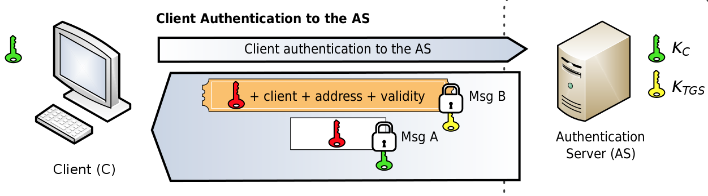
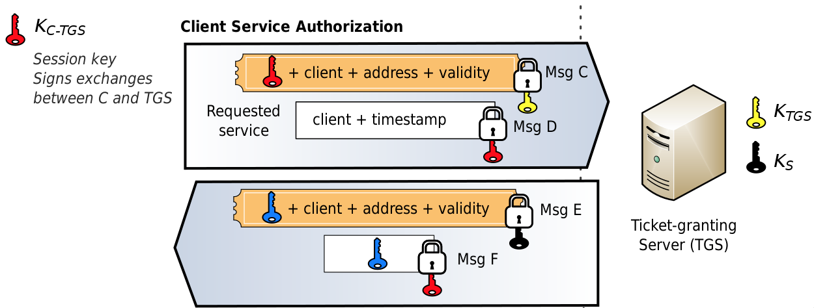
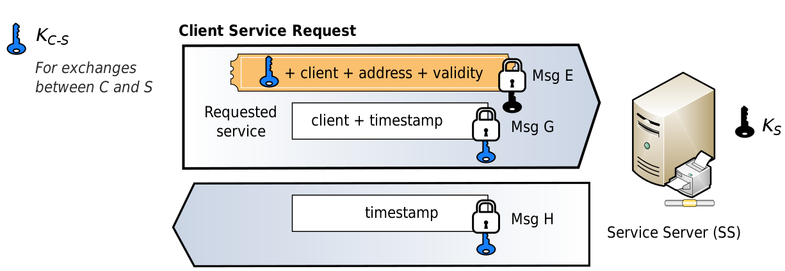

> 이 내용은 [Wikipedia - Kerberos](https://en.wikipedia.org/wiki/Kerberos_(protocol))를 참고하여 작성하였습니다.

# Kerberos

Kerberos는 보안되지 않은(un-secured) 네트워크에서 안전한 방법(secured manner)으로 노드 간 자격 증명을 수행하는 네트워크 인증 프로토콜이다.

사용자 비밀번호가 Network를 통해 교환되지 않기 때문에 MIMT(Main in the middle attack)을 통해 비밀번호 탈취가 불가능한 구조를 가지고 있는데, 어떻게 이런 특징을 가질 수 있는지 알아보도록 한다.

## 참여 주체

Kerberos 인증에는 Client, KDC(Key Distribution Center), Server가 참여한다. 일반적인 인증에서는 Client가 접근하고자 하는 서버와 인증을 수행하는 서버가 동일했지만, Kerberos에서는 접근하고자 하는 서버와 인증을 수행하는 서버(KDC)가 분리되어 있다.

KDC는 Authentication Server와 Ticket-Granting Server로 이루어져 있다.

* Authentication Server: 사용자의 ID와 Password를 기반으로 실질적인 인증을 수행한다.
* Ticket-Granting Server: Client <-> Server 간 자격 증명에 사용되는 Ticket을 발급한다.

## 인증 프로세스

> 아래에서 나오는 Kx는 x라는 이름의 키(Key)를 의미한다. 예를 들어 Ktgs는 tgs라는 이름의 Key를 뜻한다.

### Client <-> Authentication Server

> 출처: [Wikipedia - Kerberos](https://en.wikipedia.org/wiki/Kerberos_(protocol))

1. 사용자는 Client Program에 ID, Password를 입력받는다.
2. Client는 사용자의 ID를 KDC의 Authentication Server(AS)에 전달한다.
3. Authentication Server는 사용자의 ID가 존재하는지 확인한다.
   * Authentication Server는 모든 사용자의 정보(ID, Password)를 가지고 있다.(혹은 LDAP와 같은 외부 시스템에 저장된 정보에 접근할 수 있다)
4. 사용자 ID가 존재한다면 자신이 가진 사용자의 비밀번호를 통해 키(Kc)를 만들어낸다.
5. Client에게 전달할 Kc_tgs(Client와 Ticket Grant Server 간 통신 시 암/복호화에 사용할 키)를 생성한다.
6. Client에게 두 가지 메시지를 전달한다.
   * 첫번째 메시지(Msg A)는 5 에서 만들어낸 Kc_tgs를 Kc를 통해 암호화해서 만들어낸다.
   * 두번째 메시지(Msg B)는 Kc_tgs와 클라이언트 정보(ID, Address, Validity)를 Ktgs(이 키는 Authentication Server와 Ticket-Granting Server 간에만 공유한다)를 통해 암호화해서 만들어낸다.
 
 > * 클라이언트 입장에서 사용자의 비밀번호는 Authentication Server로부터 전달받은 메시지(Msg A)를 복호화하는데만 사용된다. 만일 비밀번호가 틀린 경우 다음 인증 단계(Ticket-Granting Server)에서 사용할 Kc_tgs를 복호화 할 수 없기 때문에 인증 과정이 종료된다.
 >
 > * Authentication Server 입장에서 사용자의 비밀번호는 클라이언트에게 다음 인증 단계에서 사용할 Ticket과 메시지를 암호화하는데만 사용된다. 만일 클라이언트가 잘못된 비밀번호를 가지고 있다면 이 정보를 복호화 할 수 없기 때문에 인증 과정이 종료된다.
>
> * Msg A는 클라이언트가 사용자의 비밀번호로 복호화 할 수 있는 반면, Msg B는 복호화가 불가능하다. Msg B는 KDC 내부적으로 클라이언트의 무결성을 증명하기 위한 값으로 활용된다.

### Client <-> Ticket-Granting Server

> 출처: [Wikipedia - Kerberos](https://en.wikipedia.org/wiki/Kerberos_(protocol))

1. 클라이언트는 자신의 비밀번호를 통해 Authentication Server로부터 전달받은 Msg A를 복호화해서 Kc_tgs(Ticket-Granting Server에 메시지를 보낼 때 암호화 할 키)를 얻어낸다.
2. 클라이언트는 서버로부터 받았던 Msg B(이번 그림에서는 Msg C로 표현)와 Client ID와 Timestamp를 결합한 Msg D를 Ticket-Granting Server로 전달한다.
3. Ticket Granting Server는 클라이언트로부터 전달받은 Msg C를 Ktgs를 통해 복호화한다. 복호화한 메시지에서 Tc_tgs를 획득한다.
4. Ticket Granting Server는 3 에서 얻어낸 Tc_tgs를 통해 Msg D를 복호화한다.
5. Msg D에서 얻어낸 Client ID와 Msg C의 Client ID를 비교해서 정상적으로 인증된 클라이언트인지 확인한다. 정상적으로 인증되었다면 6단계를 진행한다.
6. 클라이언트와 클라이언트가 접근하고 싶은 서버 간의 통신에 사용되는 Kc_s를 생성한다.
7. Client에게 두 가지 메시지를 전달한다.
   * 첫번째 메시지(Msg E)는 6에서 만들어낸 Kc_s와 클라이언트 정보(ID, Address, Validity)를 Ks(이 키는 Ticket-Granting Server와 실제 접속할 서버 사이에만 공유한다)를 통해 암호화해서 만들어낸다.
   * 두번째 메시지(Msg F)는 6에서 만들어낸 Kc_s를 Kc_tgs를 통해 암호화해서 만들어낸다.

> * Msg B(=Msg C)를 탈취하여 임의의 Kc_tgs\`를 통해 클라이언트 정보(ID, Timestamp)를 암호화해서 보냈다해도, Ticket Granting Server 에서 Msg B를 Ktgs를 통해 복호화 하여 얻어낸 Kc_tgs는 Kc_tgs\`와 일치하지 않기 때문에 인증 과정이 종료된다.
>
> * Msg E는 추후 클라이언트 <-> 서버 통신 시 Msg B(=Msg C)와 동일한 역할을 수행한다.

### Client <-> Server

> 출처: [Wikipedia - Kerberos](https://en.wikipedia.org/wiki/Kerberos_(protocol))

1. 클라이언트는 Ticket-Granting Server로부터 전달받은 Msg F를 Kc_tgs를 통해 복호화하여 Kc_s(Client가 Server에 메시지를 보낼 때 암호화 할 키)를 획득한다.
2. 클라이언트는 서버로부터 받았던 Msg E와 Client ID와 Timestamp를 결합한 Msg G를 Server로 전달한다.
3. Server는 클라이언트로부터 전달받은 Msg E를 Ks를 통해 복호화한다. 복호화한 메시지에서 Tc_s를 획득한다.
4. Server는 3에서 획득한 T_cs를 통해 Msg G를 복호화한다. 
5. Msg G에서 얻어낸 Client ID와 Msg E의 Msg E에서 얻어낸 Client ID를 비교한다.

---
다음 글에서는 Docker 환경에서 KDC를 구성하고 SSH 서버 접근 시 Kerberos 인증을 통해 로그인하는 과정을 진행합니다.